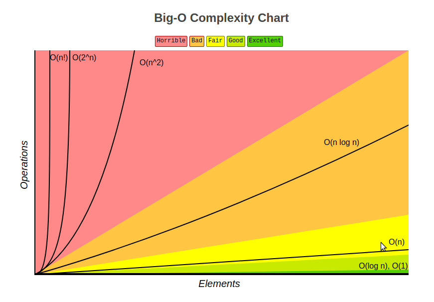
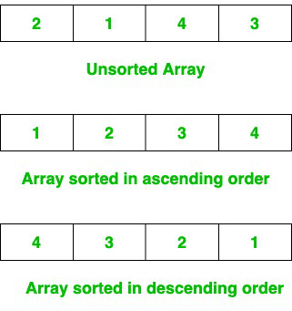

# :heavy_check_mark: Data Structures & Algorithms

## :round_pushpin: Data Structures
A data structure is a storage that is used to store and organize data. It is a way of arranging data on a computer so that it can be accessed and updated efficiently. An efficient data structure utilizes minimum memory space and execution time.

There are two classifications of data structures:

### Linear
Elements are arranged in one dimension.
- [Array](./data-structures/linear/array/array.md)
  - [Java ArrayList class](./data-structures/linear/array/java-arraylist.md)
- [Linked List](./data-structures/linear/linked-list/linked-list.md)
  - [Java LinkedList class](./data-structures/linear/linked-list/java-linkedlist.md)
  - Types:
    - [Singly Linked List](./data-structures/linear/linked-list/singly-linked-list.md)
    - [Doubly Linked List](./data-structures/linear/linked-list/doubly-linked-list.md)
    - [Circularly Linked List](./data-structures/linear/linked-list/circularly-linked-list.md)
    - [Doubly Circular Linked List](./data-structures/linear/linked-list/doubly-circular-linked-list.md)
- [Stack](./data-structures/linear/stack/stack.md)
  - [Java Stack](./data-structures/linear/stack/java-stack.md)
  - [Java Deque](./data-structures/linear/stack/java-deque.md)
  - [Java ArrayDeque](./data-structures/linear/stack/java-arraydeque.md)
- [Queue](./data-structures/linear/queue/queue.md)
  - [Java Queue Class](./data-structures/linear/queue/java-queue.md)
  - [Java PriorityQueue Class](./data-structures/linear/queue/java-priorityqueue.md)
  - Types:
    - [Priority Queue](./data-structures/linear/queue/priority-queue.md)

### Non-Linear
Elements are arranged in one-to-many, many-to-one, and many-to-many dimensions.
- [Tree](./data-structures/non-linear/tree/tree.md)
  - [Binary Tree](./data-structures/non-linear/tree/binary-tree.md)
    - [Full Binary Tree](./data-structures/non-linear/tree/full-binary-tree.md)
    - [Complete Binary Tree](./data-structures/non-linear/tree/complete-binary-tree.md)
    - [Perfect Binary Tree](./data-structures/non-linear/tree/perfect-binary-tree.md)
    - [Balanced Binary Tree](./data-structures/non-linear/tree/balanced-binary-tree.md)
    - [Degenerate Binary Tree](./data-structures/non-linear/tree/degenerate-binary-tree.md)
    - [Skewed Binary Tree](./data-structures/non-linear/tree/skewed-binary-tree.md)
    - Strictly Binary Tree
    - Extended Binary Tree
    - [Binary Search Tree (BST)](./data-structures/non-linear/tree/binary-search-tree.md)
      - [AVL Tree](./data-structures/non-linear/tree/avl-tree.md)
      - [Red-Black Tree](./data-structures/non-linear/tree/red-black-tree.md)
    - [Binary Heap](./data-structures/non-linear/tree/binary-heap.md)
  - [Trie](./data-structures/non-linear/tree/trie.md)
  - [B-Tree](./data-structures/non-linear/tree/b-tree.md)
  - [B+ Tree](./data-structures/non-linear/tree/b-plus-tree.md)
- [Graph](./data-structures/non-linear/graph/graph.md)

## :round_pushpin: Algorithms
Algorithm is defined as a process or set of well-defined instructions that are typically used to solve a group of problems or perform a specific type of calculation.

It is a set of operations performed in a step-by-step manner to execute a task.

### Complexities
We need a way to determine how efficient and effective an algorithm is. A way to measure this is with complexities. There are two types:

1. **Time Complexity**
  a. Measures the amount of time required to execute the code.
2. **Space Complexity**
  a. Amount of space required to execute the code successfully.
  b. **Auxiliary Space** is a common term. This refers to the extra space used in the program other than the input data structure.

Both are measured with respect to the input parameters.

The time required for running a program depends on several things:
- The number of operations performed.
- The speed of the device.
- The speed of data transfer if being executed on an online platform.

We use **asymptotic notation**: A mathematical tool that calculates the required time in terms of input size and does not require the execution of code.

It only looks at modular operations being performed in the whole program.

There are three asymptotic notations to represent complexity:
1. **Big-O Notation (O):** Describes worst-case scenario.
  a. This is the most used notation because it represents an upper bound.
2. **Omega Notation ($\Omega$):** Describes best-case scenario.
3. **Theta Notation ($\Theta$):** Describes average complexity of an algorithm.

From worst to best (there may be more to this):
- `O(n!)`, `O(c^n)`, `O(n^c)` - Worst
- `O(n log n)` - Bad
- `O(n)` - Fair
- `O(log n)` - good
- `O(1)` - Best

***NOTE:*** When dealing with constants, we remove them as they don't provide much value over time.

## :round_pushpin: Searching
Searching algorithms are designed to check for an element or retrieve an element from any data structure where it is stored.

***NOTE:*** There are more searching algorithms, but those below are the common and important ones.

- [Sequential/Linear Search](searching/linear-search.md)
- [Binary Search](searching/binary-search.md)

## :round_pushpin: Sorting
A sorting algorithm is used to rearrange a given array or list of elements according to a comparison operator on the elements.

The comparison operator is used to decide the new order of elements in the respective data structure.

There are many types of sorting algorithms:
- [Selection Sort](sorting/selection-sort.md)
- [Bubble Sort](sorting/bubble-sort.md)
- [Insertion Sort](sorting/insertion-sort.md)
- [Merge Sort](sorting/merge-sort.md)
- [Quick Sort](sorting/quick-sort.md)
- [Heap Sort](sorting/heap-sort.md)
- [Counting Sort](sorting/counting-sort.md)
- [Radix Sort](sorting/radix-sort.md)
- [Bucket Sort](sorting/bucket-sort.md)
- [Shell Sort](sorting/shell-sort.md)
- Comb Sort
- Pigeonhole Sort

***NOTE:*** There are more sorting algorithms, but those above are the common and important ones.

### Quick Complexity Reference
`n` represents the input size.

|Name|Best Case|Average Case|Worst Case|Memory|Stable|Method Used|
|----|---------|------------|----------|------|------|-----------|
|Quick Sort|`n log n`|`n log n`|<code>n2</code>|`1`|No|Partitioning|
|Merge Sort|`n log n`|`n log n`|`n log n`|`n`|Yes|Merging|
|Heap Sort|`n log n`|`n log n`|`n log n`|`1`|No|Selection|
|Insertion Sort|`n`|<code>n2</code>|<code>n2</code>|`1`|Yes|Insertion|
|Shell Sort|`n log n`|<code>n4/3</code>|<code>n3/2</code>|`1`|No|Insertion|
|Bubble Sort|`n`|<code>n2</code>|<code>n2</code>|`1`|Yes|Exchanging|

***NOTE:*** There are more sorting algorithms, but those below are the common and important ones.

## :round_pushpin: Patterns & Techniques
Patterns are a tool to solve specific categories of problems.

- [ ] [Sliding Window](patterns/sliding-window.md) 
- [ ] [Two Pointers](patterns/two-pointers.md) 
- [x] [Fast and Slow Pointers](patterns/fast-and-slow-pointers.md) 
- [ ] [Intervals](patterns/intervals.md) 
- [ ] [Linked Lists Reversals](patterns/linked-list-reversals.md) 
- [ ] [Two Heaps](patterns/two-heaps.md) 
- [ ] [Tree Breadth First Search (BFS)](patterns/tree-breadth-first-search.md) 
- [ ] [Tree Depth First Search (DFS)](patterns/tree-depth-first-search.md) 
- [ ] [Subsets](patterns/subsets.md) 
- [ ] [K-Way Merge](patterns/k-way-merge.md) 
- [ ] [Top K Elements](patterns/top-k-elements.md) 
- [ ] [Modified Binary Search](patterns/modified-binary-search.md) 
- [ ] [Greedy](patterns/greedy.md) 
- [ ] [Backtracking](patterns/backtracking.md) 
- [ ] [Dynamic Programming](patterns/dynamic-programming.md) 
- [ ] [Cyclic Sort](patterns/cyclic-sort.md) 
- [ ] [Topological Sort](patterns/topological-sort.md) 
- [ ] [Stacks](patterns/stacks.md) 
- [ ] [Trie](patterns/trie.md) 
- [ ] [Hash Maps](patterns/hash-maps.md) 
- [ ] [Union Find](patterns/union-find.md) 
- [ ] [Bitwise Manipulation](patterns/bitwise-manipulation.md) 
- [ ] [Custom Data Structures](patterns/custom-data-structures.md) 

## :round_pushpin: Top Leetcode Questions
Adopted from the popular [Blind](https://www.teamblind.com/post/New-Year-Gift---Curated-List-of-Top-75-LeetCode-Questions-to-Save-Your-Time-OaM1orEU) post and Needcode's curated [list](https://neetcode.io/roadmap) as well as from the book Elements of Programming Interviews in Java.
- ***NOTE:*** Some questions are in the `Patterns & Techniques` section above.
- See [this](https://leetcode.com/discuss/general-discussion/460599/blind-75-leetcode-questions) for a fast Leetcode link to curated list.

### Legend
- :green_book: Easy
- :orange_book: Medium
- :closed_book: Hard
- :lock: LC Premium

### Array 
- [x] 1. [:green_book: Two Sum](https://leetcode.com/problems/two-sum/description/)
- [x] 11. [:orange_book: Container With Most Water](https://leetcode.com/problems/container-with-most-water/description/)
- [x] 15. [:orange_book: 3Sum](https://leetcode.com/problems/3sum/description/)
- [x] 31. [:orange_book: Next Permutation](https://leetcode.com/problems/next-permutation/)
- [x] 33. [:orange_book: Search in Rotated Sorted Array](https://leetcode.com/problems/search-in-rotated-sorted-array/description/)
- [x] 36. [:orange_book: Valid Sudoku](https://leetcode.com/problems/valid-sudoku/description/)
- [x] 42. [:closed_book: Trapping Rain Water](https://leetcode.com/problems/trapping-rain-water/description/)
- [x] 49. [:orange_book: Group Anagrams](https://leetcode.com/problems/group-anagrams/description/)
- [x] 53. [:orange_book: Maximum Subarray](https://leetcode.com/problems/maximum-subarray/description/)
- [x] 66. [:green_book: Plus One](https://leetcode.com/problems/plus-one/)
- [x] 75. [:orange_book: Sort Colors](https://leetcode.com/problems/sort-colors/)
- [x] 118. [:green_book: Pascal's Triangle](https://leetcode.com/problems/pascals-triangle/)
- [x] 119. [:green_book: Pascal's Triangle II](https://leetcode.com/problems/pascals-triangle-ii/)
- [x] 121. [:green_book: Best Time to Buy and Sell Stock](https://leetcode.com/problems/best-time-to-buy-and-sell-stock/description/)
- [x] 128. [:orange_book: Longest Consecutive Sequence](https://leetcode.com/problems/longest-consecutive-sequence/description/)
- [x] 149. [:closed_book: Max Points on a Line](https://leetcode.com/problems/max-points-on-a-line/)
- [x] 152. [:orange_book: Maximum Product Subarray](https://leetcode.com/problems/maximum-product-subarray/description/)
- [x] 153. [:orange_book: Find Minimum in Rotated Sorted Array](https://leetcode.com/problems/find-minimum-in-rotated-sorted-array/)
- [x] 169. [:green_book: Majority Element](https://leetcode.com/problems/majority-element/)
- [x] 204. [:orange_book: Count Primes](https://leetcode.com/problems/count-primes/description/)
  - See `Sieve of Eratosthenes`.
- [x] 217. [:green_book: Contains Duplicate](https://leetcode.com/problems/contains-duplicate/description/)
- [x] 238. [:orange_book: Product of Array Except Self](https://leetcode.com/problems/product-of-array-except-self/description/)
- [x] 242. [:green_book: Valid Anagram](https://leetcode.com/problems/valid-anagram/description/)
- [x] 243. [:green_book: Shortest Word Distance](https://leetcode.com/problems/shortest-word-distance/) :lock:
- [x] 244. [:orange_book: Shortest Word Distance II](https://leetcode.com/problems/shortest-word-distance-ii/) :lock:
- [x] 271. [:orange_book: Encode and Decode Strings](https://leetcode.com/problems/encode-and-decode-strings/description/) :lock:
- [x] 280. [:orange_book: Wiggle Sort](https://leetcode.com/problems/wiggle-sort/) :lock:
- [x] 347. [:orange_book: Top K Frequent Elements](https://leetcode.com/problems/top-k-frequent-elements/description/)
- [ ] 384. [:orange_book: Shuffle an Array](https://leetcode.com/problems/shuffle-an-array/)
- [ ] 427. [:closed_book: Concatenated Words](https://leetcode.com/problems/concatenated-words/)
- [ ] 525. [:orange_book: Contiguous Array](https://leetcode.com/problems/contiguous-array/)
- [x] 1920. [:green_book: Build Array from Permutation](https://leetcode.com/problems/build-array-from-permutation/description/)
  - Try to solve this problem with `O(1)` space complexity.

### String 
- [x] 3. [:orange_book: Longest Substring Without Repeating Characters](https://leetcode.com/problems/longest-substring-without-repeating-characters/description/)
- [x] 5. [:orange_book: Longest Palindromic Substring](https://leetcode.com/problems/longest-palindromic-substring/description/)
- [ ] 6. [:orange_book: Zigzag Conversion](https://leetcode.com/problems/zigzag-conversion/)
- [ ] 8. [:orange_book: String to Integer (atoi)](https://leetcode.com/problems/string-to-integer-atoi/)
- [ ] 13. [:green_book: Roman to Integer](https://leetcode.com/problems/roman-to-integer/)
- [ ] 17. [:orange_book: Letter Combinations of a Phone Number](https://leetcode.com/problems/letter-combinations-of-a-phone-number/)
- [x] 20. [:green_book: Valid Parentheses](https://leetcode.com/problems/valid-parentheses/description/)
- [ ] 38. [:orange_book: Count and Say](https://leetcode.com/problems/count-and-say/)
- [x] 49. [:orange_book: Group Anagrams](https://leetcode.com/problems/group-anagrams/description/)
- [x] 76. [:closed_book: Minimum Window Substring](https://leetcode.com/problems/minimum-window-substring/description/)
- [ ] 93. [:closed_book: Restore IP Addresses](https://leetcode.com/problems/restore-ip-addresses/)
- [x] 125. [:green_book: Valid Palindrome](https://leetcode.com/problems/valid-palindrome/description/)
- [ ] 161. [:orange_book: One Edit Distance](https://leetcode.com/problems/one-edit-distance/) :lock:
- [x] 171. [:green_book: Excel Sheet Column Number](https://leetcode.com/problems/excel-sheet-column-number/)
- [ ] 186. [:orange_book: Reverse Words in a String II](https://leetcode.com/problems/reverse-words-in-a-string-ii/) :lock:
- [x] 242. [:green_book: Valid Anagram](https://leetcode.com/problems/valid-anagram/description/)
- [ ] 266. [:green_book: Palindrome Permutation](https://leetcode.com/problems/palindrome-permutation/) :lock:
- [x] 271. [:orange_book: Encode and Decode Strings](https://leetcode.com/problems/encode-and-decode-strings/description/) :lock:
- [ ] 290. [:green_book: Word Pattern](https://leetcode.com/problems/word-pattern/)
- [x] 424. [:orange_book: Longest Repeating Character Replacement](https://leetcode.com/problems/longest-repeating-character-replacement/description/)
- [ ] 443. [:orange_book: String Compression](https://leetcode.com/problems/string-compression/)
- [ ] 647. [:orange_book: Palindromic Substrings](https://leetcode.com/problems/palindromic-substrings/description/)
- [ ] 796. [:green_book: Rotate String](https://leetcode.com/problems/rotate-string/)

### Stacks and Queues 
- [x] 20. [:green_book: Valid Parentheses](https://leetcode.com/problems/valid-parentheses/)
- [ ] 71. [:orange_book: Simplify Path](https://leetcode.com/problems/simplify-path/)
- [x] 102. [:green_book: Binary Tree Level Order Traversal](https://leetcode.com/problems/binary-tree-level-order-traversal/)
- [x] 150. [:orange_book: Evaluate Reverse Polish Notation](https://leetcode.com/problems/evaluate-reverse-polish-notation/)
- [x] 155. [:orange_book: Min Stack](https://leetcode.com/problems/min-stack/)
- [ ] 227. [:orange_book: Basic Calculator II](https://leetcode.com/problems/basic-calculator-ii/)
- [ ] 232. [:green_book: Implement Queue using Stacks](https://leetcode.com/problems/implement-queue-using-stacks/)
- [ ] 622. [:orange_book: Design Circular Queue](https://leetcode.com/problems/design-circular-queue/)
- [ ] 1172. [:closed_book: Dinner Plate Stacks](https://leetcode.com/problems/dinner-plate-stacks/)

### Binary 
- [ ] 67. [:green_book: Add Binary](https://leetcode.com/problems/add-binary/)
- [x] 136. [:green_book: Single Number](https://leetcode.com/problems/single-number/description/)
- [ ] 190. [:green_book: Reverse Bits](https://leetcode.com/problems/reverse-bits/)
- [ ] 191. [:green_book: Number of 1 Bits](https://leetcode.com/problems/number-of-1-bits/description/)
- [ ] 268. [:green_book: Missing Number](https://leetcode.com/problems/missing-number/description/)
- [ ] 338. [:green_book: Counting Bits](https://leetcode.com/problems/counting-bits/)
- [ ] 371. [:orange_book: Sum of Two Integers](https://leetcode.com/problems/sum-of-two-integers/description/)

### Interval 
- [x] 56. [:orange_book: Merge Intervals](https://leetcode.com/problems/merge-intervals/)
- [x] 57. [:orange_book: Insert Interval](https://leetcode.com/problems/insert-interval/)
- [x] 252. [:green_book: Meeting Rooms](https://leetcode.com/problems/meeting-rooms/description/) :lock:
- [x] 253. [:orange_book: Meeting Rooms II](https://leetcode.com/problems/meeting-rooms-ii/description/) :lock:
- [x] 435. [:orange_book: Non-overlapping Intervals](https://leetcode.com/problems/non-overlapping-intervals/)
- [ ] 1851. [:closed_book: Minimum Interval to Include Each Query](https://leetcode.com/problems/minimum-interval-to-include-each-query/)

### Linked List 
- [x] 2. [:orange_book: Add Two Numbers](https://leetcode.com/problems/add-two-numbers/description/)
- [x] 19. [:orange_book: Remove Nth Node From End of List](https://leetcode.com/problems/remove-nth-node-from-end-of-list/description/)
- [x] 21. [:green_book: Merge Two Sorted Lists](https://leetcode.com/problems/merge-two-sorted-lists/description/)
- [x] 25. [:closed_book: Reverse Node in k-Group](https://leetcode.com/problems/reverse-nodes-in-k-group/)
- [x] 23. [:closed_book: Merge k Sorted Lists](https://leetcode.com/problems/merge-k-sorted-lists/description/)
- [x] 61. [:closed_book: Rotate List](https://leetcode.com/problems/rotate-list/)
- [x] 83. [:green_book: Remove Duplicates from Sorted List](https://leetcode.com/problems/remove-duplicates-from-sorted-list/)
- [x] 86. [:orange_book: Partition List](https://leetcode.com/problems/partition-list/)
- [x] 138. [:orange_book: Copy List with Random Pointer](https://leetcode.com/problems/copy-list-with-random-pointer/description/)
- [x] 141. [:green_book: Linked List Cycle](https://leetcode.com/problems/linked-list-cycle/description/)
- [x] 142. [:orange_book: Linked List Cycle II](https://leetcode.com/problems/linked-list-cycle-ii/)
- [x] 143. [:orange_book: Reorder List](https://leetcode.com/problems/reorder-list/description/)
- [x] 146. [:orange_book: LRU Cache](https://leetcode.com/problems/lru-cache/description/)
- [x] 160. [:green_book: Intersection of Two Linked Lists](https://leetcode.com/problems/intersection-of-two-linked-lists/)
- [x] 206. [:green_book: Reverse Linked List](https://leetcode.com/problems/reverse-linked-list/description/)
- [x] 234. [:green_book: Palindrome Linked List](https://leetcode.com/problems/palindrome-linked-list/)
- [x] 237. [:orange_book: Delete Node in a Linked List](https://leetcode.com/problems/delete-node-in-a-linked-list/)
- [x] 287. [:orange_book: Find the Duplicate Number](https://leetcode.com/problems/find-the-duplicate-number/description/)
- [x] 328. [:orange_book: Odd Even Linked List](https://leetcode.com/problems/odd-even-linked-list/)
- [x] 445. [:orange_book: Add Two Numbers II](https://leetcode.com/problems/add-two-numbers-ii/)
- [x] 1836. [:orange_book: Remove Duplicates From an Unsorted Linked List](https://leetcode.com/problems/remove-duplicates-from-an-unsorted-linked-list/) :lock:
- [x] 2095. [:orange_book: Delete the Middle Node of a Linked List](https://leetcode.com/problems/delete-the-middle-node-of-a-linked-list/)

### Matrix 
- [x] 48. [:orange_book: Rotate Image](https://leetcode.com/problems/rotate-image/description/)
- [x] 54. [:orange_book: Spiral Matrix](https://leetcode.com/problems/spiral-matrix/description/)
- [x] 73. [:orange_book: Set Matrix Zeroes](https://leetcode.com/problems/set-matrix-zeroes/description/)
- [x] 79. [:orange_book: Word Search](https://leetcode.com/problems/word-search/description/)
- [ ] 1275. [:green_book: Find Winner on a Tic Tac Toe Game](https://leetcode.com/problems/find-winner-on-a-tic-tac-toe-game/)

### Tree 
- [x] 98. [:orange_book: Validate Binary Search Tree](https://leetcode.com/problems/validate-binary-search-tree/description/)
- [x] 100. [:green_book: Same Tree](https://leetcode.com/problems/same-tree/description/)
- [x] 101. [:green_book: Symmetric Tree](https://leetcode.com/problems/symmetric-tree/)
- [x] 102. [:orange_book: Binary Tree Level Order Traversal](https://leetcode.com/problems/binary-tree-level-order-traversal/description/)
- [x] 104. [:green_book: Maximum Depth of Binary Tree](https://leetcode.com/problems/maximum-depth-of-binary-tree/description/)
- [ ] 105. [:orange_book: Construct Binary Tree from Preorder and Inorder Traversal](https://leetcode.com/problems/construct-binary-tree-from-preorder-and-inorder-traversal/description/)
- [ ] 108. [:green_book: Convert Sorted Array to Binary Search Tree](https://leetcode.com/problems/convert-sorted-array-to-binary-search-tree/)
- [x] 110. [:green_book: Balanced Binary Tree](https://leetcode.com/problems/balanced-binary-tree/description/)
- [x] 124. [:closed_book: Binary Tree Maximum Path Sum](https://leetcode.com/problems/binary-tree-maximum-path-sum/description/)
- [x] 199. [:green_book: Binary Tree Righ Side View](https://leetcode.com/problems/binary-tree-right-side-view/description/)
- [x] 208. [:orange_book: Implement Trie (Prefix Tree)](https://leetcode.com/problems/implement-trie-prefix-tree/description/)
- [ ] 211. [:orange_book: Design Add and Search Words Data Structure](https://leetcode.com/problems/design-add-and-search-words-data-structure/description/)
- [x] 212. [:closed_book: Word Search II](https://leetcode.com/problems/word-search-ii/description/)
- [x] 226. [:green_book: Invert Binary Tree](https://leetcode.com/problems/invert-binary-tree/description/)
- [x] 230. [:orange_book: Kth Smallest Element in a BST](https://leetcode.com/problems/kth-smallest-element-in-a-bst/description/)
- [x] 235. [:orange_book: Lowest Common Ancestor of a Binary Search Tree](https://leetcode.com/problems/lowest-common-ancestor-of-a-binary-search-tree/description/)
- [x] 236. [:orange_book: Lowest Common Ancestor of a Binary Tree](https://leetcode.com/problems/lowest-common-ancestor-of-a-binary-tree/description/)
- [x] 285. [:orange_book: Inorder Successor in BST](https://leetcode.com/problems/inorder-successor-in-bst/) :lock:
- [ ] 297. [:closed_book: Serialize and Deserialize Binary Tree](https://leetcode.com/problems/serialize-and-deserialize-binary-tree/description/)
- [ ] 510. [:orange_book: Inorder Successor in BST II](https://leetcode.com/problems/inorder-successor-in-bst-ii/) :lock:
- [x] 543. [:green_book: Diameter of Binary Tree](https://leetcode.com/problems/diameter-of-binary-tree/)
- [ ] 545. [:orange_book: Boundary of Binary Tree](https://leetcode.com/problems/boundary-of-binary-tree/) :lock:
- [x] 572. [:green_book: Subtree of Another Tree](https://leetcode.com/problems/subtree-of-another-tree/description/)
- [ ] 1028. [:closed_book: Recover a Tree From Preorder Traversal](https://leetcode.com/problems/recover-a-tree-from-preorder-traversal/)
- [x] 1448. [:orange_book: Count Good Nodes in Binary Tree](https://leetcode.com/problems/count-good-nodes-in-binary-tree/description/)
- [ ] 1569. [:closed_book: Number of Ways to Reorder Array to Get Same BST](https://leetcode.com/problems/number-of-ways-to-reorder-array-to-get-same-bst/)

### Graph 
- [ ] 127. [:closed_book: Word Ladder](https://leetcode.com/problems/word-ladder/)
- [ ] 128. [:orange_book: Longest Consecutive Sequence](https://leetcode.com/problems/longest-consecutive-sequence/description/)
- [x] 130. [:orange_book: Surrounded Regions](https://leetcode.com/problems/surrounded-regions/description/)
- [ ] 133. [:orange_book: Clone Graph](https://leetcode.com/problems/clone-graph/description/)
- [x] 200. [:orange_book: Number of Islands](https://leetcode.com/problems/number-of-islands/description/)
- [ ] 207. [:orange_book: Course Schedule](https://leetcode.com/problems/course-schedule/)
- [ ] 210. [:orange_book: Course Schedule II](https://leetcode.com/problems/course-schedule-ii/description/)
- [ ] 261. [:orange_book: Graph Valid Tree](https://leetcode.com/problems/graph-valid-tree/description/) :lock:
- [ ] 269. [:closed_book: Alien Dictionary](https://leetcode.com/problems/alien-dictionary/) :lock:
- [ ] 286. [:orange_book: Walls and Gates](https://leetcode.com/problems/walls-and-gates/) :lock:
- [ ] 323. [:orange_book: Number of Connected Components in an Undirected Graph](https://leetcode.com/problems/number-of-connected-components-in-an-undirected-graph/description/) :lock:
- [ ] 332. [:closed_book: Reconstruct Itinerary](https://leetcode.com/problems/reconstruct-itinerary/description/)
- [x] 417. [:orange_book: Pacific Atlantic Water Flow](https://leetcode.com/problems/pacific-atlantic-water-flow/description/)
- [ ] 505. [:orange_book: The Maze II](https://leetcode.com/problems/the-maze-ii/) :lock:
- [ ] 684. [:orange_book: Redundant Connection](https://leetcode.com/problems/redundant-connection/)
- [ ] 695. [:orange_book: Max Area of Island](https://leetcode.com/problems/max-area-of-island/description/)
- [x] 733. [:green_book: Flood Fill](https://leetcode.com/problems/flood-fill/)
- [ ] 743. [:orange_book: Network Delay Time](https://leetcode.com/problems/network-delay-time/)
- [ ] 778. [:closed_book: Swim in Rising Water](https://leetcode.com/problems/swim-in-rising-water/)
- [ ] 787. [:orange_book: Cheapest Flights Within K Stops](https://leetcode.com/problems/cheapest-flights-within-k-stops/description/)
- [ ] 994. [:orange_book: Rotting Oranges](https://leetcode.com/problems/rotting-oranges/description/)
- [ ] 1020. [:orange_book: Number of Enclaves](https://leetcode.com/problems/number-of-enclaves/)
- [ ] 1584. [:orange_book: Min Cost to Connect All Points](https://leetcode.com/problems/min-cost-to-connect-all-points/)
- [ ] 1971. [:green_book: Find if Path Exists in Graph](https://leetcode.com/problems/find-if-path-exists-in-graph/)

### Heap 
- [x] 23. [:closed_book: Merge k Sorted Lists](https://leetcode.com/problems/merge-k-sorted-lists/description/)
- [x] 215. [:orange_book: Kth Largest Element in an Array](https://leetcode.com/problems/kth-largest-element-in-an-array/)
- [x] 295. [:closed_book: Find Median from Data Stream](https://leetcode.com/problems/find-median-from-data-stream/description/)
- [x] 347. [:orange_book: Top K Frequent Elements](https://leetcode.com/problems/top-k-frequent-elements/description/)
- [ ] 355. [:orange_book: Design Twitter](https://leetcode.com/problems/design-twitter/)
- [ ] 621. [:orange_book: Task Scheduler](https://leetcode.com/problems/task-scheduler/)
- [x] 703. [:green_book: Kth Largest Element in a Stream](https://leetcode.com/problems/kth-largest-element-in-a-stream/)
- [x] 973. [:orange_book: K Closest Points to Origin](https://leetcode.com/problems/k-closest-points-to-origin/description/)
- [x] 1046. [:green_book: Last Stone Weight](https://leetcode.com/problems/last-stone-weight/description/)

### Dynamic Programming 
- [ ] 5. [:orange_book: Longest Palindromic Substring](https://leetcode.com/problems/longest-palindromic-substring/description/)
- [ ] 10. [:closed_book: Regular Expression Matching](https://leetcode.com/problems/regular-expression-matching/)
- [ ] 22. [:orange_book: Generate Parentheses](https://leetcode.com/problems/generate-parentheses/)
- [ ] 47. [:orange_book: Permutations II](https://leetcode.com/problems/permutations-ii/)
- [ ] 55. [:orange_book: Jump Game](https://leetcode.com/problems/jump-game/description/)
- [x] 62. [:orange_book: Unique Paths](https://leetcode.com/problems/unique-paths/description/)
  - [Explanation](lc-solutions/dynamic-programming/unique-paths.md)
- [x] 63. [:orange_book: Unique Paths II](https://leetcode.com/problems/unique-paths-ii/)
  - [Explanation](lc-solutions/dynamic-programming/unique-paths-ii.md)
- [x] 70. [:green_book: Climbing Stairs](https://leetcode.com/problems/climbing-stairs/description/)
  - [Explanation](lc-solutions/dynamic-programming/climbing-stairs.md)
- [x] 72. [:closed_book: Edit Distance](https://leetcode.com/problems/edit-distance/)
  - [Explanation](lc-solutions/dynamic-programming/edit-distance.md)
- [ ] 91. [:orange_book: Decode Ways](https://leetcode.com/problems/decode-ways/)
- [ ] 97. [:orange_book: Interleaving String](https://leetcode.com/problems/interleaving-string/)
- [ ] 115. [:closed_book: Distinct Subsequences](https://leetcode.com/problems/distinct-subsequences/)
- [ ] 120. [:orange_book: Triangle](https://leetcode.com/problems/triangle/)
- [x] 123. [:closed_book: Best Time to Buy and Sell Stock III](https://leetcode.com/problems/best-time-to-buy-and-sell-stock-iii/)
- [ ] 139. [:orange_book: Word Break](https://leetcode.com/problems/word-break/description/)
- [ ] 140. [:closed_book: Word Break II](https://leetcode.com/problems/word-break-ii/)
- [ ] 152. [:orange_book: Maximum Product Subarray](https://leetcode.com/problems/maximum-product-subarray/description/)
- [x] 198. [:orange_book: House Robber](https://leetcode.com/problems/house-robber/)
  - [Explanation](lc-solutions/dynamic-programming/house-robber.md)
- [x] 213. [:orange_book: House Robber II](https://leetcode.com/problems/house-robber-ii/)
  - [Explanation](lc-solutions/dynamic-programming/house-robber-ii.md)
- [ ] 221. [:orange_book: Maximal Square](https://leetcode.com/problems/maximal-square/)
- [ ] 233. [:closed_book: Number of Digit One](https://leetcode.com/problems/number-of-digit-one/)
- [ ] 264. [:orange_book: Ugly Number II](https://leetcode.com/problems/ugly-number-ii/)
- [ ] 300. [:orange_book: Longest Increasing Subsequence](https://leetcode.com/problems/longest-increasing-subsequence/description/)
- [ ] 309. [:orange_book: Best Time to Buy and Sell Stock with Cooldown (Medium)](https://leetcode.com/problems/best-time-to-buy-and-sell-stock-with-cooldown/)
- [ ] 312. [:closed_book: Burst Balloons](https://leetcode.com/problems/burst-balloons/description/)
- [x] 322. [:orange_book: Coin Change](https://leetcode.com/problems/coin-change/description/)
  - [Explanation](lc-solutions/dynamic-programming/coin-change.md)
- [ ] 329. [:closed_book: Longest Increasing Path in a Matrix](https://leetcode.com/problems/longest-increasing-path-in-a-matrix/)
- [ ] 377. [:orange_book: Combination Sum IV](https://leetcode.com/problems/combination-sum-iv/)
- [ ] 416. [:orange_book: Partition Equal Subset Sum](https://leetcode.com/problems/partition-equal-subset-sum/description/)
- [ ] 494. [:orange_book: Target Sum](https://leetcode.com/problems/target-sum/description/)
- [x] 518. [:orange_book: Coin Change II](https://leetcode.com/problems/coin-change-ii/)
  - [Explanation](lc-solutions/dynamic-programming/coin-change-ii.md)
- [ ] 647. [:orange_book: Palindromic Substrings](https://leetcode.com/problems/palindromic-substrings/description/)
- [ ] 727. [:closed_book: Minimum Window Subsequence](https://leetcode.com/problems/minimum-window-subsequence/) :lock:
- [x] 746. [:green_book: Min Cost Climbing Stairs](https://leetcode.com/problems/min-cost-climbing-stairs/)
  - [Explanation](lc-solutions/dynamic-programming/min-cost-climbing-stairs.md)
- [ ] 877. [:orange_book: Stone Game](https://leetcode.com/problems/stone-game/)
- [ ] 1137. [:green_book: N-th Tribonacci Number](https://leetcode.com/problems/n-th-tribonacci-number/)
- [x] 1143. [:orange_book: Longest Common Subsequence](https://leetcode.com/problems/longest-common-subsequence/)
  - [Explanation](lc-solutions/dynamic-programming/longest-common-subsequence.md)
- [ ] 1691. [:closed_book: Maximum Height by Stacking Cuboids](https://leetcode.com/problems/maximum-height-by-stacking-cuboids/)

### Math & Geometry 
- [ ] 43. [:orange_book: Multiple Strings](https://leetcode.com/problems/multiply-strings/)
- [ ] 29. [:orange_book: Divide Two Numbers](https://leetcode.com/problems/divide-two-integers/)
- [x] 50. [:orange_book: Pow(x,n)](https://leetcode.com/problems/powx-n/)
- [x] 66. [:green_book: Plus One](https://leetcode.com/problems/plus-one/)
- [ ] 172. [:orange_book: Factorial Trailing Zeroes](https://leetcode.com/problems/factorial-trailing-zeroes/)
- [x] 202. [:green_book: Happy Number](https://leetcode.com/problems/happy-number/)
- [ ] 273. [:closed_book: Integer to English Words](https://leetcode.com/problems/integer-to-english-words/)
- [ ] 470. [:orange_book: Implement Rand10() Using Rand7()](https://leetcode.com/problems/implement-rand10-using-rand7/)
- [ ] 2013. [:orange_book: Detect Squares](https://leetcode.com/problems/detect-squares/)

### Other 
- [ ] 192. [:orange_book: Word Frequency](https://leetcode.com/problems/word-frequency/)
- [ ] 426. [:orange_book: Convert Binary Search Tree to Sorted Doubly Linked List](https://leetcode.com/problems/convert-binary-search-tree-to-sorted-doubly-linked-list/) :lock:

## :round_pushpin: Java Utilities
- Java `Arrays` class.
- Java `Collections` class.
- Java `Math` class.
