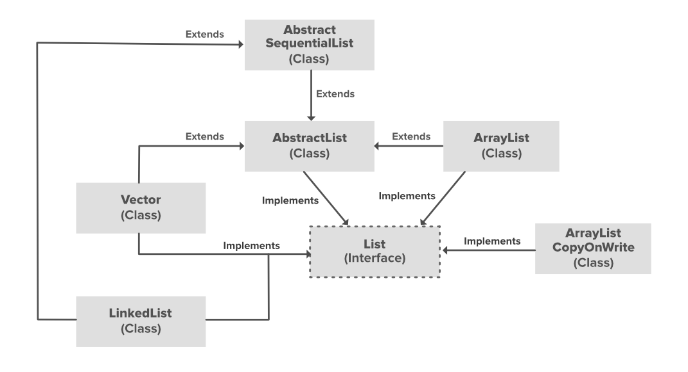

# :heavy_check_mark: Java ArrayList
*Last Updated: 1/24/2023*


## :round_pushpin: Summary
- Part of the Java collection framework.
- Class of the `java.util` package.
- Provides dynamic arrays in Java.
  - Upon adding and removing elements, the array increases/decreases in size accordingly.

## :round_pushpin: Advantages
- No declaration of array size is necessary.

## :round_pushpin: Disadvantages
- Might be a bit slower than normal arrays.

## :round_pushpin: Features

- Inherits AbstractList class.
- Implements the List interface.
- Size of the ArrayList grows/shrinks when adding/removing.
- Cannot be used with primitive types (e.g. `int`, `char`, etc).
  - Need a wrapper class.
- Similar to a `vector` in C++.
- Not synchronized.

## :round_pushpin: Operations (API)
- [Documentation](https://docs.oracle.com/javase/8/docs/api/java/util/ArrayList.html)
- Common operations:
  - `add`
  - `remove`

## :round_pushpin: Examples
- Instantiate without size:
```java
ArrayList<Integer> arr = new ArrayList<>();
```

- Instantiate with size (e.g. 5):
```java
ArrayList<Integer> arr = new ArrayList<>(5);
```

- Instantiate with another collection, `c`:
```java
ArrayList<Integer> arr = new ArrayList<>(c);
```

- Common operations:
```java
ArrayList<Integer> arr = new ArrayList<>(); // []
arr.add(5); // [5]
arr.add(6); // [5, 6]
System.out.println(arr.size()) // 2
System.out.println(arr.get(1)); // 6
arr.add(7); // [5, 6, 7]
arr.add(8); // [5, 6, 7, 8]
arr.remove(0); // [6, 7, 8]
```

## :round_pushpin: Misc
- Duplicates allowed.
- Insertion order preserved.
- Inserting `null` is possible.
- Can be used to implement the `List` interface of Java.
  - Implemented as a dynamically-resizable array.
