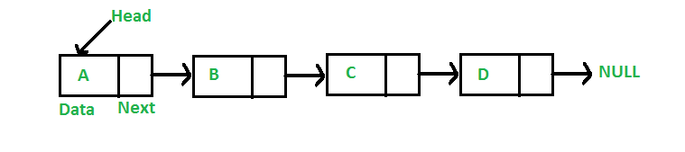

# Linked List

## Summary
- Linear data structure.
- Not stored in contiguous memory.
- Elements of a list are linked using pointers to the next element.

## Types
- Singly-Linked List
- Doubly-Linked List
- Circularly-Linked List
- Doubly Circular Linked List

## Characteristics
- Uses extra memory to store links.
- Initial size not needed for initialization (like arrays do).
- Implements stack, queue, graphs, etc.
- First node is called the head.
- Last node is called the tail and always points to `null`.
- Insertion and deletion on the ends is easy.
- Each node contains a next pointer to the next node.
