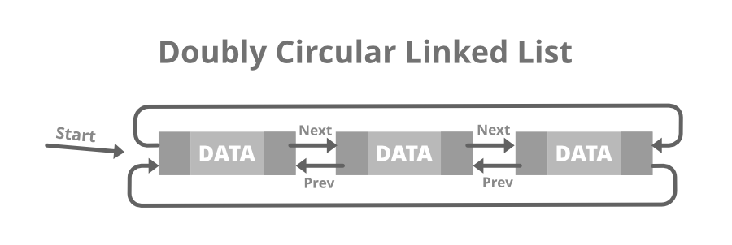

# :heavy_check_mark: Doubly Circularly Linked List
*Last Updated: 1/24/2023*



## :round_pushpin: Summary
- Has properties of a doubly linked list and a circularly linked list.
- The first and last nodes are connected with each other via `next` and `prev` pointers.
- There is no `null` end.

## :round_pushpin: Representation
- Basic representation
- Uses the same node as a doubly linked list.
```java
// Doubly Linked List Class
class DoublyLinkedList {
  Node head; // Head of list.

  // Doubly Linked List Node.
  class Node {
    int data;
    Node prev;
    Node next;

    // Constructor to create a new node.
    // The next and prev is null by default.
    Node(int d) {
      data = d;
    }
  }
}
```

## :round_pushpin: Operations
- `n` is the length of the list.
### Read/Access
- Reading elements at the head: Constant time operation - `O(1)`.
- Reading elements at the tail: Constant time operation - `O(1)`.
- Reading elements in the middle: Linear time operation - `O(n)`.

### Update
- Updating elements at the head: Constant time operation - `O(1)`.
- Updating elements at the tail: Constant time operation - `O(1)`.
- Updating elements in the middle: Linear time operation - `O(n)`.

### Insert/Create
- Inserting elements at the head: Constant time operation - `O(1)`.
- Inserting elements at the tail: Constant time operation - `O(1)`.
- Inserting elements in the middle: Linear time operation - `O(n)`.

### Delete
- Deleting elements at the head: Constant time operation - `O(1)`.
- Deleting elements at the tail: Constant time operation - `O(1)`.
- Deleting elements in the middle: Linear time operation - `O(n)`.

## :round_pushpin: Misc
- There is no Java doubly circularly linked list class.
