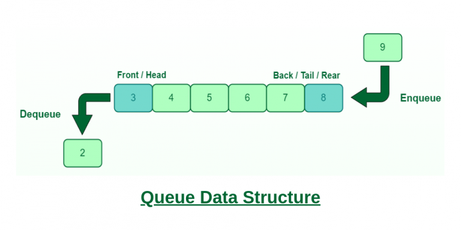

# :heavy_check_mark: Queue

## :round_pushpin: Summary
- Linear data structure.
- FIFO (first in first out).
- Similar to a stack.
- Common operations are done only on one end.
- Common operations are enqueue, dequeue, front, rear, etc.

## :round_pushpin: Characteristics
- Removing the last element requires removing all the previously inserted elements first.
- Can be implemented as an array or linked list.

## :round_pushpin: Operations
- Adding and removing happens on different ends of the queue.
### Enqueue
- Constant time operation: `O(1)`.

### Dequeue
- Constant time operation: `O(1)`.

### Front
- Constant time operation: `O(1)`.

### Rear
- Constant time operation: `O(1)`.

## :round_pushpin: Types
- [Simple Queue/Linear Queue](simple-queue.md)
- [Circular Queue](circular-queue.md)
- [Priority Queue](priority-queue.md)
- [Dequeue](dequeue.md)

## :round_pushpin: Java Syntax/Libraries
There are more queue classes than these, but these are the most common implementations of the queue interface.
- Java has a `Queue` interface: [Documentation](https://docs.oracle.com/javase/8/docs/api/java/util/Queue.html)
  - [Notes](java-queue.md)
- Java has a `PriorityQueue` class: [Documentation](https://docs.oracle.com/javase/7/docs/api/java/util/PriorityQueue.html)
  - [Notes](java-priorityqueue.md)
- Java has an `ArrayDeque` class implementation of the `Deque` interface (Can be used for queues as well): [Documentation](https://docs.oracle.com/javase/7/docs/api/java/util/ArrayDeque.html)
  - [Notes](../stack/java-arraydeque.md)
