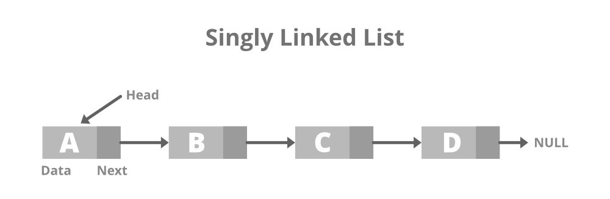

# :heavy_check_mark: Singly Linked List
*Last Updated: 1/24/2023*



## :round_pushpin: Summary
- Traversal of items in the forward direction only.
- This is basically the basic linked list.
  - See [Linked List](linked-list.md) section for more information.

## :round_pushpin: Representation
- Basic representation
```java
// Linked List Class
class LinkedList {
  Node head; // Head of list.

  class Node {
    int data;
    Node next;

    // Constructor to create a new node.
    Node(int d) {
      data = d;
      next = null;
    }
  }
}
```

## :round_pushpin: Operations
- Exact same operations as the basic [Linked List](linked-list.md).
### Read/Access
- Reading elements at the ends: Constant time operation - `O(1)`.
- Reading elements in the middle: Linear time operation - `O(n)` where `n` is the length of the array.

### Update
- Updating elements at the ends: Constant time operation - `O(1)`.
- Updating elements in the middle: Linear time operation - `O(n)` where `n` is the length of the array.

### Insert/Create
- Inserting elements at the ends: Constant time operation - `O(1)`.
- Inserting elements in the middle: Linear time operation - `O(n)` where `n` is the length of the array.

### Delete
- Deleting elements at the ends: Constant time operation - `O(1)`.
- Deleting elements in the middle: Linear time operation - `O(n)` where `n` is the length of the array.
