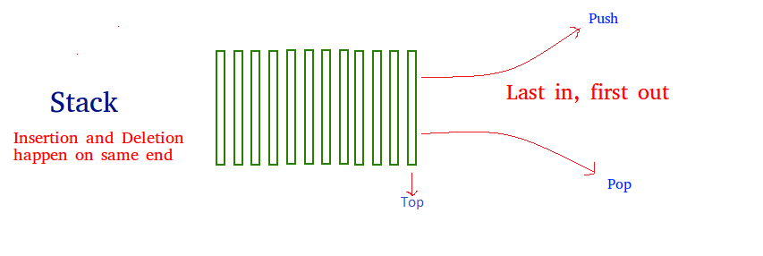

# Stack

## Summary
- Linear data structure.
- LIFO (last in first out).
- Accessing data is possible in one end.
- Operations are push and pop.

## Characteristics
- Implemented by an array or linked list.
- Elements inserted first will be popped last.
- If the space in a stack is full, any attempts to add more elements results in stack overflow.
