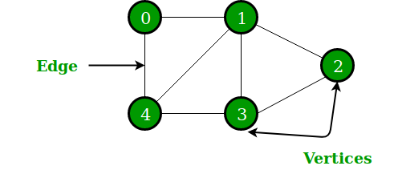
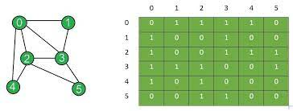
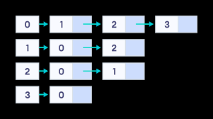

# :heavy_check_mark: Graph

## :round_pushpin: Summary
- Non-linear data structure.
- Consists of vertices (or nodes) and edges.
- Edges connect pairs of nodes.
  - Edges are ordered pairs of vertices `(u, v)`.
  - Ordered because `(u, v)` and `(v, u)` are different in directed graphs (di-graph).
  - Edges may have weight, value, or cost.
- Hierarchical.
- Arranged in a tree-like strcture.
- Top-most node is called the `root` node.

## :round_pushpin: Characteristics
- Max distance from a vertex to all other vertices is the `Eccentricity` of that vertex.
- Vertex with minimum eccentricity is considered the central point of the graph.
- The minimum value of `Eccentricity` is considered the radius of a connected graph.

## :round_pushpin: Representations
### Adjacency Matrix

- 2D array of size `V x V`, where `V` is the number of vertices in the graph.
- If the 2D array is `arr[][]`, `arr[i][j]` means that there is an edge from vertex `i` to vertex `j`.
- Undirected graph matrix is always symmetric.
- Can be used for weighted graphs: `arr[i][j] = w`, meaning edge from `i` to `j` with weight `w`.
- Advantages:
  - Easy to follow.
  - Removing edges is `O(1)`.
  - Queries for finding an edge is `O(1)`.
- Disadvantages:
  - Consumes more space `O(V^2)`.
  - Adding a vertex is `O(V^2)` time.
  - Computing neighbors of a vertex is `O(V)` time.

### Adjacency List

- Array of lists.
- Size of array is number of vertices.
- Let the array be `arr[]`.
- Entry `arr[i]` represents the list of vertices adjacent to the `i`th vertex.
  - Can be used to represent a weighted graph.
  - Weights of edges can be represented as a list of pairs.
- Advantages:
  - Saves space: `O(|V| + |E|)`.
  - Adding vertex is easier.
  - Computing all neighbors of a vertex is optimal.
- Disadvantages:
  - Determining if an edge exists is not efficient: `O(V)` time.
  - In real-life, graphs are sparse `|E| << |V|^2`.
    - Commonly used for storing graphs.
    - Matrix will enforce `|V|^2` bound on time complexity.
