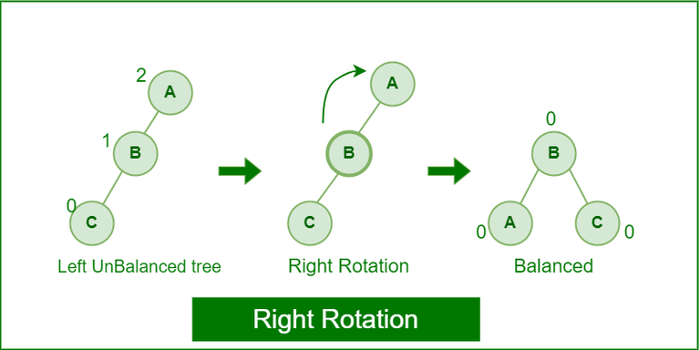

# :heavy_check_mark: AVL Tree
*Last Updated: 1/25/2023*

## :round_pushpin: Summary
- Self-balancing Binary Search Tree (BST).
- Difference between heights of left and right subtrees for any node cannot be more than one.

## :round_pushpin: Properties
### Left Rotation

- When node is added into the right subtree of the right subtree.
  - If tree is not balanced, do a left rotation.

### Right Rotation

- When node is added into the left subtree of the left subtree.
  - If tree is not balanced, do a right rotation.

### Left-Right Rotation

- First left rotation takes place after that right rotation executes.

### Right-Left Rotation

- First right rotation takes place after that left rotation executes.
