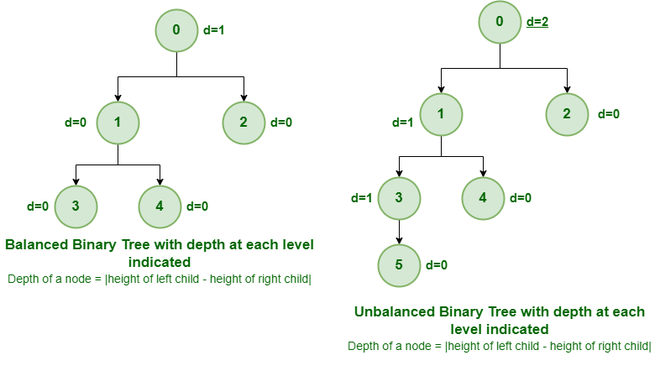

# :heavy_check_mark: Balanced Binary Tree
*Last Updated: 1/25/2023*

## :round_pushpin: Summary
- Balanced if height of tree is `O(log N)` where `N` is the number of nodes.
- Example:
  - AVL Trees maintain `O(log N)` height by making sure difference between heights of left and right subtrees is at most 1.
  - Red-Back Trees maintain height by making sure the number of black nodes on every root-to-leaf path is the same and that there are no adjacent red nodes.
- Balanced Binary Search Trees provide good performance search, insert, and delete.

## :round_pushpin: Properties
- Height of the left and right tree for any node does not differ by more than 1.
- The left subtree of that node is also balanced.
- The right subtree of that node is also balanced.
- Singly node is always balanced.
- Difference between heights of left and right subtree should be 0 or 1.
