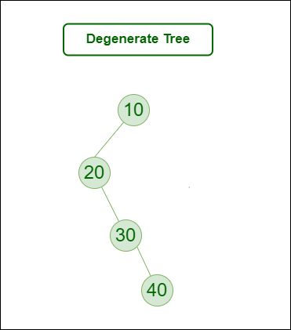

# :heavy_check_mark: Degenerate Binary Tree
*Last Updated: 1/25/2023*

## :round_pushpin: Summary
- Also known as pathological tree.
- Every internal node has one child.
- Same performance as linked list.
- A tree having a single child either left or right.
