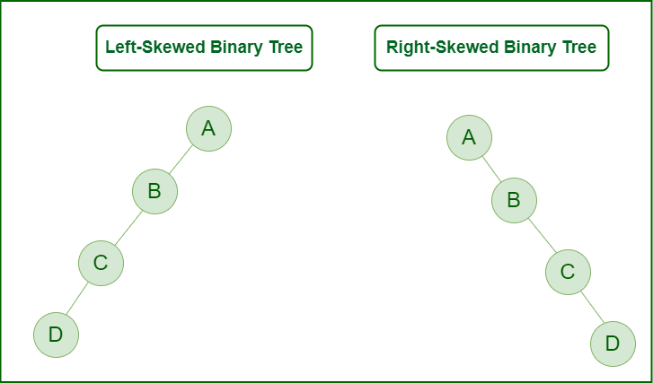

# :heavy_check_mark: Skewed Binary Tree
*Last Updated: 1/25/2023*

## :round_pushpin: Summary
- A pathological/degenerate tree in which the tree is either dominated by left nodes or right nodes.
- Two types:
  - Left-skewed binary tree.
  - Right-skewed binary tree.
