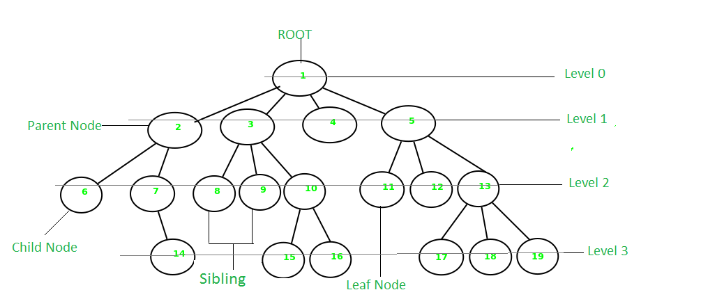
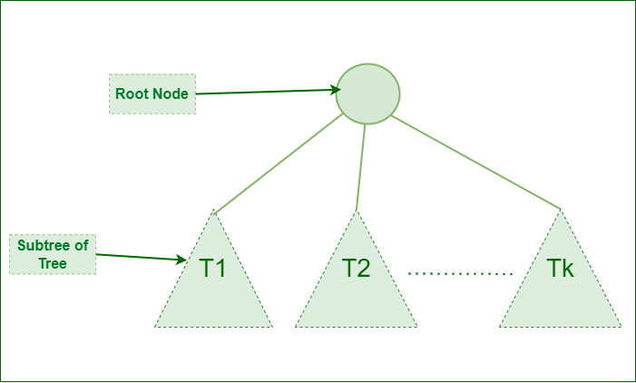

# :heavy_check_mark: Tree



## :round_pushpin: Summary
- Non-linear data structure.
  - Arranged in multiple levels.
- Hierarchical.
- Arranged in a tree-like structure.
- Top-most node is called the `root` node.
- Nodes are connected via edges.
- Nodes store a value and a reference to other nodes (children).

## :round_pushpin: Characteristics
- Also known as a recursive data structure.
  - Recursive definition: A tree consists of a root, and zero or more subtrees such that there is an edge from the root of the tree to the root of each subtree.

- The height is the longest path from the root node to a leaf node.
- The depth of a node is the distance from the root node to that node.

## :round_pushpin: Terminology
Reference all terminology with node, `n`.
- **Parent node:** Direct predecessor of `n`.
- **Child node:** Immediate successor of `n`.
- **Root node:** The top-most noe of a tree, or the node which does not have a parent node.
- **Edge:** Edge acts as a link between parent and child nodes.
- **Leaf node:** Nodes which do not have any child nodes.
- **Ancestor of a node:** Any predecessor node on the path of the root to that node, `n`, is an ancestor of `n`.
- **Descendant:** Any successor node on the path from leaf to that node, `n`, are descendants of `n`.
- **Sibling:** Children of the same parent.
- **Level of a node:** The count of edges on path from root to `n`. Root node has level 0.
  - Note: Some implementations/definitions define root node as level 1.
- **Internal node:** A node with at least one child.
- **Neighbor:** Parent and child nodes of `n` are neighbors.
- **Subtree:** Any node of the tree along with its descendants.

## :round_pushpin: Properties
- **Number of edges:** Connection between two nodes. If a tree has `N` nodes, it will have `N - 1` edges. There is only one path from each node to any other node of the tree.
- **Depth of a node:** Length of the path from the root to a node, `n`.
- **Height of a node:** Longest path from node, `n`, to a leaf node of the tree.
- **Height of a tree:** Longest path from root to a leaf node.
- **Degree of a node:** The total count of subtrees attached to a node, `n`, is called the degree of a node, `n`. Degree of a leaf node is 0. Degree of a tree is the max degree of a node among all nodes in the tree.

## :round_pushpin: Representation
- Basic `Node` representation of a tree:
```java
// TreeNode for a general tree.
class TreeNode {
  int data;
  ArrayList<TreeNode> children;

  TreeNode(int val) {
    data = val;
    children = new ArrayList<>();
  }
}
```

## :round_pushpin: Operations
- Create: Create a tree.
- Insert: Insert `TreeNode` into tree.
- Search: Search for a `TreeNode`.
- Traverse: Traverse tree.
  - Look at Traversals section.

## :round_pushpin: Traversals
- Depth First Search (DFS)
- Breadth First Search (BFS)

## :round_pushpin: Types
- **General Tree:** This page describes a general tree.
- **Binary Tree:** A node can have a maximum of two child nodes.
- **Balanced Tree:** Height of the left-subtree and right-subtree is equal or differs by at most 1.
- **Binary Search Tree (BST):** Used for searching and sorting algorithms. Values of left nodes are less than its parent. Values of right nodes are greater than its parent. Some implementations/definitions also include equality condition.
  - **AVL Tree**
  - **Red-Black Tree**
- **B-Tree**

## :round_pushpin: Applications
- **Spanning Tree:** Shortest path tree used in the routers to direct packets to destination.
- **Binary Search Tree:** Helps maintain sorted stream of data.
  - **Full Binary Tree**
  - **Complete Binary Tree**
  - **Skewed Binary Tree**
  - **Strictly Binary Tree**
  - **Extended Binary Tree**
- Storing hierarchical data
- **Syntax Tree**: Structure of program's source code.
- **Trie**: Fast and efficient way for dynamic spell checking.
- **Heap**: Can be represented in an array. Used to implement priority queues.

## :round_pushpin: Misc
- No loops (i.e. cycles).
- No self loop.
