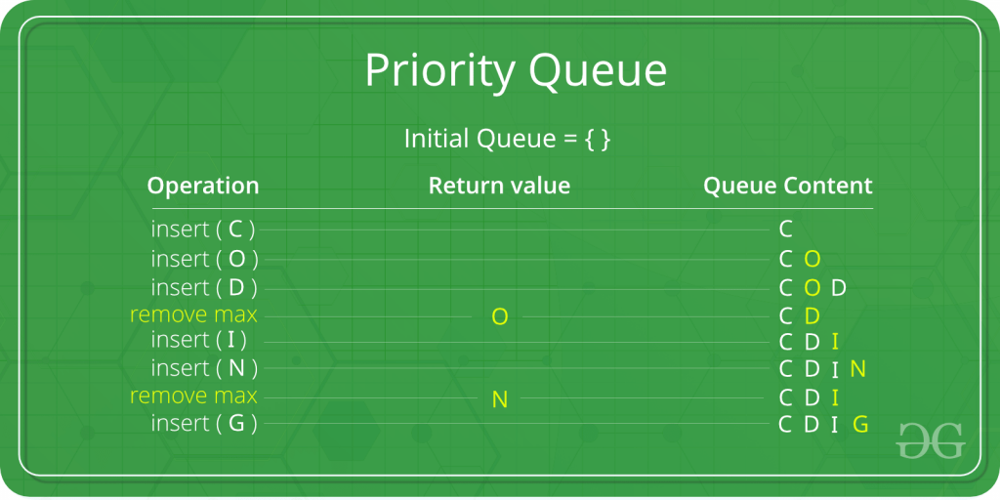

# :heavy_check_mark: Priority Queue
*Last Updated: 1/24/2023*

## :round_pushpin: Summary
- Type of queue that arranges elements based on their priority values.
- Higher priority retrieved before lower.
- Can implement with an array, linked list, heap, or binary search tree.

## :round_pushpin: Characteristics
- Priority Queue is an extension of the queue.

## :round_pushpin: Types
### Ascending Order Priority Queue
- Lower priority values are given higher priority.
- The root is the minimum element of the `min heap`.

### Descending Order Priority Queue
- Higher priority values are given higher priority.
- The root is the maximum element of the `max heap`.

## :round_pushpin: Operations
- `n` is the size of the priority queue.
### Offer
- Time Complexity: `O(log n)`.
  - Due to maintaining heap invariant.

### Poll
- Time Complexity: `O(log n)`.
  - Due to maintaining heap invariant.

### Peek
- Time Complexity: `O(1)`.
