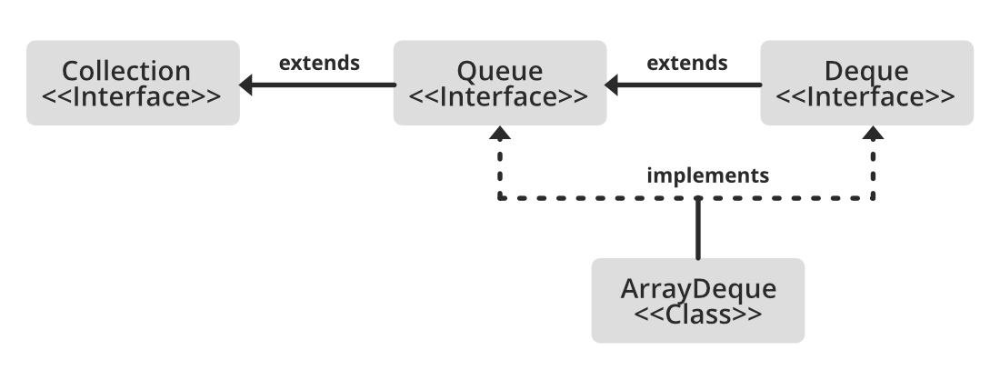

# :heavy_check_mark: Java ArrayDeque Class
*Last Updated: 1/24/2023*



## :round_pushpin: Summary
- Provides a way to apply resizable-array with implementation of the Deque interface.
- Also called `Array Double Ended Queue` or `Array Deck`.
- Grows and allows adding and removing on both ends.

## :round_pushpin: Characteristics
- No capacity limits.
- `null` elements prohibited.
- Faster than the `Stack` when used as a stack.
- Faster than `LinkedList` when used as a queue.
- Implements the `Queue` interface and `Deque` interface.

## :round_pushpin: Operations (API)
- [Documentation](https://docs.oracle.com/javase/7/docs/api/java/util/ArrayDeque.html)
- Common operations:
  - `add`
  - `addFirst`
  - `addLast`
  - `getFirst`
  - `getLast`
  - `removeFirst`
  - `removeLast`

## :round_pushpin: Examples
- Instantiate:
```java
Deque<Integer> deque = new ArrayDeque<>();
```

- Instantiate with collection, `c`:
```java
Deque<Integer> deque = new ArrayDeque<>(c);
```

- Instantiate with number of elements:
```java
Deque<Integer> deque = new ArrayDeque<>(3);
```

- Common operations:
```java
Deque<Integer> deque = new ArrayDeque<>();
deque.add(1); // [1]
deque.add(2); // [1, 2]
deque.add(3); // [1, 2, 3]
System.out.println(deque.getFirst()) // 1
deque.addFirst(-1); // [-1, 1, 2, 3]
deque.removeLast(); // [-1, 1, 2]
```
