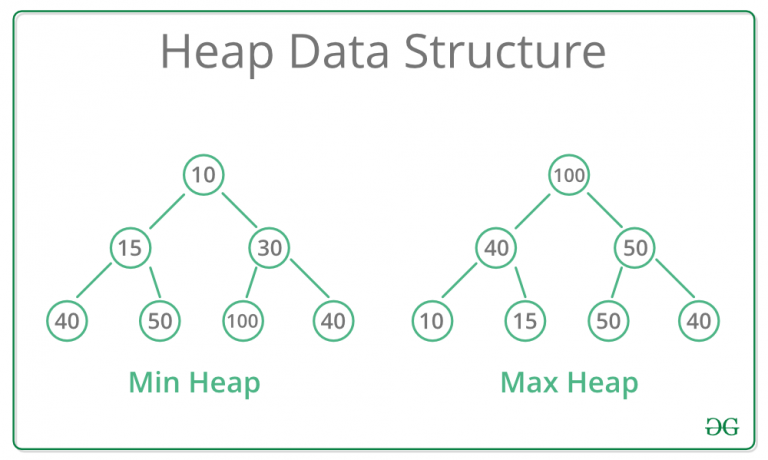

# :heavy_check_mark: Binary Heap
*Last Updated: 1/25/2023*

## :round_pushpin: Summary
- A heap is a Binary Tree.
- It's a Complete Binary Tree.
  - All levels filled except possibly the last level.
  - All keys are as far left as possible.
  - Suitable to store in an array.

## :round_pushpin: Types
- A Binary Heap is either a `Min Heap` or `Max Heap`.
  - In a Min Heap, the key at the root is the minimum value.
  - In a Max Heap, the key at the root is the maximum value.
  - Should recursively be true for all nodes in the tree.
- Binomial Heap
- Fibonacci Heap

## :round_pushpin: Operations
### Heapify
- Creating the heap from an array.

### Insertion
- Inserting node into the heap.
- Time: `O(log N)` where `N` is the number of nodes in the heap.

### Deletion
- Deleting the top element (min or max) of the heap.
- Time: `O(log N)` where `N` is the number of nodes in the heap.

### Peek
- Find the top-most node.
- Time: `O(1)`.

## :round_pushpin: Representation
- Usually represented as an array.
- Root is `arr[0]` where `arr` is the array.
- Assuming `i` represents the index/position of a node in the heap:
  - `arr[(i - 1) / 2]` returns the parent node.
  - `arr[(2 * i) + 1]` returns the left child node.
  - `arr[(2 * i) + 2]` returns the right child node.
- Traversal method is `level-order`.

## :round_pushpin: Applications
- Heap sort
- Priority Queue
- Graph algorithms:
  - Prim's Minimum Spanning Tree
  - Dijkstra's Shortest Path
