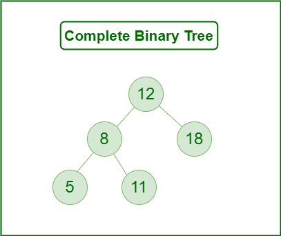

# :heavy_check_mark: Complete Binary Tree
*Last Updated: 1/25/2023*

## :round_pushpin: Summary
- All levels are completely filled except possibly the last level.
- The last level has all keys as left as possible.
- Like a Full Binary Tree but with few differences:
  1. Every level must be completely filled.
  2. All leaf elements must lean towards the left.
  3. The last leaf might not have a right sibling.
- A Complete Binary Tree does not have to be a Full Binary Tree.

## :round_pushpin: Properties
- Proper Binary Tree.
  - All leaves have the same depth.
- Number of nodes at depth, `d`, is 2d.
- The height of the tree with `N` nodes is `log(N + 1)`.
- All levels except the last level are completely full.
