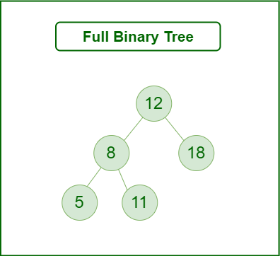

# :heavy_check_mark: Full Binary Tree
*Last Updated: 1/25/2023*

## :round_pushpin: Summary
- Every node has 0 or 2 children.
- All nodes except leaf nodes have two children.
- Also known as a proper binary tree.
