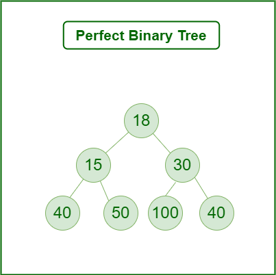

# :heavy_check_mark: Perfect Binary Tree
*Last Updated: 1/25/2023*

## :round_pushpin: Summary
- All internal nodes have two children.
- All leaf nodes are at the same level.
  - All leaf nodes are at the max depth of the tree.
- Tree completely filled with no gaps.

## :round_pushpin: Properties
- Number of leaf nodes is the number of internal nodes + 1.
  - `L = I + 1` where `L` is leaf nodes and `I` is internal nodes.
- A perfect binary tree of height `h` has 2h + 1 - 1 nodes.
- Has 2h leaf nodes.
