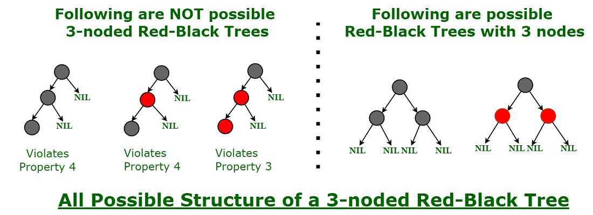

# :heavy_check_mark: Red-Black Tree
*Last Updated: 1/25/2023*

## :round_pushpin: Summary
- Self-balancing Binary Search Tree (BST).
- Each node has an extra bit.
  - Interpreted as the color (red or black).
  - Ensures tree is balanced during insertions and deletions.
- Maintains searching time to `O(log N)` where `N` is the total number of elements in the tree.

## :round_pushpin: Properties
- Every node has a color (either red or black).
- Root is always black.
- No two adjacent red nodes (red nodes cannot have red parent or red child).
- Every path from a node (including root) to any of its descendants has the same number of black nodes.
- Every leaf must be colored black.
- Black height is number of black nodes from root to leaf.
  - Leaf nodes are counted as black nodes.
  - Red-Black Tree of height `h` has `black height >= h / 2`.
- Height of tree with `n` nodes is h <= 2 log2(n + 1).

## :round_pushpin: Operations
- `N` is the total number of nodes in the tree.
### Search
- Time Complexity: `O(log N)`

### Insert
- Time Complexity: `O(log N)`

### Delete
- Time Complexity: `O(log N)`

## :round_pushpin: Balancing

- Chain of three nodes is not possible.
