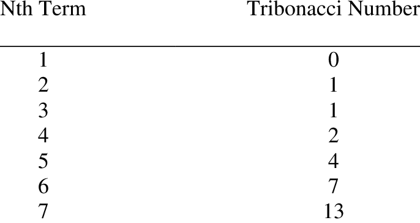

# :heavy_check_mark: 1137. :green_book: N-th Tribonacci Number
*Last Updated: 3/9/2023*



## :round_pushpin: Background
The `N-th Tribonacci Number` problem is a mathematical problem that involves finding the value of the Nth number in the Tribonacci sequence.

This is a variant of the well known `Fibonacci sequence`.

Here, each term is the sum of the three preceding terms, rather than the two preceding terms in the Fibonacci sequence.

So, the first few terms of the sequence are:

```
0, 1, 1, 2, 4, 7, 13, 24, 44, 81, 149, 274, ...
```

## :round_pushpin: Problem
Leetcode problem [reference](https://leetcode.com/problems/coin-change-ii/)

The Tribonacci sequence <code>T<sub>n</sub></code> is defined as follows:

<code>T<sub>0</sub> = 0</code>
<code>T<sub>1</sub> = 1</code>
<code>T<sub>2</sub> = 1</code>
<code>T<sub>n+3</sub> = T<sub>n</sub> + T<sub>n+1</sub> + T<sub>n+2</sub></code> for `n >= 0`

Given `n`, return the value of <code>T<sub>n</sub></code>.

## :round_pushpin: Examples
```
Input:        n = 4
Output:       4
Explanation:  T_3 = 0 + 1 + 1 = 2
              T_4 = 1 + 1 + 2 = 4
```

```
Input:        n = 25
Output:       1389537
```

## :round_pushpin: DP Characteristics For N-th Tribonacci Number
The brute force algorithm is very inefficient. So, we have to use `Dynamic Programming (DP)`.

The LCS problem has the properties of a DP problem:
1. **Optimal Substructure:** The problem can be broken down into smaller, simpler subproblems, which can, in turn, be broken down into simpler subproblems, and so on, until, finally the solution becomes trivial.
2. **Overlapping Subproblems:** The solutions to high-level subproblems often reuse solutions to lower level subproblems.

Subproblem solutions are `memoized` for faster access/calculations/reuse.

## :round_pushpin: N-th Tribonacci Number Properties
This problem is much like the regular `Fibonacci Sequence` problem.

We just keep track of the previous **three** numbers instead of the usual **two**.

This is pretty simple to implement using additional space (i.e. an auxiliary array that holds the previous values).

### Constant Space Implementation
There is also a constant space implementation.

Rather than using an auxiliary array, we can just keep track of the previous *three* numbers in temporary variables. Think of the pattern called Sliding Window. Here, we boot the number on the left side when sliding our window and include the number on the right side.

Basically, keep three temporary variables.

Here is the code:

```java
class Solution {
  public int tribonacci(int n) {
    if (n == 0) return 0;
    if (n == 1 || n == 2) return 1;

    int a = 0;
    int b = 1;
    int c = 1;

    for (int i = 3; i <= n; i++) {
      int d = a + b + c;
      a = b;
      b = c;
      c = d;
    }

    return c;
  }
}
```

## :round_pushpin: DP Table
Look at the example below:

```css
n = 8

      0   1   2   3   4   5   6    7    8
    +---+---+---+---+---+---+----+----+----+
    | 0 | 1 | 1 | 2 | 4 | 7 | 13 | 24 | 44 |
    +---+---+---+---+---+---+----+----+----+
```

Notice that each value after `i = 3` follows this pattern:

```java
dp[i] = dp[i - 1] + dp[i - 2] + dp[i - 3];
```

## :round_pushpin: Complexity Analysis
`N` is the input/number we are looking for.

Using auxiliary array:
Time Complexity: `O(N)`
Space Complexity: `O(N)`

Using temp variables:
Time Complexity: `O(N)`
Space Complexity: `O(1)`

## :round_pushpin: Variations
- Nth Pell Number.
- Nth Lucas Number.
- Nth Tetranacci Number.
- Tribonacci Matrix Exponentiation.

## :round_pushpin: Applications
Here are some applications in the real-world:
- Finance and investment.
- Population modeling.
- Biology and genetics.
- Cryptography.
- Game development.

## :round_pushpin: Supplemental Sources

1. [Geeksforgeeks](https://www.geeksforgeeks.org/tribonacci-numbers/)
2. [Topcoder](https://www.topcoder.com/thrive/articles/n-th-tribonacci-number)
3. [YouTube - Neetcode](https://www.youtube.com/watch?v=3lpNp5Ojvrw)
