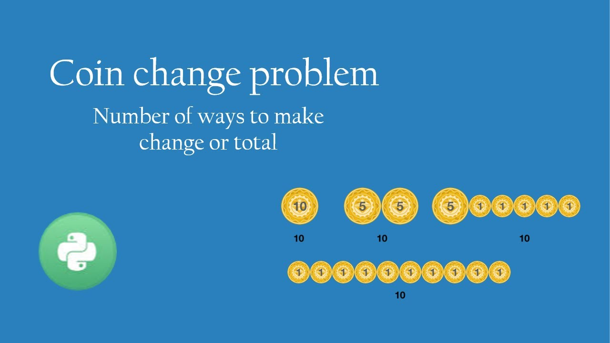

# :heavy_check_mark: 518. :orange_book: Coin Change II
*Last Updated: 3/8/2023*



## :round_pushpin: Background
The `Coin Change II` problem is a classic problem that is derived from the original `Coin Change` problem. The only difference is that we are looking for the *number of ways in we can make the amount*.

This problem also has some similarities to the `0/1 Knapsack Problem`.

## :round_pushpin: Problem
Leetcode problem [reference](https://leetcode.com/problems/coin-change-ii/)

You are given an integer array `coins` representing coins of different denominations and an integer `amount` representing a total amount of money.

Return *the number of combinations that make up that amount*. If that amount of money cannot be made up by any combination of the coins, return `0`.

You may assume that you have an infinite number of each kind of coin.

The answer is **guaranteed** to fit into a signed **32-bit** integer.

## :round_pushpin: Examples
```
Input:        amount = 5, coins = [1,2,5]
Output:       4
Explanation:  There are four ways to make up the amount:
              5=5
              5=2+2+1
              5=2+1+1+1
              5=1+1+1+1+1
```

```
Input:        amount = 3, coins = [2]
Output:       0
Explanation:  The amount of 3 cannot be made up just with coins of 2.
```

```
Input:        amount = 10, coins = [10]
Output:       1
```

## :round_pushpin: DP Characteristics For Coin Change II
The brute force algorithm is very inefficient. So, we have to use `Dynamic Programming (DP)`.

The LCS problem has the properties of a DP problem:
1. **Optimal Substructure:** The problem can be broken down into smaller, simpler subproblems, which can, in turn, be broken down into simpler subproblems, and so on, until, finally the solution becomes trivial.
2. **Overlapping Subproblems:** The solutions to high-level subproblems often reuse solutions to lower level subproblems.

Subproblem solutions are `memoized` for faster access/calculations/reuse.

## :round_pushpin: Coin Change II Properties
The thing to recognize here is the subproblems for this problem.

All coins should be considered one at a time, and we should consider all amounts up to the amount we need to find. These are basically the subproblems.

Basically, at every coin, we ask ourselves to make a choice:
1. Choose the coin.
2. Don't choose the coin.

If we decide to choose the coin, we have to subtract the current amount by the current chosen coin. We then check if this difference exists somewhere in our `dp` array (i.e. if we have seen this difference before).

If we decide **not** to choose the current coin, we just look at our previous calculation where we didn't even consider this coin in the first place. For example, if we are on coin `2` after coin `1` and choose *not* to consider `2`, we just look at how many ways we made the current amount using just coin `1`.

So, it comes down to making one of two choices above.

## :round_pushpin: DP Table
So, we need to record the subproblems inside a 2D array/table.

So, we have to understand the base case where we use **no coins**. When we use no coins, we can make the amount `0`. No matter how many coins we consider, if we choose to use *none* of the coins, we can *always* make the amount `0`.

When we are considering zero coins, we cannot make any amount `>= 1` for the same reason.

Otherwise, when we consider every other cell, we have to make those two choices mentioned in the previous section:
1. Choose to use the coin.
2. Choose **not** to use the coin.

When we choose to use the coin, we have to subtract the current amount by the coin, and see what the previously recorded answer for that is. We also have to consider the number of ways when we don't use it. So, we follow:

```java
dp[i][j] = dp[i - 1][j] + dp[i][j - coins[i]];
```

When we choose **not** to use the coin, we just consider the previously recorded answer when we never considered the current coin. So, we follow:

```java
dp[i][j] = dp[i - 1][j];
```

Look at the example below:

```css
coins = [1,2,5]
amount = 5

dp:
            0   1   2   3   4   5
          +---+---+---+---+---+---+
0 []      | 1 | 0 | 0 | 0 | 0 | 0 |
          +---+---+---+---+---+---+
1 [1]     | 1 | 1 | 1 | 1 | 1 | 1 |
          +---+---+---+---+---+---+
2 [1,2]   | 1 | 1 | 2 | 2 | 3 | 3 |
          +---+---+---+---+---+---+
3 [1,2,5] | 1 | 1 | 2 | 2 | 3 | 4 |
          +---+---+---+---+---+---+
```
Let's consider the cell `[2,4]` where the coin we are considering is `1` and `2` and the amount we are looking at currently is `4`. So, we know that we can use the coin because `coins[i] < j (amount)`.

So, we consider `dp[i - 1][j]` where we *don't* use the current coin. This is cell `[1,4]` which is `1`.

We also consider using it. So, we subtract the current coin from the amount which means the new amount is `2`. So, we consider cell `[2,2]` which is `2`.

We add `2` and `1` together to get `3`.

If we are on cell `[3,1]` where we need to make `1` using current coin `5`. Obviously, we **cannot** make `1` with the coin `5`. So, we choose *not* to use it. We just look at cell `[2,1]` which is `1`.

## :round_pushpin: Complexity Analysis
`N` is the number of coins in the `coins` array.
`k` is the amount we need to make.

Time Complexity: `O(kN)`
Space Complexity: `O(kN)`

## :round_pushpin: Variations
- Minimum number of coins.
- Limited number of coins.
- Maximum value of coins.
- Fractional coins.
- Non-infinite coins.
- Different types of coins.

## :round_pushpin: Applications
Here are some applications in the real-world:
- Currency exchange.
- Vending machines.
- Supermarkets.
- Finance.
- Gaming.

## :round_pushpin: Supplemental Sources

1. [YouTube - Neetcode](https://www.youtube.com/watch?v=Mjy4hd2xgrs)
2. [YouTube - TECH DOSE](https://www.youtube.com/watch?v=ruMqWViJ2_U)
3. [YouTube - Back To Back SWE](https://www.youtube.com/watch?v=DJ4a7cmjZY0&t=479s)
