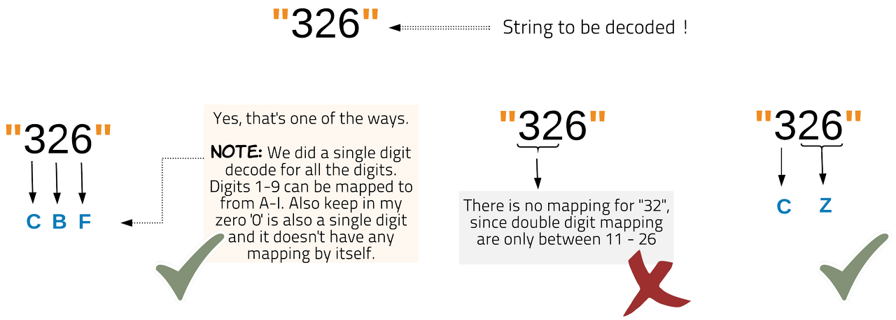

# :heavy_check_mark: 91. :orange_book: Decode Ways
*Last Updated: 3/10/2023*



## :round_pushpin: Background
This problem shares similarities with the `Climbing Stairs` problem where we *know* that since we are restricted to 1 or 2 steps (here is 1 or 2 digits), we can only arrive at the stair from `n - 2` and `n - 1`.

This problem has a large background in cryptography and information theory. The idea is that we are given a string where each character is a digit. We are given a mapping of alphabets to numbers (1-26), and we are tasked with finding the number of ways we can decode our string.

The general idea behind this problem is that we have to find ways to decode subproblems (substrings) and that will give us a way to find the answer for the overall string.

It's easy to get confused on finding the *min* and *max* letters that we can use to make up the decoded string. Here, we are looking for the *number* of ways.

There is a brute-force solution that has us recursively go down a decision tree at every character of our input. This is not optimal, and it is best to use Dynamic Programming (DP) in order to solve this problem.

There are a few edge cases to consider when we start this approach:
1. There are double digit numbers (this is the max number of digits allowed).
2. Numbers must fall in the range 1 -26.
3. Numbers **cannot** start with 0.

Keeping an eye on these edge cases will help us solve this problem. The base case is that a string with length of 1, will always return 1 way to decode the string.

## :round_pushpin: Problem
Leetcode problem [reference](https://leetcode.com/problems/decode-ways/)

A message containing letters from `A-Z` can be **encoded** into numbers using the following mapping:

```
'A' -> "1"
'B' -> "2"
...
'Z' -> "26"
```

To **decode** an encoded message, all the digits must be grouped then mapped back into letters using the reverse of the mapping above (there may be multiple ways). For example, `"11106"` can be mapped into:
- `"AAJF"` with the grouping `(1 1 10 6)`.
- `"KJF"` with the grouping `(11 10 6)`.

Note that the grouping `(1 11 06)` is invalid because `"06"` cannot be mapped into `'F'` since `"6"` is different from `"06"`.

Given a string `s` containing only digits, return *the **number** of ways to **decode** it*.

The test cases are generated so that the answer fits in a **32-bit** integer.

## :round_pushpin: Examples
```
Input:        s = "12"
Output:       2
Explanation:  "12" could be decoded as "AB" (1 2) or "L" (12).
```

```
Input:        s = "226"
Output:       3
Explanation:  "226" could be decoded as "BZ" (2 26). "VF" (22 6), or
              "BBF" (2 2 6).
```

```
Input:        s = "12"
Output:       2
Explanation:  "06" cannot be mapped to "F" because of the leading zero
              ("6" is different from "06").
```

## :round_pushpin: DP Characteristics For Decode Ways
The brute force algorithm is very inefficient. So, we have to use `Dynamic Programming (DP)`.

The LCS problem has the properties of a DP problem:
1. **Optimal Substructure:** The problem can be broken down into smaller, simpler subproblems, which can, in turn, be broken down into simpler subproblems, and so on, until, finally the solution becomes trivial.
2. **Overlapping Subproblems:** The solutions to high-level subproblems often reuse solutions to lower level subproblems.

Subproblem solutions are `memoized` for faster access/calculations/reuse.

## :round_pushpin: Decode Ways Properties
We notice that the substrings to the original string provides us with subproblems that we can use to get the answer to the original problem. We can basically build up from a substring of just 1.

The question is: "How do we get the **current** answer from a subanswer?". This is a difficult concept to grasp.

We know the base case is where a string is just 1 character long. This means there is only **one** way to decode this as it **only** maps to one character.

We also have to consider digits of length two. If the digit is length 2 and falls inside the range of the digits allowed, we need to consider this as well. Let's take an aside for a moment.

When we are at a digit, we consider using the digit **itself** or the **with** the digit **next** to it. Basically, we consider 1 digit and/or 2-digits. We say *or* because the two-digit value **might** be an invalid two-digit number.

So, we need to make two choices:
1. Include one-digit.
2. And/or include two-digits (if valid).

So, when we consider *just* the **one-digit** number, we know that the number of ways to decode *with* this digit is the **same** as decoding **without** it. Why? We can take the number of ways to decode the string *without* the current number and just append the current number to get the 5 ways.

When, we consider the **two-digit** number, we consider the substring *without* the two-digit number. We get the number of ways to decode this substring and just **append** the current two-digit number to get the number of ways.

This is why we add `n - 2` and `n - 1` to get the current number of ways.

<u>***Note:*** If this is confusing, watching video `5` for a great explanation on this.</u>

### Why Does This Work?
Consider the number `26`. If we consider just the `2`, there is only **one** way to decode this value. If we consider the two-digit number `26`, there is **two** ways to decode this (one from considering *only* the single digit and the other from two-digits).

So, each choice (one or two-digits) contributes to **one** way we can decode it.

This is why we can add the values of `n - 2` and `n - 1` to get `n`. There is only **one** way to decode `n - 1`, so we just take the ways to decode the substring up to `n - 1` and append the 1 digit. There is also only **one** way to decode `n - 2`, so we just take the ways to decode the substring up to `n - 2` and append the 2 digits.

For example:

```css
index:      0   1   2   3   4
          +---+---+---+---+---+
Input:    | 1 | 2 | 1 | 2 | 1 |
          +---+---+---+---+---+
Ways:     | 1 | 2 | 3 | 5 | 8 |
          +---+---+---+---+---+
```
Notice that each value after index 1, the way to get the value in the cell is to add values from `i - 1` and `i - 2`.

When we consider i = 4 and look at one-digit, `1`, we look at the substring up to `i - 1 = 3`. We **know** there is only **one** way to decode a single digit. So, we look at the substring `"1212"` and its number of ways to decode that and just append the 1 digit. The number of ways to decode `"12121"` when we only consider 1 digit is `5`.

When we consider two-digits, `21`, we look at the substring up to `i - 2 = 2`. We **know** there is only **one** way to decode a double digit (because we already considered one-digit, there is only one way left!). So, we look at the substring `"121"` and its ways to decode that, and we append `"21"` to all the ways.

So, the number of ways to decode the current index will be the addition of `i - 2` and `i - 1`.

***Note:*** Remember that we only consider two-digits if the two-digit number is valid!

## :round_pushpin: DP Table
```css
index:      0   1   2   3   4
          +---+---+---+---+---+
Input:    | 1 | 2 | 1 | 2 | 1 |
          +---+---+---+---+---+
Ways:     | 1 | 2 | 3 | 5 | 8 |
          +---+---+---+---+---+
```

So, if the one-digit and two-digits are valid:
```java
dp[i] = dp[i - 1] + dp[i - 2];
```

If the one-digit is only valid:
```java
dp[i] = dp[i - 1];
```

## :round_pushpin: Complexity Analysis
`N` is length of the input string.

Time Complexity: `O(N)`
Space Complexity: `O(N)`

***Note:*** There is also a constant space algorithm as well.

## :round_pushpin: Variations
These variations may be on Leetcode:
- Decode Ways II.
- Decode Ways III.
- Decode Ways IV.
- Decode Ways V.
- Decode Ways VI.
- Decode Ways VII.

## :round_pushpin: Applications
Here are some applications in the real-world:
- Digital communication.
- Barcode scanning.
- Medical imaging.
- Natural language processing.
- Genetics.

## :round_pushpin: Supplemental Sources

1. [YouTube - Neetcode](https://www.youtube.com/watch?v=6aEyTjOwlJU)
    - Good brief explanation.
2. [YouTube - Kevin Naughton Jr.](https://www.youtube.com/watch?v=cQX3yHS0cLo)
    - Does not explain *why*. Just implements.
3. [YouTube - Back To Back SWE](https://www.youtube.com/watch?v=YcJTyrG3bZs)
    - Explains recursive solution/decision tree method.
4. [YouTube - Knowledge Center](https://www.youtube.com/watch?v=o1i7JYWbwOE)
5. [YouTube - Knapsack](https://www.youtube.com/watch?v=W4rYz-kd-cY)
    - I think this is the best explanation. Every other YouTuber explanation does not explain it as concise.
