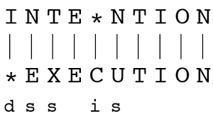
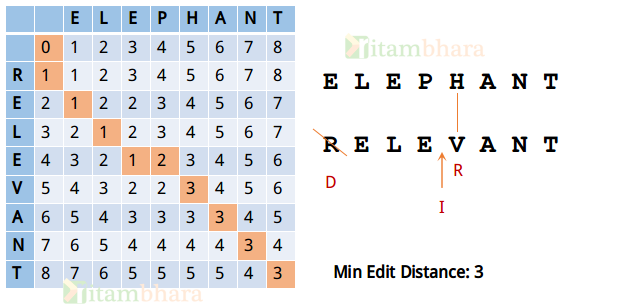

# :heavy_check_mark: :closed_book: 72. Edit Distance (Levenshtein Distance) (ED/LD)
*Last Updated: 3/3/2023*



## :round_pushpin: Background
The `Edit Distance` is a string metric that is measured by counting the minimum number of operations required to transform one string into the other.

There are different variations of Edit Distance. The one described here is the `Levenshtein Distance` which supports 3 operations:
1. Insertion
2. Deletion
3. Removal

This problem utilizes the substrings (sub-problems) of the original string to solve the original string. Basically, we use the cross section/substring of the index position and record these values in a 2D array.

## :round_pushpin: Problem
Leetcode problem [reference](https://leetcode.com/problems/edit-distance/)

Given two strings, `word1` and `word2`, return *the minimum number of operations required to convert `word1` to `word2`*.

You have the following three operations permitted on a word:
- `Insert` a character.
- `Delete` a character.
- `Replace` a character.

## :round_pushpin: Examples
```
Input:        word1 = "horse", word2 = "ros"
Output:       3
Explanation:  horse -> rorse (replace 'h' with 'r')
              rorse -> rose (remove 'r')
              rose -> ros (remove 'e')
```

```
Input:        word1 = "intention", word2 = "execution"
Output:       5
Explanation:  intention -> inention (remove 't')
              inention -> enention (replace 'i' with 'e')
              enention -> exention (replace 'n' with 'x')
              exention -> exection (replace 'n' with 'c')
              exection -> execution (insert 'u')
```

## :round_pushpin: DP Characteristics For Edit Distance
The brute force algorithm is very inefficient. So, we have to use `Dynamic Programming (DP)`.

The LCS problem has the properties of a DP problem:
1. **Optimal Substructure:** The problem can be broken down into smaller, simpler subproblems, which can, in turn, be broken down into simpler subproblems, and so on, until, finally the solution becomes trivial.
2. **Overlapping Subproblems:** The solutions to high-level subproblems often reuse solutions to lower level subproblems.

Subproblem solutions are `memoized` for faster access/calculations/reuse.

## :round_pushpin: Edit Distance (ED/LD) Properties
The ED of every string can be solved by the ED of the substrings of the original string.

Basically, at every character in the string, we have to perform 1 of 3 operations. Whether we *have* to perform these operations depends on the characters that are currently being compared.

When comparing characters from `word1` and `word2`, we compare character-by-character. Let's assume `i` is the pointer for `word1`, and `j` is the pointer for `word2`. At every character, we check if `word1.charAt(i) == word2.charAt(j)`. What we do next depends on whether these two characters are equal or not.

### Case 1: Equal Characters
When the characters are equal, we do not care about the operation on the current characters. We can just take the solution of the substring that does not contain these two characters.

For example, say we have `word1 = "abcd"` and `word2 = "bbbd"`, and we are comparing index 3 for both `i` and `j`.

The characters at this index is the same for both strings, being character `d`. So, we don't have to do anything. All we need to do is look at the Edit Distance of the word if these characters didn't exist or was not there. For example, `ed("abcd", "bbbd") = ed("abc", "bbb")`. At that point, we will know the minimum edit distance for `"abc"` and `"bbb"`. So, the minimum edit distance of `"abcd"` and `"bbbd"` is the same as that because we don't need to do any operation on equal characters.

### Case 2: Non-equal Characters
When characters are ***not*** equal, we have the three possible operations: (1) insert, (2) delete, and (3) replace. So, which operation do we do?

Say we have `word1 = "abcd"` and `word2 = "bbbd"`, and we are comparing index 2 for both `i` and `j`.

The characters at this index are *not* the same. We are comparing character `c` in `word1` to character `b` in `word2`. So, which operation do we do? Note that all operations are done on the ***first*** word. So, ask ourselves this:
1. If we were to replace `c` to `b`, what is the minimum edit distance of the substrings `"ab"` and `"bb"`. This is because, we are going to be replacing `c` to `b`, so we don't really care what `b` is. So the substring to compare are those removed. So, we cut off the ends of both strings and look at the substring without these characters.
2. If we were to decide to delete `c` from the first word, we need to look at the substring of `word1` that does not contain `c`. So, we consider the substring of `"ab"` and `"bbb"`. This is because our subproblem already figured out what the minimum distance is from `"ab"` to `"bbb"`. And this was already *without* the `c` that we are currently considering. So, if we want to change `"abc"` to `"bbb"` while trying to remove `c`, it's the same as changing from `"ab"` to `"bbb"`, which is why we take away the character from the first word.
3. If we were to decide to insert `b` into the first word to create `"bbb"`, we keep the original first word as is, but we take away the letter from the second word. So, we consider the substring from `"abc` to `"bb"`. This is because when we change `"abc"` to `"bb"`, we just need to insert `b` into the `"bb"` in order to get `"bbb"`. That is why we remove the letter from the second word because we will be inserting it anyways.

So, it is important to know *why* we look at the different substrings when considering inserting or deleting to get to our current cell.

Remember that we are always transforming *from* the first string *to* the second string.

***Explanation from ChatGPT:***
The intuition here is that the algorithm breaks the problem of finding the minimum number of operations required to transform one string into another into subproblems.

## :round_pushpin: DP Table
The picture here is just an example. See below for an in-depth explanation on different strings.


The explanation below is based off a custom example. We are transforming `"abcd"` to `"bbbd"`.

The solution is at the bottom right: `dp[4][4] = 2`
```css
i       0   1   2   3   4
      |   | a | b | c | d |
   ---+---+---+---+---+---+
0     | 0 | 1 | 2 | 3 | 4 |
1  b  | 1 | 1 | 1 | 2 | 3 |
2  b  | 2 | 2 | 1 | 2 | 3 |
3  b  | 3 | 3 | 2 | 2 | 3 |
4  d  | 4 | 4 | 3 | 3 | 2 |
```

### Case 1: Equal Characters
Let's consider the cell `[2,2]` which represents the subproblem where we convert `"ab"` to `"bb"`. So, `ED(ab, bb)`.

Notice that the last characters are equal. In this case, we consider the subproblem where both the last characters are removed. So, `ED(a, b)`. This is because `b` to `b` requires **no** operations to be performed on them. So, it's basically the same answer as if we *never* had the `b` at all.

This is why we look at the top-left cell where it is `dp[i - 1][j - 1]`. We just grab and copy this value into the current cell. So, we look at `[1,1]` and copy it into `[2,2]`.

### Case 2: Non-equal Characters
Let's consider the cell `[3,1]` which represents the subproblem where we convert `"a"` to `"bbb"`. So, `ED(a, bbb)`.

Notice that the end characters of both strings are *not* equal. They are `a` and `b`. So, we have 3 options:
1. We replace `a` to `b`. So, we have to see `ED("", bb)` which is at cell `[i - 1][j - 1]` which is `[2,0]`. The reason we do this is because after this transformation, the first word becomes `bb`. With the last letter attached, this will be `bba`. To get to `bbb` with replacement, we replace `a` with `b`. This is why we look at the top-left cell for replacement.
2. At `ED("a", "bbb")`, if we decide to insert the last letter of the second word `b` into the first word, we remove the last letter from the second string for now. For example, our subproblem would be `ED("a", "bb")`. We transform our first string into the `bb` string. **Then**, we add (insert) `b` into the first string. So, this is why we look at the **top** cell. The top cell ignores the last letter of the second word.
3. At `ED("a", "bbb")`, if we decide to delete the last letter of the first word, we consider the subproblem `ED("", "bbb")`. Once our first word gets transformed to `bbb`, the next letter `a` is attached to `bbb` to get `bbba` for the first string. We then remove the `a` from the first string and get `bbb` which is the answer. So, that's why we look at the **left** cell. The left cell ignores the character we want to remove for now. It puts the first string in a state to remove the character.

In conclusion:
1. The top cell represents insertion: `dp[i][j] = dp[i - 1][j]`
2. The left cell represents deletion: `dp[i][j] = dp[i][j - 1]`
3. The top-left cell represents replacement: `dp[i][j] = dp[i - 1][j - 1]`

To determine what we do:
1. If the characters are equal: `dp[i][j] = dp[i - 1][j - 1]`
2. If the characters are *not* equal, we can insert, delete, or replace. To determine *which* operation we do, we have to grab the minimum edit distance of the 3 and add 1 for the current cell's operation, So:
    - `dp[i][j] = Math.min(dp[i - 1][j - 1], dp[i][j - 1], dp[i - 1][j]) + 1`

### What About Determining Steps?
So, there are *many* ways to arrive at the result. Because of this, there are many ways to backtrack and get the operations we did.

We can backtrack from the bottom right of the array and go up until we reach the value of 0 and backtrack the way we came and keep track of the operation we did while doing so.

## :round_pushpin: Complexity Analysis
`M` and `N` are the lengths of both strings.

Time Complexity: `O(M * N)`
Space Complexity: `O(M * N)`

## :round_pushpin: Variations
The `Edit Distance` problem has different variations depending on the allowed string operations:

- Levenshtein Distance.
  - Removal, insertion, or deletion.
- Longest Common Subsequence (LCS).
  - Insertion and deletion.
  - See problem/explanation [here](./longest-common-subsequence.md).
- Hamming Distance.
  - Only substitutions with strings of *same* length.
- Damerau-Levenshtein Distance.
  - Insertion, deletion, substitution, and transposition of two adjacent characters.
- Jaro distance.
  - Only transposition.

## :round_pushpin: Applications
Here are some current applications that uses edit distance:
- Quantify similarity of DNA sequences.
- Hirschberg's Algorithm.
- Approximate String Matching.
- Levenshtein Automata.
- Spell Checking.
- Machine Translation.
- Plagiarism Detection.
- Speech Recognition.

## :round_pushpin: Supplemental Sources
1. [YouTube - Neetcode](https://www.youtube.com/watch?v=XYi2-LPrwm4)
2. [YouTube - Back to Back SWE](https://www.youtube.com/watch?v=MiqoA-yF-0M)
3. [YouTube - TECH DOSE](https://www.youtube.com/watch?v=AuYujVj646Q)
4. [YouTube - TECH DOSE](https://www.youtube.com/watch?v=5RlPzxWv9p4)
