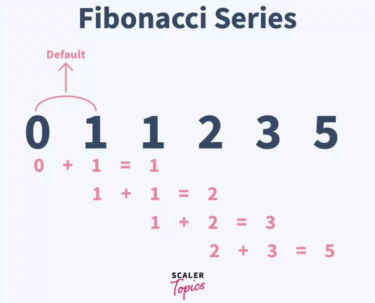

# :heavy_check_mark: :green_book: 509. Fibonacci Number
*Last Updated: 3/12/2023*



## :round_pushpin: Background
This problem is based off the well-known mathematical sequence where each number is the sum of the two preceding ones, starting from 0 and 1. The first few numbers of the sequence are shown in the image above.

This sequence has many interesting properties that appear in areas of mathematics and science, such as number theory, geometry, and even biology.

## :round_pushpin: Problem
Leetcode problem [reference](https://leetcode.com/problems/fibonacci-number/)

The **Fibonacci numbers**, commonly denoted `F(n)` form a sequence, called the **Fibonacci sequence**, such that each number is the sum of the two preceding ones, starting from `0` and `1`. That is,

```
F(0) = 0, F(1) = 1
F(n) = F(n - 1) + F(n - 2), for n > 1.
```

Given `n`, calculate `F(n)`.

## :round_pushpin: Examples
```
Input:        n = 2
Output:       1
Explanation:  F(2) = F(1) + F(0) = 1 + 0 = 1.
```

```
Input:        n = 3
Output:       2
Explanation:  F(3) = F(2) + F(1) = 1 + 1 = 2.
```

```
Input:        n = 4
Output:       3
Explanation:  F(4) = F(3) + F(2) = 2 + 1 = 3.
```

## :round_pushpin: DP Characteristics For Fibonacci Number
The brute force algorithm is very inefficient. So, we have to use `Dynamic Programming (DP)`.

The LCS problem has the properties of a DP problem:
1. **Optimal Substructure:** The problem can be broken down into smaller, simpler subproblems, which can, in turn, be broken down into simpler subproblems, and so on, until, finally the solution becomes trivial.
2. **Overlapping Subproblems:** The solutions to high-level subproblems often reuse solutions to lower level subproblems.

Subproblem solutions are `memoized` for faster access/calculations/reuse.

## :round_pushpin: Fibonacci Number Properties
So, notice that we have to add the *previous* two numbers to get the current number. The base case is when n is 0 and 1.

We can use this base case to initialize a starting point. We can use a dp table or constant space by keeping track of temporary variables (like a sliding window).

## :round_pushpin: DP Table
```css

index:    0   1   2   3   4   5   6
        +---+---+---+---+---+---+---+
dp:     | 0 | 1 | 1 | 2 | 3 | 5 | 8 |
        +---+---+---+---+---+---+---+
```

The index below represents `n` in our problem. The Fibonacci number at `n = 5` is `F(5) = F(4) + F(3) = 3 + 2 = 5`.

We follow this formula:
```java
dp[i] = dp[i - 1] + dp[i - 2];
```

## :round_pushpin: Complexity Analysis
`N` is the fibonacci number we are looking for.

Time Complexity: `O(N)`
Space Complexity: `O(N)`

We can also do this in constant space if we used temporary variables.

## :round_pushpin: Variations
- Find the sum of the first n Fibonacci numbers.
- Find the nth Lucas number.
- Find the number of ways to represent a number as a sum of Fibonacci numbers.
- Find the closest Fibonacci number to a given number.
- Find the last digit of the nth Fibonacci number.

## :round_pushpin: Applications
Here are some real-life applications:
- Financial modeling.
- Algorithm optimization.
- Plant growth.
- Computer graphics.
- Cryptography.

## :round_pushpin: Supplemental Sources
1. [YouTube - Neetcode](https://www.youtube.com/watch?v=dDokMfPpfu4)
2. [YouTube - Nick White](https://www.youtube.com/watch?v=WrWFfzt3ayc)
