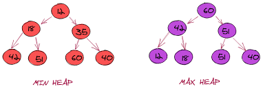
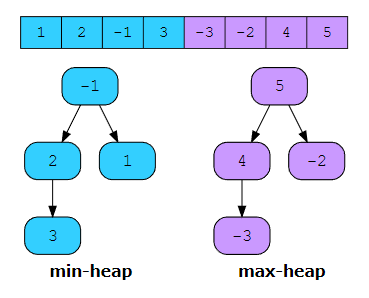

# :heavy_check_mark: Two Heaps
*Last Updated: 2/12/2023*

## :round_pushpin: Introduction
- The `Two Heaps` pattern uses either two `Min Heaps`, two `Max Heaps`, or one `Min Heap` and one `Max Heap` at the same time.
- Because we are dealing with heaps of size `n`:
  - Insertion takes: `O(log n)`
  - Deletion takes: `O(log n)`
  - Root access takes: `O(1)`
- The `Min Heap` stores the smallest element at the root while the `Max Heap` stores the largest element at the root.

## :round_pushpin: Requirements
- Some problems require splitting data into two parts where we have to find the smallest of one and the largest of the other.
- The image below shows how we can find the smallest and largest using two heaps.

- Recognizing patterns:
  - Problem matches pattern:
    - We need to repeatedly calculate two maximuma, two minima, or one maximum and one minimum.
    - The input data is *not* sorted.
  - Problem does **not** match pattern:
    - We do not need to track two extreme values, but only one.
    - We do not need to repeatedly calculate the extreme values.
    - Input data is already sorted, meaning there is no benefit to using heaps.

## :round_pushpin: Leetcode Problems 

- [x] 295. [Find Median from Data Stream (Hard)](https://leetcode.com/problems/find-median-from-data-stream/)
- [ ] 480. [Sliding Window Median (Hard)](https://leetcode.com/problems/sliding-window-median/)
- [ ] 502. [IPO (Hard)](https://leetcode.com/problems/ipo/)
- [ ] 621. [Task Scheduler (Medium)](https://leetcode.com/problems/task-scheduler/)

## :round_pushpin: Sources
*List to be updated...*
