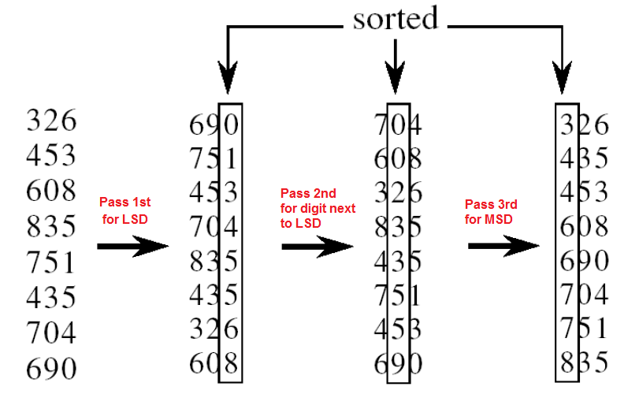

# :heavy_check_mark: Radix Sort
*Last Updated: 1/31/2023*



## :round_pushpin: TLDR
`d` is the number of digits, `n` is the size of the input, and `b` is the base.

**Time Complexity:** `O(d * (n + b))`

**Space Complexity:** `O(n + b)`

## :round_pushpin: Summary
- Only used to sort numbers.
- Sort from least significant to most significant digit.
- Lower bound on comparison-based sorting is $\Omega$(n log n).
  - This means they cannot do better than `n log n`.
- Counting sort is a linear time sorting algorithm `O(n + k)` time when elements are in range 1 to k.
- What if elements are in the range 1 to n<sup>2</sup>?
  - Using counting sort takes <code>O(N<sup>2</sup>)</code> time (worse than comparison based).
  - Use `Radix Sort` to sort in linear time.
- Use digit by digit sorting starting from the least significant digit to the most significant.
- Uses `Counting Sort` as a subroutine.
  - See Counting Sort [here](counting-sort.md).

## :round_pushpin: Explanation
- Do the following for each digit, `l`, where `l` varies from least to most significant digit.
- We will be sorting input array using counting sort according to the ith digit.

## :round_pushpin: Code
```java
/*
  Function that gets the max value in array.
*/
public int getMax(int[] arr, int n) {
  int mx = arr[0];
  for (int i = 1; i < n; i++) {
    if (arr[i] > mx) {
      mx = arr[i];
    }
  }
  return mx;
}

/*
  This is the Counting Sort function.
  Sorts by digit represented by exp.
*/
public void countingSort(int[] arr, int n, int exp) {
  // Output array.
  int[] output = new int[n];
  int i;
  // Base 10, so count only contains 0 - 9.
  int[] count = new int[10];
  // Fill count array with 0s.
  Arrays.fill(count, 0);

  // Store count of occurences in count array.
  for (i = 0; i < n; i++) {
    count[(arr[i] / exp) % 10]++;
  }

  // Running sum.
  for (i = 1; i < 10; i++) {
    count[i] += count[i - 1];
  }

  // Build the output array.
  for (i = n - 1; i >= 0; i--) {
    output[count[(arr[i] / exp) % 10] - 1] = arr[i];
    count[(arr[i] / exp) % 10]--;
  }

  // Copy output array to original array.
  for (i = 0; i < n; i++) {
    arr[i] = output[i];
  }
}

/*
  Main function that sorts the input array of size n.
  arr:    Input array.
  n:      Size of the array.
*/
public void radixSort(int[] arr, int n) {
  // Find the maximum number in the array to know how many digits is the max.
  int m = getMax(arr, n);

  // Perform Counting Sort for every digit.
  // Instead of passing digit, exp is passed.
  // The exp is 10^i where 'i' is the current digit number.
  // Basically, we are iterating through the digits count of the largest number.
  // The exponent increases by a factor of 10 each iteration.
  // The check condition is to divide the max number by the exponent for the digit.
  // If the digit turns out to 0, we ran out of digits to process and we can stop.
  for (int exp = 1; m / exp > 0; exp *= 10) {
    countingSort(arr, n, exp);
  }
}
```

## :round_pushpin: Advantages
- Linear time complexity.
- Stable.
- Efficient for sorting large numbers of integers or strings.
- Easily parallelized.

## :round_pushpin: Disadvantages
- Not efficient for sorting floating-point numbers or other types of data that are not easily mapped to small number of digits.
- Requires a lot of memory.
- Not efficient for small datasets.
- Requires data being sorted can be represented in a fixed number of digits.

## :round_pushpin: Analysis
Let there by `d` digits in input integers.

Radix Sort takes `O(d * (n + b))` time.
- `b` is the base for representing numbers (`b` in decimal system is 10).
- If `k` is the max possible value, `d` would be <code>O(log<sub>b</sub>(k))</code>.
- Overall time complexity is <code>O((n + b) * log<sub>b</sub>(k))</code>.
- Limit `k` to <code>k <= n<sup>c</sup></code> where `c` is a constant.
- Complexity becomes <code>O(n log<sub>b</sub>(n))</code>.
- Still doesn't beat comparison based, so make `b` larger?
- If we set `b` to `n`, the time complexity is `O(n)`.
- So we can sort an array of integers with a range from 1 to n<sup>c</sup> if numbers are represented in base `n` (or every digit takes <code>log<sub>2</sub>(n)</code> bits).

**Time Complexity:** `O(d * (n + b))`

**Space Complexity:** `O(n + b)`
