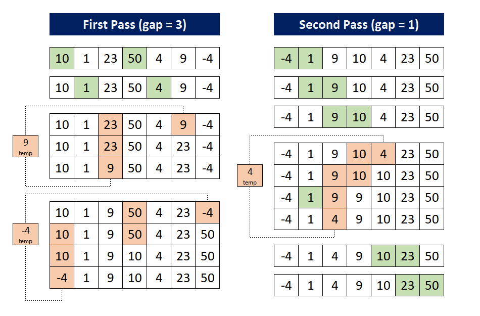

# :heavy_check_mark: Shell Sort
*Last Updated: 1/31/2023*



## :round_pushpin: TLDR
**Time Complexity [Worst]:** <code>O(N<sup>2</sup>)</code>
**Time Complexity [Best]:** <code>$\Omega$(N log N)</code>
**Time Complexity [Average]:** <code>$\Theta$(N<sup>5/4</sup>)</code> or <code>$\Theta$(N<sup>3/2</sup>)</code>

**Space Complexity:** `O(1)`

## :round_pushpin: Summary
- Not stable.
- In-place
- Mainly a variation of `Insertion Sort`.
- In `Insertion Sort`, we move elements one position ahead.
  - Many movements can be involved if they need to be move far.
- Shell Sort allows exchange of far items.
  - Compare elements at a distance apart rather than adjacent elements.
  - Reduce this gap by 2 until it reaches 1.
- Make the array h-sorted for large values of `h`.
  - We can also say `gap`.
- Reduce `h` until it becomes 1.
- An array is said to be h-sorted if all sublists of every `h`th element are sorted.

## :round_pushpin: Explanation
Basically, using Insertion Sort with a gap on each iteration.
On each iteration, reduce the gap in half until 1.

Algorithm:
1. Start
2. Initialize value of gap size. Example: `h`.
3. Divide the list into smaller sub-parts. Each must have equal intervals to `h`.
4. Sort these sub-lists using Insertion Sort.
5. Repeat from step 2 until list is sorted.

## :round_pushpin: Code
```java
/*
  Main function using Shell Sort to sort input array.
*/
public void shellSort(int[] arr) {
  int n = arr.length;

  // Start with a big gap (half the length of original array).
  for (int gap = n / 2; gap > 0; gap /= 2) {
    // Do a gapped insertion sort for this gap size.
    // We are placing the 'i' far right so that we don't go out of bounds.
    // We look at 'i' and 'i - gap'.
    // Keep iterating until 'i' reaches end of array. This will account for all gaps of this gap size.
    for (int i = gap; i < n; i++) {
      // Grab the current 'i' value to compare with previous values that are 'gap' lengths apart.
      int temp = arr[i];

      // Swap the current 'i' value down gap-lengths until it's in the correct spot.
      int j;
      // Conditions are that the 'j' pointer can compare with a previous value that is 'gap' distance to the left.
      // If there is enough room for a gap, we compare the temp with the value gap distance apart.
      for (j = i; j >= gap && arr[j - gap] > temp; j -= gap) {
        // If the value that appears before (left value) is greater than temp. Swap them.
        arr[j] = arr[j - gap];
      }

      // The 'j' pointer will point to the correct spot for temp (original arr[i] value).
      arr[j] = temp;
    }
  }
}
```

## :round_pushpin: Shell Sort vs. Heap Sort
- Heap Sort surpasses Shell Sort in efficiency as we approach 2000 elements to be sorted.

## :round_pushpin: Analysis
**Time Complexity [Worst]:** <code>O(N<sup>2</sup>)</code>
**Time Complexity [Best]:** <code>$\Omega$(N log N)</code>
**Time Complexity [Average]:** <code>$\Theta$(N log N)</code>

**Space Complexity:** `O(1)`
