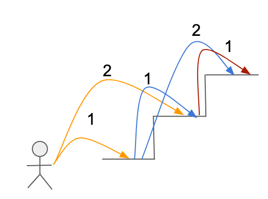

# :heavy_check_mark: 70. Climbing Stairs
*Last Updated: 3/3/2023*



## :round_pushpin: Background
This is a classic algorithm that asks how many distinct ways there are to climb a given number of stairs. You can climb 1 or 2 steps at a time.

This can be solved using Dynamic Programming (DP) or recursion (though inefficient).

## :round_pushpin: Problem
Leetcode problem [reference](https://leetcode.com/problems/climbing-stairs/)

You are climbing a staircase. It takes `n` steps to reach the top.

Each time you can either climb `1` or `2` steps. In how many distinct ways can you climb to the top?

## :round_pushpin: Examples
```
Input:        n = 2
Output:       2
Explanation:  There are two ways to climb to the top.
              1. 1 step + 1 step
              2. 2 steps
```

```
Input:        n = 3
Output:       3
Explanation:  There are three ways to climb to the top.
              1. 1 step + 1 step + 1 step
              2. 1 step + 2 steps
              3. 2 steps + 1 step
```

## :round_pushpin: DP Characteristics For Climbing Stairs
The brute force algorithm is very inefficient. So, we have to use `Dynamic Programming (DP)`.

The LCS problem has the properties of a DP problem:
1. **Optimal Substructure:** The problem can be broken down into smaller, simpler subproblems, which can, in turn, be broken down into simpler subproblems, and so on, until, finally the solution becomes trivial.
2. **Overlapping Subproblems:** The solutions to high-level subproblems often reuse solutions to lower level subproblems.

Subproblem solutions are `memoized` for faster access/calculations/reuse.

## :round_pushpin: Climbing Stairs Properties
The intuition behind using DP to solve this problem is that the number of ways to climb `n` stairs can be calculated by adding together the number of ways to climb `n - 1` stairs and `n - 2` stairs.

This is because you can reach the `n`th stair by climbing 1 step from the `n - 1`th stair *or* by climbing 2 steps from the `n - 2`th stair.

See the picture below to see the recursive tree. Notice that we are calling the same functions multiple times. Perhaps we can record this value?


***Explanation from ChatGPT:***

## :round_pushpin: DP Table
The Dynamic Programming (DP) table for the climbing stairs algorithm is the same for every problem. However, depending on the number of stairs `N` we are to find, it may be shorter or longer than the array depicted below.

```css
index   0   1   2   3   4   5  ...
      +---+---+---+---+---+---+---+
      | 0 | 1 | 2 | 3 | 5 | 8 |...
      +---+---+---+---+---+---+---+
```

The base case at `n = 0` and `n = 1` and `n = 2` will always be `0`, `1`, and `2` respectively. From here, the further values at `i = n` will add values from `i = n - 1` and `i = n - 2`.

### Why Do We Add The Last Two Numbers?
So, the question arises: why do we add the last two numbers? What is the significance behind these last two numbers that we have to add them together for?

Background:

Suppose we want to climb `n` stairs. We can take one of two approaches to get there:
1. Start at the `n - 1`th stair and climb **one** additional stair to reach the `n`th stair.
2. Start at the `n - 2`th stair and climb **two** additional stairs to reach the `n`th stair.

We can only climb 1 or 2 stairs at a time, so this is the *only* way to reach the `n`th stair.

Now, let's assume that we know the number of distinct ways to climb `n - 1` stairs and `n - 2` stairs. To find the distinct ways to climb `n` stairs, we need to add those two numbers together.

Here's why:

1. If there are `X` distinct ways to climb `n - 1` stairs, then we can take any one of those `X` ways and climb **one** additional stair to reach the `n`th stair. This gives us `X` distinct ways to climb `n` stairs starting from the `n - 1`th stair.
2. If there are `Y` distinct ways to climb `n - 2` stairs, then we can take any one of those `Y` ways and climb **two** additional stairs to reach the `n`th stair. This gives us `Y` distinct ways to climb `n` stairs starting from the `n - 2`th stair.

There are no other ways to climb `n` stairs other than these two. So, the total number of distinct ways to climb `n` stairs is `X + Y`.

Here's a visual example:

```css
n | 1 |   2   |     3     |       4       |
--+---+-------+-----------+---------------+
  | 1 | 1 + 1 | 1 + 1 + 1 | 1 + 1 + 1 + 1 |
  |   | 2     | 2 + 1     | 2 + 1 + 1     |
  |   |       | 1 + 2     | 1 + 2 + 1     |
  |   |       |           | 1 + 1 + 2     |
  |   |       |           | 2 + 2         |
```

When `n = 4`, we have to look at `n = 3` and `n = 2`.
1. At `n = 2`, we need to take 2 steps to reach `n = 4`. So, we just add `2` to all the steps in `n = 2` and place that in 4. This is a total of 2 distinct ways.
2. At `n = 3`, we need to take 1 step to reach `n = 4`. So, we just add `1` to all the steps in `n = 3` and place that in 4. This is a total of 3 distinct ways.

The sums are all shown in `n = 4`. Total is `2 + 3 = 5` total number of distinct ways to climb `n = 4` stairs.

## :round_pushpin: Complexity Analysis
`N` is the number of steps/stairs.

Time Complexity: `O(N)`
Space Complexity: `O(N)`

## :round_pushpin: Variations
- Generalized Climbing Stairs.
- Min Cost Climbing Stairs.
- Distinct Steps Climbing Stairs.
- Staircase Problem.
- Weighted Climbing Stairs.

## :round_pushpin: Applications
Climbing Stairs is not really an algorithm that is used for various applications. However, there are many problems that follow this same algorithm (like Fibonacci).

## :round_pushpin: Sources
2. [YouTube - Neetcode](https://www.youtube.com/watch?v=Y0lT9Fck7qI)
3. [YouTube - Back to Back SWE](https://www.youtube.com/watch?v=NFJ3m9a1oJQ)
4. [YouTube - Kevin Naughton Jr.](https://www.youtube.com/watch?v=uHAToNgAPaM)
5. [Geeksforgeeks](https://www.geeksforgeeks.org/count-ways-reach-nth-stair/)
