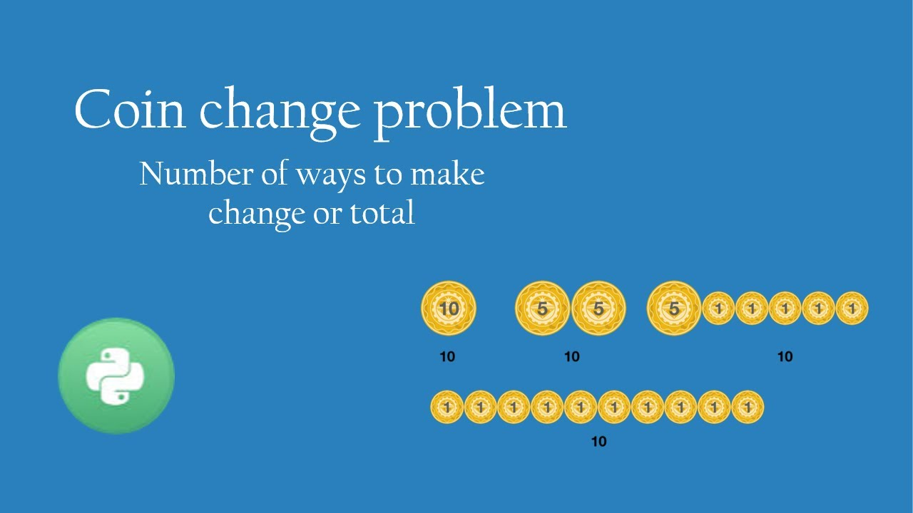

# :heavy_check_mark: 518. :orange_book: Coin Change II
*Last Updated: 3/8/2023*



## :round_pushpin: Background
The `Coin Change II` problem is a classic problem that is derived from the original `Coin Change` problem. The only difference is that we are looking for the *number of ways in we can make the amount*.

## :round_pushpin: Problem
Leetcode problem [reference](https://leetcode.com/problems/coin-change-ii/)

## :round_pushpin: Examples
```
```

```
```

```
```

## :round_pushpin: DP Characteristics For Coin Change II
The brute force algorithm is very inefficient. So, we have to use `Dynamic Programming (DP)`.

The LCS problem has the properties of a DP problem:
1. **Optimal Substructure:** The problem can be broken down into smaller, simpler subproblems, which can, in turn, be broken down into simpler subproblems, and so on, until, finally the solution becomes trivial.
2. **Overlapping Subproblems:** The solutions to high-level subproblems often reuse solutions to lower level subproblems.

Subproblem solutions are `memoized` for faster access/calculations/reuse.

## :round_pushpin: Coin Change II Properties

## :round_pushpin: DP Table

```css
coins = [1,2,5]
amount = 11

       0   1   2   3   4   5   6   7   8   9   10  11
     +---+---+---+---+---+---+---+---+---+---+---+---+
dp   | 0 | 1 | 1 | 2 | 2 | 1 | 2 | 2 | 3 | 3 | 2 | 3 |
     +---+---+---+---+---+---+---+---+---+---+---+---+
```

## :round_pushpin: Complexity Analysis
`N` is the number of coins in the `coins` array.
`k` is the amount we need to make.

Time Complexity: `O(kN)`
Space Complexity: `O(kN)`

## :round_pushpin: Variations

## :round_pushpin: Applications
Here are some applications in the real-world:

## :round_pushpin: Supplemental Sources

1. [YouTube - Neetcode](https://www.youtube.com/watch?v=rWAJCfYYOvM)
2. [YouTube - Kevin Naughton Jr.](https://www.youtube.com/watch?v=1R0_7HqNaW0)
3. [YouTube - TECH DOSE](https://www.youtube.com/watch?v=ZI17bgz07EE)
4. [YouTube - Back To Back SWE](https://www.youtube.com/watch?v=jgiZlGzXMBw&t=687s)
5. [YouTube - Tushar Roy](https://www.youtube.com/watch?v=Y0ZqKpToTic)
