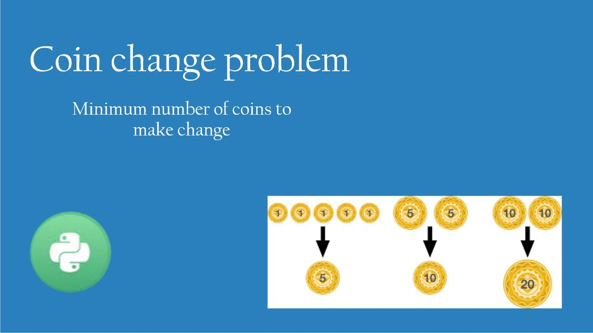

# :heavy_check_mark: 322. :orange_book: Coin Change
*Last Updated: 3/7/2023*



## :round_pushpin: Background
The `Coin Change` problem is a classic problem.

This problem involves finding the minimum number of coins required to make certain amount of change, given a set of of available coin denominations.

This problem seems very intuitive at first because the general way people go about it is the greedy approach. This approach is basically taking the largest denomination and keep using the largest until we get down to 0. For example, if we have denominations of `[1,3,4,5]`, and we are looking for the minimum coins to make change of `7`, one may be inclined to use one `5` and two `1`s. This makes 3 coins. However, the actual answer is one `4` and one `3` which gives us 2 coins.

So, the greedy approach is *not* the right approach. Instead, we must use the Dynamic Programming (DP) approach.

## :round_pushpin: Problem
Leetcode problem [reference](https://leetcode.com/problems/coin-change/)

You are given an integer array `coins` representing coins of different denominations and an integer `amount` representing a total amount of money.

Return *the fewest number of coins that you need to make up that amount*. If that amount of money cannot be made up by any combination of the coins, return `-1`.

You may assume that you have an infinite number of each kind of coin.

## :round_pushpin: Examples
```
Input:        coins = [1,2,5], amount = 11
Output:       3
Explanation:  11 = 5 + 5 + 1
```

```
Input:        coins = [2], amount = 3
Output:       -1
Explanation:  We do not have enough coins.
```

```
Input:        coins = [1], amount = 0
Output:       0
Explanation:  The amount of 0 means we just don't use any coins.
```

## :round_pushpin: DP Characteristics For Coin Change
The brute force algorithm is very inefficient. So, we have to use `Dynamic Programming (DP)`.

The LCS problem has the properties of a DP problem:
1. **Optimal Substructure:** The problem can be broken down into smaller, simpler subproblems, which can, in turn, be broken down into simpler subproblems, and so on, until, finally the solution becomes trivial.
2. **Overlapping Subproblems:** The solutions to high-level subproblems often reuse solutions to lower level subproblems.

Subproblem solutions are `memoized` for faster access/calculations/reuse.

## :round_pushpin: Coin Change Properties
It is apparent that the greedy approach will not work. So, we must look at the Dynamic Programming (DP) approach.

Let's see if we can find the subproblem property.

Basically, if we have an amount we want to reach, we can break our problem down by using the denominations given. We can subtract the amount we need by the denominations we have and look up what we need.

Every cell in our `dp` array will have values that represent the minimum number of coins needed to make change equal to `n` where `n` is anything between `0` and `n`.

So, if we iterate from `0` to `n` and subtract the denominations from the current iteration value, we can get what we need by accessing previous cells in the `dp` array.

Basically, the first value in our `dp` array is the base case where the amount `0` can be made with 0 coins. Also, the denominations in the `coins` array also have the values of 1 because it just takes one of the denominations to make *that* amount.

## :round_pushpin: DP Table
Our `dp` array will be a 1D array with the length equal to the amount we are looking for + 1. This is because we need to make room for the 0th amount *and* the amount `n`.

Here is an example:
```css
coins = [1,2,5]
amount = 11

       0   1   2   3   4   5   6   7   8   9   10  11
     +---+---+---+---+---+---+---+---+---+---+---+---+
dp   | 0 | 1 | 1 | 2 | 2 | 1 | 2 | 2 | 3 | 3 | 2 | 3 |
     +---+---+---+---+---+---+---+---+---+---+---+---+
```
The general idea is that every cell `dp[i]`, where `0 >= i <= n`, represents the minimum amount of coins needed to represent that index value.

To determine this value in the cell, we need to look at the index value and the coin denominations. We subtract all coin denominations *from* the index value and add 1. We get the minimum most value from all of these and place it in the cell. We use:

```
dp[i] = dp[i - coins[c]] + 1

coins[c]:   the current coin.
c:          is the index into the coins array.
i:          index into the dp array.
dp:         the dynamic programming array.
```

So, for every cell, we subtract the current coin from the index value. We search that value in our `dp` array and add 1 to it. We only use the value if it is *smaller* than the one currently in the `dp` array.

We do this for every coin in the `coins` array.

## :round_pushpin: Complexity Analysis
`N` is the number of coins in the `coins` array.
`k` is the amount we need to make.

Time Complexity: `O(kN)`
Space Complexity: `O(k)`

## :round_pushpin: Variations
- Unbounded coin change problem.
- Minimum coin change problem.
- Restricted coin change problem.
- Subset sum problem.
- Variation with arbitrary weights.

## :round_pushpin: Applications
Here are some applications in the real-world:
- Vending machines.
- Retail transactions.
- Banking and finance.
- Transportation systems.
- Gaming and gambling.

## :round_pushpin: Supplemental Sources

1. [YouTube - Neetcode](https://www.youtube.com/watch?v=rWAJCfYYOvM)
2. [YouTube - Kevin Naughton Jr.](https://www.youtube.com/watch?v=1R0_7HqNaW0)
3. [YouTube - TECH DOSE](https://www.youtube.com/watch?v=ZI17bgz07EE)
4. [YouTube - Back To Back SWE](https://www.youtube.com/watch?v=jgiZlGzXMBw&t=687s)
5. [YouTube - Tushar Roy](https://www.youtube.com/watch?v=Y0ZqKpToTic)
