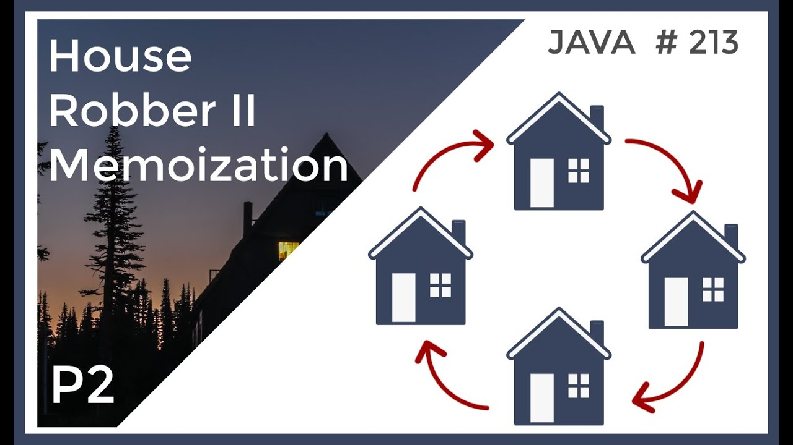

# :heavy_check_mark: 213. :orange_book: House Robber II
*Last Updated: 3/7/2023*



## :round_pushpin: Background
The `House Robber II` problem is a Dynamic Programming (DP) problem that involves a robber trying to maximize the amount of money they can steal from some houses.

This is an extension of the *original* `House Robber` problem. Check that problem out [here](house-robber.md).

Basically, the houses in *this* problem are arranged in a **circular** order. This means the first *and* last houses are adjacent to each other. If we choose to rob the first house, we cannot rob the second house, and vice versa.

So, the problem here is to figure out whether we robbed the first house or not in order to even consider the last house.

## :round_pushpin: Problem
Leetcode problem [reference](https://leetcode.com/problems/house-robber-ii/)

You are a professional robber planning to rob houses along a street. Each house has a certain amount of money stashed. All houses are this place are **arranged in a circle**. That means the first house is the neighbor of the last one. Meanwhile, adjacent houses have security systems connected and **it will automatically contact the police if two adjacent houses were broken into on the same night**.

Given an integer array `nums` representing the amount of money of each house, return *the maximum amount of money you can rob tonight **without alerting the police***.

## :round_pushpin: Examples
```
Input:        nums = [2,3,2]
Output:       3
Explanation:  You cannot rob house 1 (money = 2) and then rob house 3
              (money = 2), because they are adjacent houses.
```

```
Input:        nums = [1,2,3,1]
Output:       4
Explanation:  Rob house 1 (money = 1) and then rob house 3 (money =
              3). Total amount you can rob = 1 + 3 = 4.
```

## :round_pushpin: DP Characteristics For House Robber II
The brute force algorithm is very inefficient. So, we have to use `Dynamic Programming (DP)`.

The LCS problem has the properties of a DP problem:
1. **Optimal Substructure:** The problem can be broken down into smaller, simpler subproblems, which can, in turn, be broken down into simpler subproblems, and so on, until, finally the solution becomes trivial.
2. **Overlapping Subproblems:** The solutions to high-level subproblems often reuse solutions to lower level subproblems.

Subproblem solutions are `memoized` for faster access/calculations/reuse.

## :round_pushpin: House Robber II Properties
***Note:*** The properties in this problem are the same as that of the original problem. The only modification is is that we must consider the first and last house being chosen or not.

So, we have to understand the restriction that we *cannot* rob adjacent houses. We also can only steal from one house at a time.

So, we must consider two cases for each house:
1. The robber **does not** steal from the current house. In this case, the robber will move on to the next house and try to steal from it. Since the robber cannot steal from two adjacent houses, we do not have to worry about the next house behind adjacent to the current house.
2. The robber steals from the current house. In this case, the robber will skip the next house and move on to the house after that to try to steal from it. Again, we don't have to worry about the next house being adjacent to the current house since the robber is skipping the next house.

To explain it in simpler terms:

We start by figuring out the max amount of money the robber can steal from the first house in the row. Then, we move on to the second house and figure out the max money the robber can steal from the first two houses. We continue this until we reach the end.

At each house, we have two choices:
1. Skip the current house. Here, the robber skips the current house to move to the next house. In which case, the max amount of money they can steal at the **current** house is the same as the max of the **previous** house.
2. Rob the current house. Here, the max money they can steal from the current house is the amount of money in the current house **plus** the max amount of money from two houses back (because they cannot be adjacent).

Basically, in `scenario 1`, we are setting up the current house value for the next iteration (house) because we decided **not** to rob the current house (in case this is confusing).

### Circular Property
So, what is the difference between this problem and the original? We must consider whether we choose the first house or not.

1. If we chose to consider the first house, we must **not** consider the last house.
2. If we chose **not** to consider the first house, we are able to consider the last house.

Basically, we will have two passes while creating/filling out our `dp` array. We make our first pass from `0 -> n - 1`. We make our second pass from `1 -> n`. We take the values from **both**, and we return the **maximum** value of the two. This represents the maximum money we can get from robbing the houses in the circle.

## :round_pushpin: DP Table
The Dynamic Programming (DP) table for this problem uses a 1D array that records the max amount we can rob at any given house. So, the idea is to record these values in this table. The right-most value will hold the max amount of money we can rob in the row of houses.

We will make two passes on the original array and fill the values in.

The idea is, that at every cell, we follow the two conditions in the previous section. We take the max of scenario 1 and 2 and use that to place in the current cell in our `dp` array.

```java
dp[i] = Math.max(dp[i - 1], dp[i - 2] + nums[i]);
```

Here is an example:
```css
       0   1   2    3    4    5    6    7    8    9    10
     +---+---+----+----+----+----+----+----+----+----+----+
nums | 2 | 3 |  9 | 10 |  1 |  2 | 11 |  7 |  4 |  8 |  1 |
     +---+---+----+----+----+----+----+----+----+----+----+

pass 1: 0 -> n - 1

       0   1   2    3    4    5    6    7    8    9
     +---+---+----+----+----+----+----+----+----+----+
dp   | 2 | 3 | 11 | 13 | 13 | 15 | 24 | 24 | 28 | 32 |
     +---+---+----+----+----+----+----+----+----+----+

pass 2: 1 -> n

       0   1   2    3    4    5    6    7    8    9
     +---+---+----+----+----+----+----+----+----+----+
dp   | 3 | 9 | 13 | 13 | 15 | 24 | 24 | 24 | 32 | 32 |
     +---+---+----+----+----+----+----+----+----+----+

The max of the two is 32.
```

Basically, we consider the first house and *not* the last house. We also consider the last house and *not* the first house.

At every cell, we either **rob it** or **leave it**. If we chose to leave it alone, we just take the value to the *left* of the current cell and place it into the current cell. We are essentially setting up for the next house we *may* or *may not* rob.

If we rob it, we see what is more worth:
1. Start robbing from this house.
2. Or, continue robbing from the previous houses (at least two away).

Also, we must notice the base cases. The first two houses will always equal the value (amount of money) at those two houses. This is because we start from these two, and they cannot be adjacent.

## :round_pushpin: Complexity Analysis
`N` is the number of houses in the row.

Time Complexity: `O(N)`
Space Complexity: `O(N)`

## :round_pushpin: Variations
- House Robber problem with non-circular arrangement.
- House Robber problem with k houses.
- House Robber problem with varying loot values.
- House Robber problem with skipping a fixed number of houses.
- House Robber problem with multiple robbers.

## :round_pushpin: Applications
Here are some applications in the real-world:
- Financial Planning.
- Resource Allocation.
- Game Theory.
- Inventory Management.
- Scheduling.

## :round_pushpin: Supplemental Sources

1. [YouTube - Neetcode](https://www.youtube.com/watch?v=rWAJCfYYOvM)
