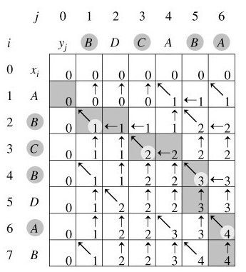

# :heavy_check_mark: 1143. Longest Common Subsequence (LCS)
*Last Updated: 3/1/2023*


## :round_pushpin: Problem
Leetcode problem [reference](https://leetcode.com/problems/longest-common-subsequence/)

We are given two strings `text1` and `text2`. Return *the length of their longest **common subsequence***.
If there is no **common subsequence**, return `0`.

## :round_pushpin: Examples
```
Input:        text1 = "abcde", text2 = "ace"
Output:       3
Explanation:  The longest common subsequence is "ace" of length 3.
```

```
Input:        text1 = "abc", text2 = "abc"
Output:       3
Explanation:  The longest common subsequence is "abc" of length 3.
```

```
Input:        text1 = "abc", text2 = "def"
Output:       0
Explanation:  There is no LCS.
```

## :round_pushpin: Subsequence vs Substring
A **`subsequence`** of a string is a new string generated from the original string with some characters (or none) deleted without changing the relative order of the remaining characters.

- `ace` is a subsequence of `abcde`.

A **`common subsequence`** of two strings is a subsequence that is common to both strings.

A **`substring`** of a string is a contiguous subset of a string that is not disjointed or separated.

- `abcd` is a substring of `abcde`.

Notice that the substring of a string are all connected and directly adjacent to one another.

## :round_pushpin: DP Characteristics For LCS
The brute force algorithm is very inefficient. So, we have to use `Dynamic Programming (DP)`.

The LCS problem has the properties of a DP problem:
1. **Optimal Substructure:** The problem can be broken down into smaller, simpler subproblems, which can, in turn, be broken down into simpler subproblems, and so on, until, finally the solution becomes trivial.
2. **Overlapping Subproblems:** The solutions to high-level subproblems often reuse solutions to lower level subproblems.

Subproblem solutions are `memoized` for faster access/calculations/reuse.

## :round_pushpin: LCS Properties
Let `LCS(X, Y)` be a function that computes a longest subsequence common to `X` and `Y`. It has two properties:

**First Property:** `LCS(X ^ A, Y ^ A) = LCS(X, Y) ^ A` for all strings `X` and `Y` and all symbols `A`, where `^` denotes string concatenation. This lets us simplify the LCS calculation for two subsequences ending in the **same** symbol.

For example:
- `LCS("BANANA", "ATANA") = LCS("BANAN", "ATAN") ^ "A"`.
- Basically, `LCS("BANANA","ATANA") = LCS("BAN","AT")^"ANA"`.

**Second Property:** If `A` and `B` are NOT the same, then `LCS(X ^ A, Y ^ B)` is one of the max length strings in the set `{ LCS(X ^ A, Y), LCS(X, Y ^ B) }` for all strings `X` and `Y`.

For example:
- `LCS("ABCDEFG", "BCDGK")` is the longest string among `LCS("ABCDEFG", "BCDG")` and `LCS("ABCDEF", "BCDGK")`.
- If both happened to be of equal length, one of them can be chosen arbitrarily.

Distinguish 2 cases:
1. If `LCS("ABCDEFG", "BCDGK")` ends with a `G`, then the final `K` cannot be in the LCS. Therefore, `LCS("ABCDEFG", "BCDGK") = LCS("ABCDEFG", "BCDG")`.
2. If `LCS("ABCDEFG", "BCDGK")` does not end with a `G`, then the final `G` cannot be in the LCS. Therefore, `LCS("ABCDEFG", "BCDGK") = LCS("ABCDEF", "BCDGK")`.

***Explanation from ChatGPT:***
The intuition is that if the current characters are not equal, then we have two options: either we include the current character in the LCS or we don't.

1. If we include the current character, then we need to find the LCS of the shorter prefixes of the two sequences that exclude the current character (i.e., the prefixes represented by the top and left cells).
2. If we don't include the current character, then we need to find the LCS of the longer prefixes of the two sequences that exclude the current character.

The maximum of the LCS values for these two options gives us the LCS of the current prefixes.

## :round_pushpin: DP Table
The first row and first column will contain all `0`s because an empty string will not have an LCS with any other string. This is kind of like a base case. Below is an example of a DP table for two sample strings:



We start at cell `[1,1]` where it represents the first two letters of our string. Every other cell represents the substring of the string up to that index. For example, in the image above, at cell `[5,3]`, this represents the following function: `LCS("ABCDBD", "BDC")`.

The bottom-right cell represents `LCS("ABCBDAB", "BDCABA")` which is the problem we are trying to solve. Notice that this answer relies on the answers of the previous cells.

### What About The Letters?
If we want to find out the letters that make up the LCS, we can just travel backwards.

Steps:
1. Start from the bottom-right.
2. Check the cell above, to the left, and to the top-left.
3. If the top and left cells are equal and the current cell is equal to both, we can go top or left.
4. If the top and left cells differ. Go to the cell (top or left) that is of greater value between the two. The current cell should be equal to the one we decide to move to.
5. If the top-left is ever 1 less than the current cell, we move to the top-left.

Notice that in some moves, we can go either left or right. This is fine. We can choose any direction. However, we may end up getting different letters because that make up the same LCS. In the image above, it shows `BCBA` as the LCS, but it can also be `BDAB`.

## :round_pushpin: Complexity Analysis
`M` and `N` are the lengths of both strings.

Time Complexity: `O(M * N)`
Space Complexity: `O(M * N)`

## :round_pushpin: Applications
Here are some current applications that uses the LCS algorithm:
- Version Control.
  - Comparison of two revisions of a file (think code diffs).
  - Revision control systems like Git.
- DNA Sequencing.
- Plagiarism Detection.
- Image Analysis.
- Spell Checking.
- Natural Language Processing.

## :round_pushpin: Sources
1. [YouTube - Abdul Bari](https://www.youtube.com/watch?v=sSno9rV8Rhg&t=915s)
2. [YouTube - Neetcode](https://www.youtube.com/watch?v=Ua0GhsJSlWM)
3. [YouTube - Back to Back SWE](https://www.youtube.com/watch?v=ASoaQq66foQ&t=1s)
4. [YouTube - TECH DOSE](https://www.youtube.com/watch?v=LAKWWDX3sGw)
5. [YouTube - Tushar Roy](https://www.youtube.com/watch?v=NnD96abizww)
6. [Wikipedia](https://en.wikipedia.org/wiki/Longest_common_subsequence#Second_property)
7. [Programiz](https://www.programiz.com/dsa/longest-common-subsequence)
8. [Geeksforgeeks](https://www.geeksforgeeks.org/longest-common-subsequence-dp-4/)
