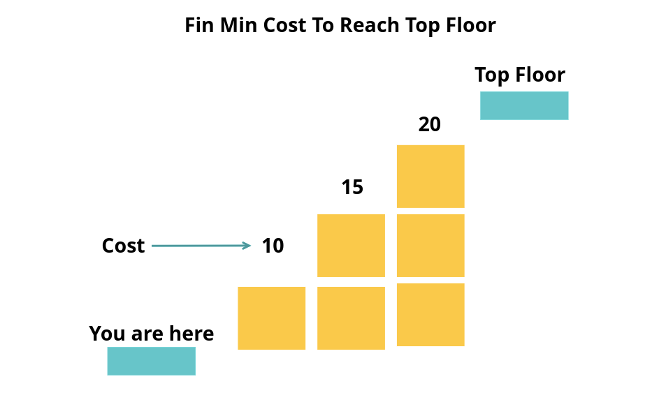

# :heavy_check_mark: 746. :green_book: Min Cost Climbing Stairs
*Last Updated: 3/4/2023*



## :round_pushpin: Background
The minimum cost climbing stairs problem is a Dynamic Programming (DP) problem that asks us to  find the minimum cost to climb a set of stairs. It is a variation of the classic `Climbing Stairs` problem explained [here](climbing-stairs.md).

Basically, we want to climb as many steps with the least cost to get *past* the top stair. We can think of every index, `i`, in the `cost` array as the cost required to take a step from this stair `i + 1`. We are using `0-index` based array for the cost. So, when `i == 0`, this represents the cost of taking a step *out* of the first step.

Each step is either 1 or 2 steps.

There is a recursive solution, but like the `Climbing Stairs` problem, it is very inefficient because it calculates values we have already calculated in the recursion tree.

## :round_pushpin: Problem
Leetcode problem [reference](https://leetcode.com/problems/min-cost-climbing-stairs/)

You are given an integer array `cost` where `cost[i]` is the cost of the `i`th step on a staircase. Once you pay the cost, you can either climb one or two steps.

You can either start from the step with index `0`, or the step with index `1`.

Return *the minimum cost to reach the top of the floor*.

## :round_pushpin: Examples
```
Input:        cost = [10,15,20]
Output:       15
Explanation:  You will start at index 1.
              - Pay 15 and climb two steps to reach the top.
              The total cost is 15.
```

```
Input:        cost = [1,100,1,1,1,100,1,1,100,1]
Output:       6
Explanation:  You will start at index 0.
              - Pay 1 and climb two steps to reach index 2.
              - Pay 1 and climb two steps to reach index 4.
              - Pay 1 and climb two steps to reach index 6.
              - Pay 1 and climb one step to reach index 7.
              - Pay 1 and climb two steps to reach index 9.
              - Pay 1 and climb one step to reach the top.
              The total cost is 6.
```

## :round_pushpin: DP Characteristics For Min Cost Climbing Stairs
The brute force algorithm is very inefficient. So, we have to use `Dynamic Programming (DP)`.

The LCS problem has the properties of a DP problem:
1. **Optimal Substructure:** The problem can be broken down into smaller, simpler subproblems, which can, in turn, be broken down into simpler subproblems, and so on, until, finally the solution becomes trivial.
2. **Overlapping Subproblems:** The solutions to high-level subproblems often reuse solutions to lower level subproblems.

Subproblem solutions are `memoized` for faster access/calculations/reuse.

## :round_pushpin: Min Cost Climbing Stairs Properties
To understand the Dynamic Programming approach, we must understand what is going on.

We know that we can start at the stair at index `0` or `1` because the problem says so. So, there are *two* base cases. At the first and second stairs, the cost will be `0`.

***However***, we must understand *when* we calculate the cost. We are trying to find the cost *after* it passes a certain stair, **not** when it arrives.

For example, if we have a `cost` array:

```
cost = [10,15,20]
```
The index `0` (value is `10`) represents the cost to go *past* the first stair (stair 1). We can start at cost `0` and `1`, which correlates to stairs 1 and 2. The problem asks us what the cost is to go **past** stair 3 (index `2` of `cost`).

So, we have two different paths:
1. Stair 1 -> Stair 2 -> Stair 3 -> past (10 + 15 + 20).
2. Stair 1 -> Stair 3 -> past (10 + 20).
3. Stair 2 -> Stair 3 -> past (15 + 20).
4. Stair 2 -> past (15).

Like the original `Climbing Stairs` problem, we look at the previous two stairs because that is the only way we can climb to the top most stair.
1. From the `n - 2`th stair, we consider the cost to get to that stair and the cost to *pass* that stair (because we can take two steps to the top with the cost).
2. From the `n - 1`th stair, we consider the cost to get to that stair and the cost to *pass* that stair (because we can take one step to the top with the cost).

We take the two values and compare them. Whichever is the minimum is what we will choose as the cost to go past the `n`th stair. We repeat this process until we reach the top-most stair. The number of stairs is equal to the number of costs.

See below for the DP table.

***Explanation from ChatGPT:***

## :round_pushpin: DP Table
The Dynamic Programming (DP) table for the min cost climbing stairs algorithm is the same as the classic climbing stairs. However, the criteria we must consider in getting a new value is different.

```css
index    0    1    2    3   4  ...
      +----+----+----+----+---+---
cost  | 10 | 15 | 20 | 35 | 7 |...
      +----+----+----+----+---+---

The table below represents the cost to pass the stair.
The index 0 represents stair 1.

index   0   1   2    3    4    5   ...
      +---+---+----+----+----+----+---+
dp    | 0 | 0 | 10 | 15 | 30 | 37 |...
      +---+---+----+----+----+----+---+
```

Notice that in the `dp` table, we have the value `0` for both the first and second cells in the table. These cells represent the stairs. Because we can start at *any* one of the first two stairs, they are *free* to start from. So, the cost to ***land*** on these stairs is `0`.

So, say we want to *land* on stair 3 (index `2` of the `dp` table). So, how do we arrive at this stair? Because we can only take 1 or 2 steps, we can only arrive here from stairs `1` (index 0) and `2` (index 1) because stair 1 is two steps away and stair 2 is 1 step away.

So, *which* stair do we step from? 1 or 2?

We take a look at the cost of moving *from* step 1 and add that to the cost it took to *land* on 1. This value is `landOnStair(0) + costToPassStair(0)`. In this case, it is `0 + 10`.

We take a look at the cost of moving *from* step 2 and add that to the cost it took to *land* on 2. This value is `landOnStair(1) + costToPassStair(1)`. In this case, it is `0 + 15`.

So, it costs `10` to move from stair 1 and **land** on stair 3. It costs `15` to move from stair 2 and **land** on stair 3. Which seems to be the better choice? It is obviously the former. So, we store `10` into `dp[2]` which represents the cost it takes to **LAND** on stair 3.

So, using this pattern, we can get the cost to *land* on the top-most stair. This correlates to `dp[4]` which means the cost it takes to *land* on stair 5. However, we want the cost to **PASS** stair 5. So, we get the value to the right at `dp[5]` or `dp[dp.length - 1]`. This is why we need to create a `dp` array that is `1 + cost.length`.

### Why Do We Add The Last Two Numbers?
***Note:*** This explanation is taken from the class `Climbing Stairs` problem because the same logic applies in *why* we choose the last two stairs.

So, the question arises: why do we add the last two numbers? What is the significance behind these last two numbers that we have to add them together for?

Background:

Suppose we want to climb `n` stairs. We can take one of two approaches to get there:
1. Start at the `n - 1`th stair and climb **one** additional stair to reach the `n`th stair.
2. Start at the `n - 2`th stair and climb **two** additional stairs to reach the `n`th stair.

We can only climb 1 or 2 stairs at a time, so this is the *only* way to reach the `n`th stair.

## :round_pushpin: Complexity Analysis
`N` is the number of steps/stairs/cost array.

Time Complexity: `O(N)`
Space Complexity: `O(N)`

## :round_pushpin: Variations
- Min Cost Climbing Stairs With Variable Step Sizes.
- Minimum Jumps To Reach End.
- Minimum Energy To Climb Stairs.
- Minimum Cost Climbing Stairs With Limited Number Of Steps.
- Minimum Cost Climbing Stairs With Restriction On Consecutive Steps.

## :round_pushpin: Applications
Here are some applications in the real-world:
- Resource allocation.
- Supply Chain Optimization.
- Finance.
- Transportation.
- Energy Management.

## :round_pushpin: Sources
2. [YouTube - Neetcode](https://www.youtube.com/watch?v=ktmzAZWkEZ0)
3. [YouTube - Nick White](https://www.youtube.com/watch?v=OoGswqFU-zs)
