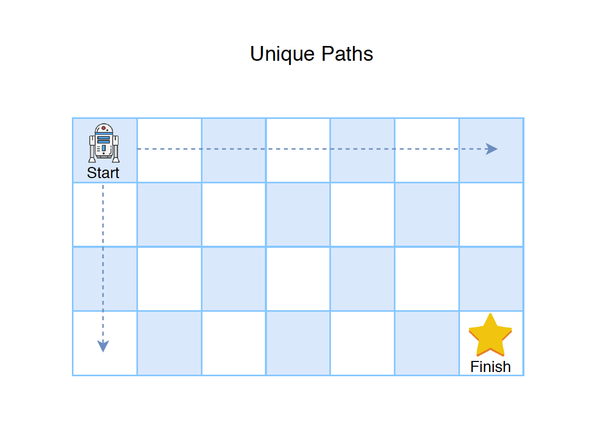

# :heavy_check_mark: 62. :orange_book: Unique Paths
*Last Updated: 3/6/2023*



## :round_pushpin: Background
The unique paths problem is a classic Dynamic Programming (DP) problem. This involves finding the number of unique paths in a grid from the top-left to the bottom-right corner.

You can only move right or down at each step.

## :round_pushpin: Problem
Leetcode problem [reference](https://leetcode.com/problems/unique-paths/)

There is a robot on an `m x n` grid. The robot is initially located at the **top-left corner** (i.e. `grid[0][0]`). The robot tries to move to the **bottom-right corner** (i.e. `grid[m - 1][n - 1]`). The robot can only move either down or right at any point in time.

Given the two integers `m` and `n`, return *the number of possible unique paths that the robot can take to reach the bottom-right corner*.

The test cases are generated so that the answer will be less than or equal to <code>2 * 10<sup>9</sup></code>.

## :round_pushpin: Examples
```
Input:        m = 3, n = 7
Output:       28
```

```
Input:        m = 3, n = 2
Output:       3
Explanation:  From the top-left corner, there are a total of 3
              ways to reach the bottom-right corner.
              1. Right -> Down -> Down.
              2. Down -> Down -> Right.
              3. Down -> Right -> Down.
```

## :round_pushpin: DP Characteristics For Unique Paths
The brute force algorithm is very inefficient. So, we have to use `Dynamic Programming (DP)`.

The LCS problem has the properties of a DP problem:
1. **Optimal Substructure:** The problem can be broken down into smaller, simpler subproblems, which can, in turn, be broken down into simpler subproblems, and so on, until, finally the solution becomes trivial.
2. **Overlapping Subproblems:** The solutions to high-level subproblems often reuse solutions to lower level subproblems.

Subproblem solutions are `memoized` for faster access/calculations/reuse.

## :round_pushpin: Unique Paths Properties
When dealing with unique paths, a brute-force idea is to traverse *every* possible path possible with only right and down movements.

However, it will soon become obvious that this approach is not realistic, and it will take too long to complete.

There are a few important things to note:
1. Every cell comes from another cell (unless it is the origin).
2. Every cell has a path coming from the top *and* left. This applies to every cell but the cells on the first row and first column.

Basically, every cell's incoming path should be added together to get the total number of paths to that particular cell.

To do this, we can create a table to record the number of unique paths at each cell *so far*.

***Explanation from ChatGPT:***

## :round_pushpin: DP Table
The Dynamic Programming (DP) table for the unique paths problem can be seen as the same as the field the robot is traveling.

Basically, every cell of the dp table records the number of unique paths **to** that cell. To calculate the number of unique paths to that cell, we have to add up all the **incoming** paths to that cell.

We know paths can only come from the top or the left. So, we just add the values from the **top** and the **left**.

The table below is a `3x3` grid where the robot traverses from the top-left to the bottom-right.

```css
      0   1   2
    +---+---+---+
0   | 0 | 1 | 1 |
    +---+---+---+
1   | 1 | 2 | 3 |
    +---+---+---+
2   | 1 | 3 | 6 |
    +---+---+---+
```

Notice that at the first row and first column, the values are all `1`. Why is that? This is because there is literally only **one** path from the origin (top-left) to *any* of the cells in the first row and first column.

For any other cell, we add the values at the top and the left. Why is this? This is because we need to look at **where** the paths are **coming from** for any cell. So, if we look at `grid[1][2]` where the cell is `3`. The cell above is `1` and the cell to the left is `2`. Because we can only move **right** and **down**, for any cell, we have to look **up** and **left**. These cells are the only cells that can move to our current cell.

So, get the number of unique paths for the top and left cells and add them together for the answer for the current cell.

The bottom-right position (final robot position) will hold the value for the unique paths from origin to destination.

## :round_pushpin: Complexity Analysis
`M` is the number of rows in the grid.
`N` is the number of columns in the grid.

Time Complexity: `O(N * M)`
Space Complexity: `O(N * M)`

## :round_pushpin: Variations
- Grid with obstacles.
- Diagonal movements.
- Multiple starting and ending points.
- Different path lengths.
- Non-square grid.
- Continuous grid.

## :round_pushpin: Applications
Here are some applications in the real-world:
- Robotics.
- Logistics.
- Computer Vision.
- Networking.
- Game development.
- Path planning in autonomous vehicles.

## :round_pushpin: Sources
1. [YouTube - Neetcode](https://www.youtube.com/watch?v=IlEsdxuD4lY)
2. [YouTube - TECH DOSE](https://www.youtube.com/watch?v=rBAxUTqvlQA)
3. [YouTube - Kevin Naughton Jr.](https://www.youtube.com/watch?v=6qMFjFC9YSc)
