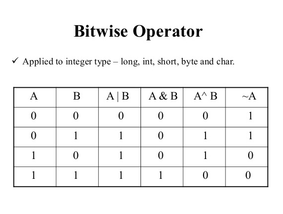
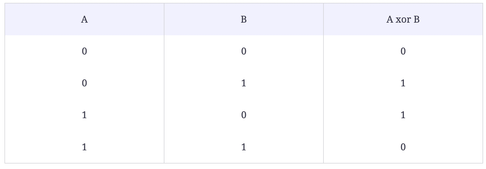

# :heavy_check_mark: Bitwise Manipulation
*Last Updated: 2/13/2023*



## :round_pushpin: Introduction
- XOR is a logical bitwise operator that returns 0 (false) if both bits are the same and returns 1 (true) otherwise.
- It only returns 1 if exactly one bit is set to 1 out of the two bits in comparison.



## :round_pushpin: Example
```
Given an array of n - 1 integers in the range from 1 to n, find the one number that is missing from the array.

Input: 1, 5, 2, 6, 4
Output: 3
```

A straightforward approach is:
1. Find the sum of all integers from 1 to `n`. Call it `s1`.
2. Subtract all numbers in the input array from `s1`. This gives us the missing number.

```java
public static int findMissingNumber(int[] arr) {
  int n = arr.length + 1;

  // Find sum of all numbers from 1 to n.
  int s1 = 0;
  for (int i = 1; i <= n; i++) {
    s1 += i;
  }

  // Subtract all numbers in input from sum.
  for (int num : arr) {
    s1 -= num;
  }

  // s1 now is the missing number.
  return s1;
}
```

Time Complexity: `O(N)`
Space Complexity: `O(1)`

### What Could Go Wrong?
```
While finding the sum of numbers from 1 to n, we can get integer overflow when n is large.
```

How do we avoid this? Can XOR help?
- Remember the important property of XOR that it returns 0 if both bits in comparison are the same.
- XOR of a number with itself will always result in 0.
- This means that if we XOR all numbers in the input array with all numbers from the range 1 to `n`, then each number in the input is going to get zeroed out except the missing number.
- The following are the steps to find the missing number using XOR:
  1. XOR all the numbers from 1 to `n`. Let's call it `x1`.
  2. XOR all the numbers in the input array. Let's call it `x2`.
  3. The missing number can be found by `x1 XOR x2`.

```java
public static int findMissingNumber(int[] arr) {
  int n = arr.length + 1;

  // Find sum of all numbers from 1 to n.
  int x1 = 1;
  for (int i = 2; i <= n; i++) {
    x1 = x1 ^ i;
  }

  // x2 represents XOR of all values in arr.
  int x2 = arr[0];
  for (int i = 1; i < n - 1; i++) {
    x2 = x2 ^ arr[i];
  }

  // The missing number is the XOR of x1 and x2.
  return x1 ^ x2;
}
```
Time Complexity: `O(N)`
Space Complexity: `O(1)`

- We will **not** have integer overflow with this implementation.

## :round_pushpin: Properties
Important properties:
1. Taking XOR of a number with itself returns 0, e.g.
  a. `1 ^ 1 = 0`
  b. `29 ^ 29 = 0`
2. Taking XOR of a number with 0 returns the same number, e.g.,
  a. `1 ^ 0 = 1`
  b. `31 ^ 0 = 31`
3. XOR is Associative and Commutative, which means:
  a. `(a ^ b) ^ c = a ^ (b ^ c)`
  b. `a ^ b = b ^ a`

## :round_pushpin: Leetcode Problems 

- [x] 136. [Single Number (Easy)](https://leetcode.com/problems/single-number/)
- [ ] 137. [Single Number II (Medium)](https://leetcode.com/problems/single-number-ii/)
- [ ] 190. [Reverse Bits (Easy)](https://leetcode.com/problems/reverse-bits/)
- [ ] 389. [Find the Difference (Easy)](https://leetcode.com/problems/find-the-difference/)
- [ ] 832. [Flipping an Image (Easy)](https://leetcode.com/problems/flipping-an-image/)
- [ ] 1009. [Complement of Base 10 Integer (Easy)](https://leetcode.com/problems/complement-of-base-10-integer/)

## :round_pushpin: Sources
*List to be updated...*
