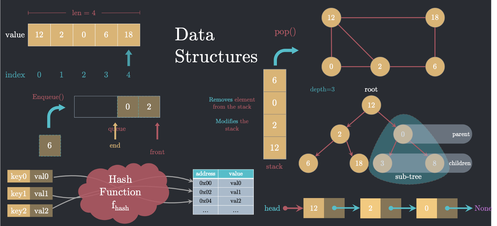

# :heavy_check_mark: Custom Data Structures
*Last Updated: 2/13/2023*

## :round_pushpin: Introduction
- Sometimes problems may ask us to implement data structures.
- There are many ways to do so.
- It is best to ask the interviewer clarification questions as you progress.

## :round_pushpin: Leetcode Problems 

- [ ] 146. [LRU Cache](https://leetcode.com/problems/lru-cache/)
- [ ] 155. [Min Stack (Medium)](https://leetcode.com/problems/min-stack/)
- [ ] 380. [Insert Delete GetRandom O(1) (Medium)](https://leetcode.com/problems/insert-delete-getrandom-o1/)
- [ ] 460. [LFU Cache (Hard)](https://leetcode.com/problems/lfu-cache/)
- [ ] 981. [Time Based Key-Value Store (Medium)](https://leetcode.com/problems/time-based-key-value-store/)
- [ ] 1146. [Snapshot Array (Medium)](https://leetcode.com/problems/snapshot-array/)

## :round_pushpin: Sources
*List to be updated...*
