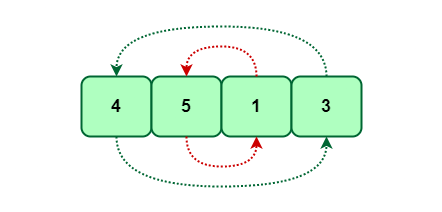

# :heavy_check_mark: Cyclic Sort
*Last Updated: 2/13/2023*



## :round_pushpin: Introduction
- Problems involving arrays containing numbers in a given range.

## :round_pushpin: Examples
```
You are given an unsorted array containing numbers taken from the range 1 to 'n'. The array can have duplicates, which means that some numbers will be missing. Find all missing numbers.
```

- You can use the fact that the input array contains numbers in the range of 1 to `n`.
- We can try to sort the numbers.
- We can then iterate the array to find all indices that are missing the correct numbers.

## :round_pushpin: Leetcode Problems 

- [ ] 41. [First Missing Positive (Hard)](https://leetcode.com/problems/first-missing-positive/)
- [ ] 268. [Missing Number (Easy)](https://leetcode.com/problems/missing-number/)
- [ ] 287. [Find the Dupliate Number (Medium)](https://leetcode.com/problems/find-the-duplicate-number/)
- [ ] 448. [Find All Numbers Disappeared in an Array (Easy)](https://leetcode.com/problems/find-all-numbers-disappeared-in-an-array/)
- [ ] 1539. [Kth Missing Positive Number (Easy)](https://leetcode.com/problems/kth-missing-positive-number/)

## :round_pushpin: Sources
*List to be updated...*
