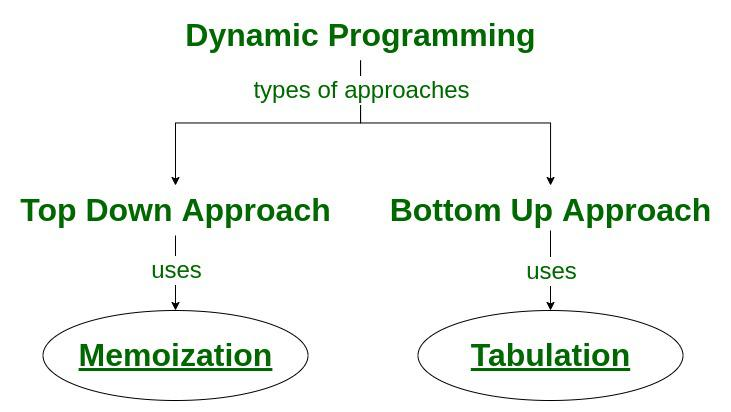

# :heavy_check_mark: Dynamic Programming
*Last Updated: 2/13/2023*

## :round_pushpin: Introduction
- Just an optimization over plain `recursion`.
  - Wherever we see a recursive solution, this is an indication we can optimize it using `Dynamic Programming`.
- The idea is to store the result of the subproblems, so that we do not need to recompute them later.
- Reduces time complexity from exponential to polynomial.
- One of the most powerful techniques.

## :round_pushpin: Examples
- Fibonacci Numbers
- Making change
- `0/1 Knapsack Problem`
- Optimal Binary Search Tree

## :round_pushpin: Requirements
- Big hint if the given problem can be broken up into smaller sub-problems, and these sub-problems can be broken down further, etc.
- You will see some overlapping sub-problems.
- The optimal solutions to the sub-problems contribute to the optimal solution of the given problem (in other words `Optimal Substructure`).
- Solutions to the sub-problems are stored in a table or array (`memoization`) or in a bottom-up manner (`tabulation`) to avoid redundant computation.

- Two necessary conditions:
  1. **Overlapping sub-problems:** When the solutions to the same subproblems are needed repetitively for solving the actual problem. The problem is said to have overlapping subproblems property.
  2. **Optimal Substructure:** If the optimal solution of the given problem can be obtained by using optimal solutions of its subproblems then the problem is said to have Optimal Substructure Property.

## :round_pushpin: Techniques
1. **Top-Down (Memoization):** Break down the given problem in order to being solving it. If you see that the problem has already been solved, return the saved answer. If it hasn't been solved, solve it and save it.
2. **Bottom-Up (Dynamic Programming):** Analyze the problem and see in what order the sub-problems are solved, and work your way up from the trivial sub-problem to the given problem. This process ensures that the sub-problems are solved before the main problem.

## :round_pushpin: Tabulation vs. Memoization
There are two different ways to store the values so that values of a sub-problem can be reused.
1. Tabulation: Bottom-Up
2. Memoization: Top-Down

Consider the following statements:
1. I will study the theory of DP from a website, then I will practice some problems on classic DP and therefore will master DP.
2. To master DP, I will practice DP problems and practice problems. First, I would have to study some theories of DP from websites.

Both say the same things. Version 1 is bottom-up and version 2 is top-down.

## :round_pushpin: Greedy vs. Dynamic Programming
|Feature|Greedy Method|Dynamic Programming|
|-------|-------------|-------------------|
|Feasibility|We make whatever choice seems best at the moment in the hope that it will lead to global optimal solution.|We make decisions at each step considering the current problem and solutions to previously solved sub-problems to calculate the optimal solution.|
|Optimality|Sometimes there is no such guarantee of getting Optimal Solution.|It is guaranteed that Dynamic Programming will generate an optimal solution as it generally considers all possible cases and then choose the best.|
|Recursion|A greedy method follows the problem solving heuristic of making the locally optimal choice at each stage.|A Dynamic programming is an algorithmic technique which is usually based on a recurrent formula that uses some previously calculated states.|
|Memoization|It is more efficient in terms of memory as it never look back or revise previous choices.|It requires Dynamic Programming table for Memoization and it increases its memory complexity.|
|Time Complexity|Greedy methods are generally faster. For example, Dijkstra’s shortest path algorithm takes `O(E Log V + V Log V)` time.|Dynamic Programming is generally slower. For example, Bellman Ford algorithm takes `O(VE)` time.|
|Fashion|Computes its solution by making its choices in a serial forward fashion, never looking back or revising previous choices.|Computes its solution bottom up or top down by synthesizing them from smaller optimal sub solutions.|
|Example|`Fractional Knapsack`|`0/1 Knapsack`|

## :round_pushpin: Leetcode Problems 

- [ ] 70. [Climbing Stairs (Easy)](https://leetcode.com/problems/climbing-stairs/)
- [ ] 140. [Word Break II (Hard)](https://leetcode.com/problems/word-break-ii/)
- [ ] 322. [Coin Change (Medium)](https://leetcode.com/problems/coin-change/)
- [ ] 416. [Partition Equal Subset Sum (Medium)](https://leetcode.com/problems/partition-equal-subset-sum/)
- [ ] 494. [Target Sum (Medium)](https://leetcode.com/problems/target-sum/)
- [ ] 871. [Minimum Number of Refueling Stops (Hard)](https://leetcode.com/problems/minimum-number-of-refueling-stops/)
- [ ] 907. [Sum of Subarray Minimums (Medium)](https://leetcode.com/problems/sum-of-subarray-minimums/)
- [ ] 1137. [N-th Tribonacci Number (Easy)](https://leetcode.com/problems/n-th-tribonacci-number/)

## :round_pushpin: Sources
*List to be updated...*
