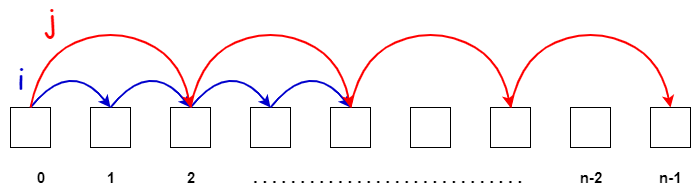
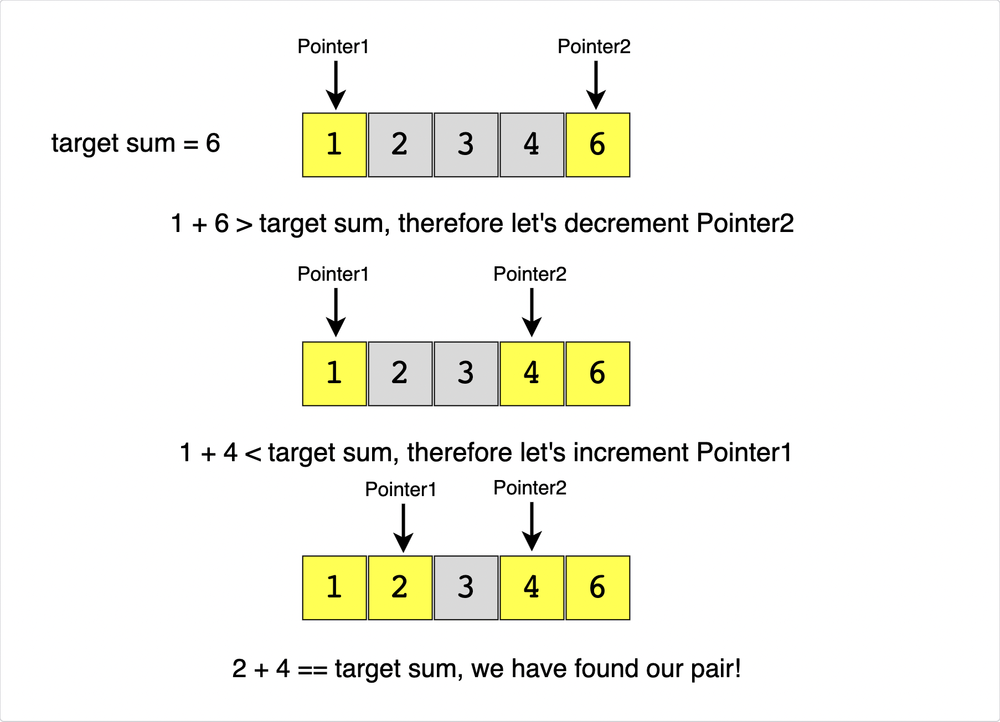

# :heavy_check_mark: Fast and Slow Pointers
*Last Updated: 2/8/2023*



## :round_pushpin: Introduction

## :round_pushpin: Requirements

## :round_pushpin: Types

## :round_pushpin: Recognition

## :round_pushpin: Example
Take a look at this example:
```
Given an array of sorted numbers and a target sum, find a pair in the array whose sum is equal to the given target.
```

### Brute-Force Approach
We can consider each element one by one (pointed out by the first pointer) and iterate through the remaining elements (pointed out by the second pointer) to find a pair with the given sum.

```java
public static int isPairSum(int[] arr, int target) {
  for (int i = 0; i < arr.length - 1; i++) {
    for (int j = i + 1; j < arr.length; j++) {
      // Check if it equals target.
      if (arr[i] + arr[j] == target) {
        return 1;
      }

      // If the sum of the pairs exceeds target, it means there's no way
      // there'll be a pair since they're all sorted.
      if (arr[i] + arr[j] > target) {
        break;
      }
    }
  }

  // No pair found.
  return 0;
}
```
**Time Complexity:** The time complexity of this algorithm is <code>O(N<sup>2</sup>)</code> where `N` is the number of elements in the input array.

### Efficient Approach
It's given that the input array is sorted.

An efficient way would be to start with one pointer in the beginning and another pointer at the end. At every step, we will see if the numbers pointed by the two pointers add up to the target sum.

If not, do one of two things:
1. If the sum of the two numbers pointed by the two pointers is greater than the target sum, we need a pair with a smaller sum. So, try more pairs by decrementing the end pointer.
2. If the sum of the two numbers pointed by the two pointers is smaller than the target sum, we need a pair with a larger sum. So, try more pairs by incrementing the start pointer.



**Time Complexity:** `O(N)` where `N` is the number of elements in the input array.
```java
public static int isPairSum(int[] arr, int target) {
  // Make two pointers on both ends.
  int i = 0;
  int j = arr.length - 1;

  // Move them inwards until they meet.
  while (i < j) {
    if (arr[i] + arr[j] == target) {
      return 1;
    } else if (arr[i] + arr[j] < target) {
      i++;
    } else {
      j--;
    }
  }

  // No pair found.
  return 0;
}
```

## :round_pushpin: Leetcode Problems 

- [x] 1. [EXAMPLE (Easy)](https://)

## :round_pushpin: Sources
*List to be updated...*
