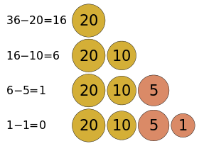
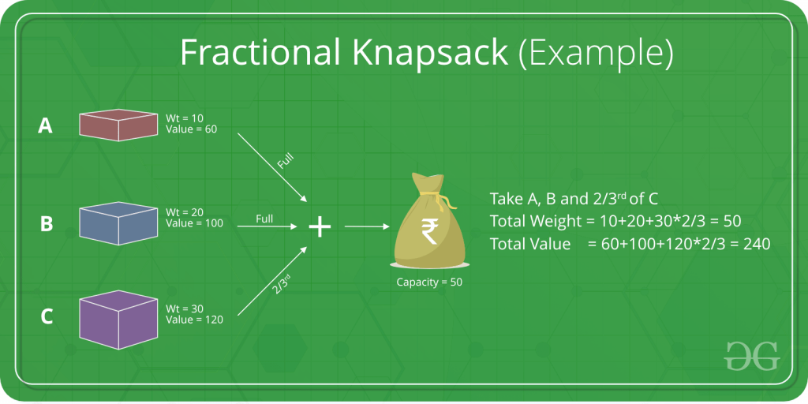

# :heavy_check_mark: Greedy
*Last Updated: 2/13/2023*

## :round_pushpin: Introduction
- What is the Greedy Algorithm?
  - Choice that always seems best at the moment (locally optimal).
  - An algorithmic paradigm that builds up a solution piece by piece, always choosing the next piece that offers the most obvious and immediate benefit.
- Used in optimization problems.
- Makes the optimal choice at each step.

## :round_pushpin: Examples
- `Fractional Knapsack Problem`
  - The local optimal strategy is to choose the item that has maximum value vs weight ratio.
  - This leads to a globally optimal solution because we are allowed to take fractions of an item.

- Huffman Encoding
- Dijkstra's Algorithm

## :round_pushpin: Requirements
- Problems where choosing locally optimal also leads to a global solution are the best fit for Greedy.
- Must meet both conditions below to use Greedy approach:
  1. **Greedy choice property:** A global (overall) optimal solution can be reached by choosing the optimal choice at each step.
  2. **Optimal substructure:** A problem has an optimal substructure if an optimal solution to the entire problem contains the optimal solutions to the sub-problems.
- In other words, greedy algorithm works on problems for which it is true that, at every step, there is a choice that is optimal for the problem up to that step, and after the last step, the algorithm produces the optimal solution of the complete problem.
- Must identify an optimal substructure or subproblem in the problem.
- Determine what the solution will include (e.g. the largest sum, the shortest path, etc).

## :round_pushpin: Limitations
- Greedy algorithms can fail to find globally optimal solutions because they do not consider all data.
- Choice made by greedy may depend on choices made so far.
- It is not aware of future choices it can make.

## :round_pushpin: Leetcode Problems 

- [ ] 45. [Jump Game II (Medium)](https://leetcode.com/problems/jump-game-ii/)
- [x] 53. [Maximum Subarray (Medium)](https://leetcode.com/problems/maximum-subarray/)
  - Already finished with another pattern/method.
- [x] 55. [Jump Game (Medium)](https://leetcode.com/problems/jump-game/)
  - There is also a DP solution.
- [ ] 134. [Gas Station (Medium)](https://leetcode.com/problems/gas-station/)
- [ ] 678. [Valid Parenthesis String (Medium)](https://leetcode.com/problems/valid-parenthesis-string/)
- [ ] 763. [Partition Labels (Medium)](https://leetcode.com/problems/partition-labels/)
- [ ] 846. [Hand of Straights (Medium)](https://leetcode.com/problems/hand-of-straights/)
- [ ] 881. [Boats to Save People (Medium)](https://leetcode.com/problems/boats-to-save-people/)
- [ ] 1029. [Two City Scheduling (Medium)](https://leetcode.com/problems/two-city-scheduling/)
- [ ] 1899. [Merge Triplets to Form Target Triplet (Medium)](https://leetcode.com/problems/merge-triplets-to-form-target-triplet/)

## :round_pushpin: Sources
*List to be updated...*
