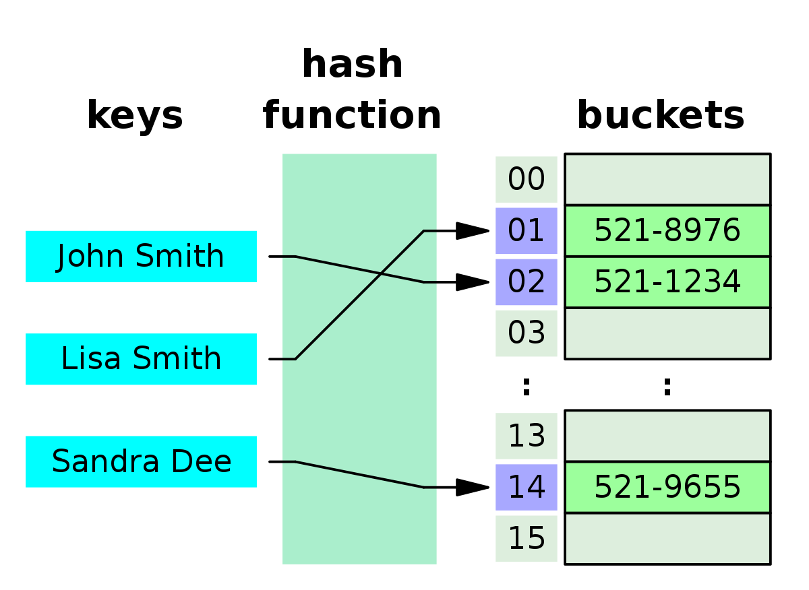

# :heavy_check_mark: Hash Maps
*Last Updated: 2/13/2023*



## :round_pushpin: Introduction
- Stores data in key/value pairs.
- One object is used as a key to another object.
- Inserting duplicate keys causes the replacement of that element with the new value.
- Similar to `Hash Table` but unsynchronized.

## :round_pushpin: Operations
We can use Java's `HashMap` class.

### Adding/Changing Elements
Use the `put(key, value)` method.

### Removing Elements
Use the `remove(key)` method.

```java
public static void main(String[] args) {
  HashMap<Integer, String> map = new HashMap<>();

  map.put(1, "one");
  map.put(2, "two");
  map.get(1); // "one"

  map.containsKey(3); // false
  map.containsKey(1); // true
  map.remove(1);
  map.containsKey(1); // false
}
```

### Constructor 1
The default constructor which creates an instance of HashMap with an initial capacity of 16 and load factor of 0.75.
```java
HashMap<K, V> hm = new HashMap<K, V>();
```

### Constructor 2
Creates a HashMap instance with a specified initial capacity and load factor of 0.75.
```java
HashMap<K, V> hm = new HashMap<K, V>(int initialCapacity);
```

### Constructor 3
Creates a HashMap instance with a specified initial capacity and specified load factor.
```java
HashMap<K, V> hm = new HashMap<K, V>(int initialCapacity, float loadFactor);
```

### Constructor 4
Creates a HashMap instance with the same mappings as the specified.
```java
HashMap<K, V> hm = new HashMap<K, V>(Map map);
```

### Traversal of HashMap
Can use the `Iterator` interface to traverse any structure in the `Collection` framework.

```java
public static void main(String[] args) {
  HashMap<String, Integer> map = new HashMap<>();

  map.put("vishal", 10);
  map.put("sachin", 30);
  map.put("vaibhav", 20);

  for (Map.Entry<String, Integer> e : map.entrySet()) {
    System.out.println("Key: " + e.getKey() + " Value: " + e.getValue());
  }
}
```

## :round_pushpin: Leetcode Problems 

- [ ] 166. [Fraction to Recurring Decimal (Medium)](https://leetcode.com/problems/fraction-to-recurring-decimal/)
- [ ] 205. [Isomorphic Strings (Easy)](https://leetcode.com/problems/isomorphic-strings/)
- [ ] 359. [Logger Rate Limiter (Easy)](https://leetcode.com/problems/logger-rate-limiter/)
- [ ] 409. [Longest Palindrome (Easy)](https://leetcode.com/problems/longest-palindrome/)
- [ ] 496. [Next Greater Element I (Easy)](https://leetcode.com/problems/next-greater-element-i/)
- [ ] 706. [Design HashMap (Easy)](https://leetcode.com/problems/design-hashmap/)

## :round_pushpin: Sources
*List to be updated...*
