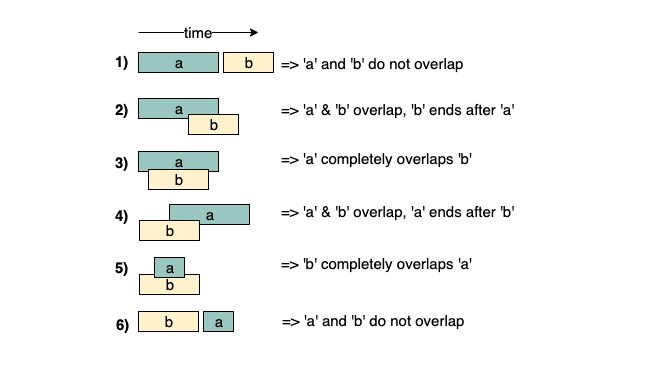
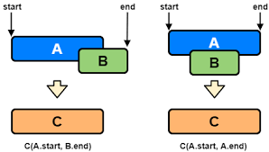

# :heavy_check_mark: Intervals
*Last Updated: 2/12/2023*

## :round_pushpin: Introduction
- An intervening period of time.
- Deals with overlapping intervals.
- In problems, we need to find overlapping intervals or merge intervals if they overlap.
- The picture above shows two intervals `a` and `b`.
  - It shows 6 different ways the two intervals can relate to each other.
- The picture below shows what to do when two intervals overlap.
  - We can merge them into one using the criteria below.

## :round_pushpin: Requirements
- Look for overlapping items or merging intervals.

## :round_pushpin: Thoughts
- **Detecting an overlap:**
  - Usually, the intervals are sorted by their start times.
  - Sorting by start time allows us to see the intervals in a timeline form.
  - It is better to see the overlap of intervals this way.
  - We can see the earliest interval start time along with other intervals' start times that started before the earliest ended.
  - If we find that a current interval's start time is started *before* the previous intervals' latest end time, there's an overlap.
- **Merging an overlap:**
  - When an overlap is encountered, a usual task is to merge them into one.
  - How do you merge an overlapping interval?
    - By common sense, we know that there are 4 scenarios of overlap (see first image (2) to (4) above or second image).
    - Either `A` comes first, `B` comes first, `B` completely overlaps `A`, or `A` completely overlaps `B`.
    - Regardless of the 4 scenarios mentioned, we take the **minimum of the start of A and B** and the **maximum of the end of A and B**. These two values gives us the new overlapped interval `C` with the new min and max (i.e. start and end).

## :round_pushpin: Leetcode Problems 

- [x] 56. [Merge Intervals (Medium)](https://leetcode.com/problems/merge-intervals/)
- [x] 57. [Insert Interval (Medium)](https://leetcode.com/problems/insert-interval/)
- [x] 253. [Meeting Rooms II (Medium)](https://leetcode.com/problems/meeting-rooms-ii/)
- [ ] 435. [Non-overlapping Intervals (Medium)](https://leetcode.com/problems/non-overlapping-intervals/)
- [x] 759. [Employee Free Time (Hard)](https://leetcode.com/problems/employee-free-time/)
- [ ] 986. [Interval List Intersections (Medium)](https://leetcode.com/problems/interval-list-intersections/)
- [ ] 2402. [Meeting Rooms III (Hard)](https://leetcode.com/problems/meeting-rooms-iii/)

## :round_pushpin: Sources
*List to be updated...*
