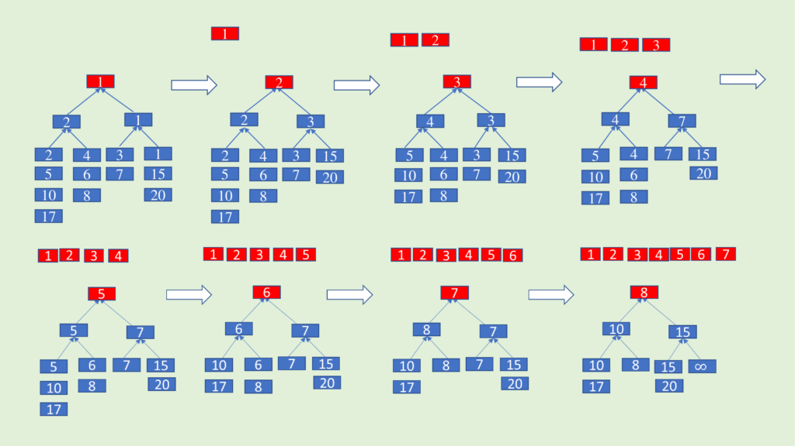

# :heavy_check_mark: K-way Merge
*Last Updated: 2/12/2023*

## :round_pushpin: Introduction
- This pattern helps us solve problems that involve a list of sorted arrays.
- Whenever we are given `k` sorted arrays, we can use a `Heap` to efficiently perform a sorted traversal of all elements of all arrays.
- We can push the smallest (first) element of each sorted array in a `Min Heap`.
  - We can get the overall minimum.
- We can keep track of the array the element came from.
- We can then remove the top element from the heap to get the smallest element and push the next element from the same array.
- Rinse and repeat.
- Time complexity is usually `O(N log K)`where `N` is the total number of elements in all the `K` input arrays.
- Space complexity is `O(K)`.

## :round_pushpin: Requirements
- Usually have the inputs sorted.
- Multiple inputs that requires consolidating.

## :round_pushpin: Leetcode Problems 

- [ ] 4. [Median of Two Sorted Arrays (Hard)](https://leetcode.com/problems/median-of-two-sorted-arrays/)
- [x] 23. [Merge k Sorted Lists (Hard)](https://leetcode.com/problems/merge-k-sorted-lists/description/)
- [x] 88. [Merge Sorted Array (Easy)](https://leetcode.com/problems/merge-sorted-array/description/)
  - This problem is also in `Two Pointers`.
- [ ] 373. [Find K Pairs with Smallest Sums (Medium)](https://leetcode.com/problems/find-k-pairs-with-smallest-sums/)
- [ ] 378. [Kth Smallest Element in a Sorted Matrix (Medium)](https://leetcode.com/problems/kth-smallest-element-in-a-sorted-matrix/)
- [ ] 632. [Smallest Range Covering Elements from K Lists (Hard)](https://leetcode.com/problems/smallest-range-covering-elements-from-k-lists/)
- [ ] 1439. [Find the Kth Smallest Sum of a Matrix With Sorted Rows (Hard)](https://leetcode.com/problems/find-the-kth-smallest-sum-of-a-matrix-with-sorted-rows/)

## :round_pushpin: Sources
*List to be updated...*
