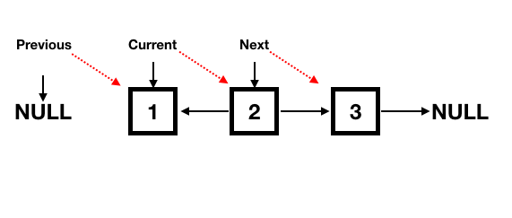

# :heavy_check_mark: Linked List Reversals
*Last Updated: 2/10/2023*

## :round_pushpin: Introduction
- A lot of problems ask to reverse a linked list (or the links between nodes).
- We may need to do the above "in-place" without the use of extra data structures.
- Usually linked lists (unless a double ended linked list) are only able to be traversed one-way. So, we need a way to go the opposite.

## :round_pushpin: Requirements
- Requires backtracking on a linked list.
- Rearranging a linked list.

## :round_pushpin: Leetcode Problems 

- [ ] 19. [Remove Nth Node From End of List (Medium)](https://leetcode.com/problems/remove-nth-node-from-end-of-list/)
  - I believe this is actually a Two Pointers question or a Fast & Slow Pointers question.
- [ ] 24. [Swap Nodes in Pairs (Medium)](https://leetcode.com/problems/swap-nodes-in-pairs/)
- [x] 25. [Reverse Ndoes in k-Group (Hard)](https://leetcode.com/problems/reverse-nodes-in-k-group/)
- [ ] 61. [Rotate List (Medium)](https://leetcode.com/problems/rotate-list/)
- [x] 92. [Reverse Linked List II (Medium)](https://leetcode.com/problems/reverse-linked-list-ii/)
- [x] 141. [Reorder List (Medium)](https://leetcode.com/problems/reorder-list/)
  - I placed this problem in Two Pointers as well.
  - This problem involves reversals, so I included it here.
- [ ] 189. [Rotate Array (Medium)](https://leetcode.com/problems/rotate-array/)
  - This might be a Two Pointers problem.
- [X] 206. [Reverse Linked List (Easy)](https://leetcode.com/problems/reverse-linked-list/)
- [ ] 725. [Split Linked List in Parts (Medium)](https://leetcode.com/problems/split-linked-list-in-parts/)
- [ ] 1721. [Swapping Nodes in a Linked List (Medium)](https://leetcode.com/problems/swapping-nodes-in-a-linked-list/)
- [ ] 2074. [Reverse Nodes in Even Length Groups (Medium)](https://leetcode.com/problems/reverse-nodes-in-even-length-groups/)

## :round_pushpin: Sources
*List to be updated...*
