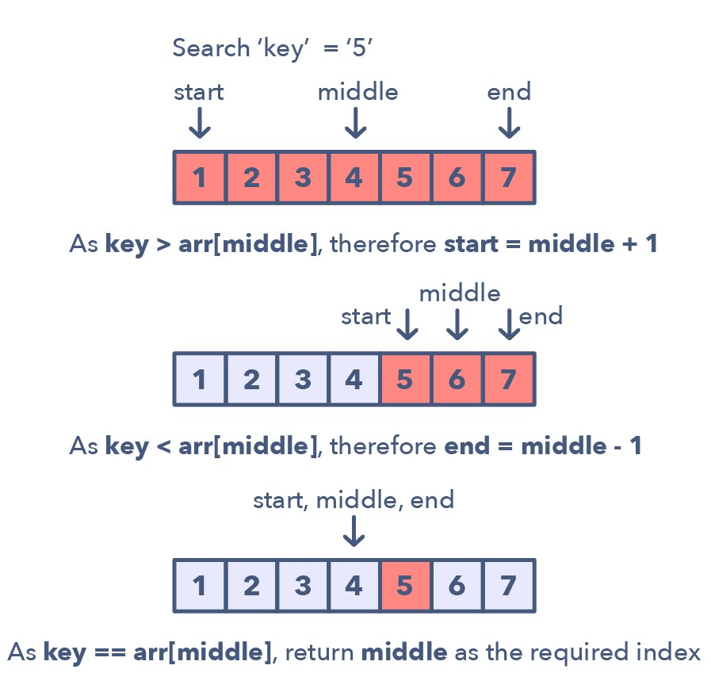

# :heavy_check_mark: Modified Binary Search
*Last Updated: 2/18/2023*

## :round_pushpin: Introduction
- Whenever we are given a sorted `Array` or `LinkedList` or `Matrix`, and we are asked to find an element, the best algorithm is to use `Binary Search`.

## :round_pushpin: Requirements
- Input must be sorted in some way.

## :round_pushpin: Leetcode Problems 

- [x] 4. [Median of Two Sorted Arrays (Hard)](https://leetcode.com/problems/median-of-two-sorted-arrays/)
  - Used `Heap` to finish this as well.
- [x] 33. [Search in Rotated Sorted Array (Medium)](https://leetcode.com/problems/search-in-rotated-sorted-array/description/)
- [ ] 34. [Find First and Last Position of Element in Sorted Array (Medium)](https://leetcode.com/problems/find-first-and-last-position-of-element-in-sorted-array/)
- [x] 35. [Search Insert Position (Easy)](https://leetcode.com/problems/search-insert-position/description/)
- [x] 74. [Search a 2D Matrix (Medium)](https://leetcode.com/problems/search-a-2d-matrix/description/)
- [ ] 81. [Search in a Rotated Sorted Array II (Medium)](https://leetcode.com/problems/search-in-rotated-sorted-array-ii/)
- [x] 278. [First Bad Version (Easy)](https://leetcode.com/problems/first-bad-version/)
- [x] 153. [Find Minimum in Rotated Sorted Array (Medium)](https://leetcode.com/problems/find-minimum-in-rotated-sorted-array/)
- [ ] 154. [Find Minimum in Rotated Sorted Array II (Hard)](https://leetcode.com/problems/find-minimum-in-rotated-sorted-array-ii/)
- [ ] 162. [Find Peak Element (Medium)](https://leetcode.com/problems/find-peak-element/)
- [ ] 528. [Random Pick with Weight (Medium)](https://leetcode.com/problems/random-pick-with-weight/)
- [ ] 540. [Single Element in a Sorted Array (Medium)](https://leetcode.com/problems/single-element-in-a-sorted-array/)
- [ ] 658. [Find K Closest Elements (Medium)](https://leetcode.com/problems/find-k-closest-elements/)
- [ ] 702. [Search in a Sorted Array of Unknown Size (Medium)](https://leetcode.com/problems/search-in-a-sorted-array-of-unknown-size/)
- [x] 704. [Binary Search (Easy)](https://leetcode.com/problems/binary-search/)
- [ ] 744. [Find Smallest Letter Greater Than Target (Easy)](https://leetcode.com/problems/find-smallest-letter-greater-than-target/)
- [ ] 875. [Koko Eating Bananas (Medium)](https://leetcode.com/problems/koko-eating-bananas/description/)
- [ ] 981. [Time Based Key-Value Store (Medium)](https://leetcode.com/problems/time-based-key-value-store/)

## :round_pushpin: Sources
*List to be updated...*
