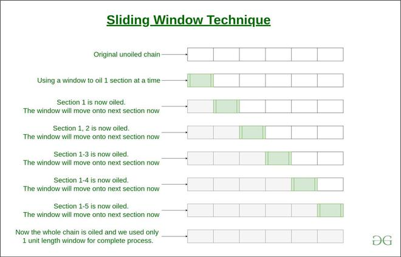

# :heavy_check_mark: Sliding Window
*Last Updated: 1/31/2023*



## :round_pushpin: Introduction
In problems with an array or linked list, we are often asked to find or calculate something among all the contiguous subarrays (or sublists) of a given size.

It is a computational technique which aims to reduce the use of nested loops and replace it with a single loop, reducing the time complexity.

## :round_pushpin: Requirements
The size of the sliding window *must* be fixed throughout the complete nested loop.

## :round_pushpin: Types
There are two types:
1. Static/Fixed Sliding Window
  a. Usually, the size of the window will be given.
  b. Expand the window until this size is met.
  c. Slide accordingly while maintaining this size.
2. Dynamic Sliding Window
  a. Usually, the size of the window will ***not*** be given.
  b. Instead, another constraint will be given (e.g. finding the longest/shortest subarray with a given, required sum).
  c. Expand the window until this constraint is met.
  d. See if the window can be shrunken down or expanded more while ***adhering*** to this constraint.
  e. For example, expand the subarray until the sum is at least 7. Shrink the window from here to see what the shortest subarray is with a sum of at least 7.

The dynamic sliding window sometimes might be used with a set or map to keep track of things.

## :round_pushpin: Recognition
Things to look out for (signs of a sliding window pattern).
- Iterating sequentially.
  - Like a contiguous sequence of elements (i.e. subarrays, subsets, strings, arrays, linked lists).
- Trying to find the min, max, longest, shortest, contained.
  - Perhaps we need to calculate something.

## :round_pushpin: Example
Take a look at this problem:
```
Given an array, find the average of all contiguous subarrays of size 'K' in it.

Example:
Array: [1, 3, 2, 6, -1, 4, 1, 8, 2], K = 5
```

We are asked to find the average of all coniguous subarrays of size 5 in the given array.

To solve it:
1. For the first 5 numbers (index 0 - 4), the average is: (1 + 3 + 2 + 6 - 1) / 5 = 2.2.
2. The next 5 numbers (index 1 - 5), the average is: (3 + 2 + 6 - 1 + 4) / 5 = 2.8.
3. The next 5 numbers (index 2 - 6), the average is: (2 + 6 - 1 + 4 + 1) / 5 = 2.4.

The final output is:
```
Output: [2.2, 2.8, 2.4, 3.6, 2.8]
```

### Brute-Force Approach
A brute-force approach is to calculate the sum of every 5-element contiguous subarray of the given array and divide the sum by 5 to find the average:
```java
class AverageOfSubarrayOfSizeK {
  public static double[] findAverages(int K, int[] arr) {
    double[] result = new double[arr.length - K + 1];
    for (int i = 0; i <= arr.length - K; i++) {
      // Find sum of next 'K' elements.
      double sum = 0;
      for (int j = i; j < i + K; j++) {
        sum += arr[j];
      }
      result[i] = sum / K;
    }
    return result;
  }
}
```
**Time Complexity:** For every element, we are calculating the sum of its next 'K' elements. The time complexity will be `O(N * K)` where `N` is the number of elements in the input array.

### Efficient Approach
There is an inefficiency with the brute-force approach.

For any two consecutive subarrays of size 5, the overlapping part (contains 4 elements) will be evaluated twice.


There are four overlapping elements. Can we reuse the `sum` from the previous subarray?


Visualize each contiguous subarray as a sliding window of 5 elements. When we move to the next subarray:
- Slide window by one element.
- Reuse the sum from the previous window.
- Subtract the element leaving the window (left).
- Add the element entering the window (right).

This algorithm saves us from going through the subarray again to find the `sum`.

**Time Complexity:** `O(N)`.
```java
class AverageOfSubarrayOfSizeK {
  public static double[] findAverages(int K, int[] arr) {
    double[] result = new double[arr.length - K + 1];
    double windowSum = 0;
    int windowStart = 0;
    for (int windowEnd = 0; windowEnd < arr.length; windowEnd++) {
      windowSum += arr[windowEnd]; // Add the next element.
      // Slide the window. We don't need to slide if we have not hit the required window size of 'k'.
      if (windowEnd >= K - 1) {
        result[windowStart] = windowSum / K; // Calculate the average.
        windowSum -= arr[windowStart]; // Subtract the element going out.
        windowStart++; // Slide the window ahead.
      }
    }

    return result;
  }
}
```

***NOTE:*** In some cases, the sliding window is not of fixed size. We have to expand/shrink the window based on the problem constraints.

## :round_pushpin: Leetcode Problems
- [x] 3. [Longest Substring Without Repeating Characters (Medium)](https://leetcode.com/problems/longest-substring-without-repeating-characters/)
- [ ] 30. [Substring with Concatenation of All Words (Hard)](https://leetcode.com/problems/substring-with-concatenation-of-all-words/)
- [ ] 53. [Maximum Subarray (Medium)](https://leetcode.com/problems/maximum-subarray/)
- [ ] 76. [Minimum Window Substring (Hard)](https://leetcode.com/problems/minimum-window-substring/)
- [ ] 159. [Longest Substring with At Most Two Distinct Characters (Medium)](https://leetcode.com/problems/longest-substring-with-at-most-two-distinct-characters/)
- [ ] 209. [Minimum Size Subarray Sum (Medium)](https://leetcode.com/problems/minimum-size-subarray-sum/)
- [ ] 239. [Sliding Window Maximum (Hard)](https://leetcode.com/problems/sliding-window-maximum/)
- [ ] 325. [Maximum Size Subarray Sum Equals k (Medium)](https://leetcode.com/problems/maximum-size-subarray-sum-equals-k/)
- [ ] 340. [Longest Substring with At Most K Distinct Characters (Medium)](https://leetcode.com/problems/longest-substring-with-at-most-k-distinct-characters/)
- [ ] 424. [Longest Repeating Character Replacement (Medium)](https://leetcode.com/problems/longest-repeating-character-replacement/)
- [ ] 438. [Find All Anagrams in a String (Medium)](https://leetcode.com/problems/find-all-anagrams-in-a-string/)
- [ ] 560. [Subarray Sum Equals K (Medium)](https://leetcode.com/problems/subarray-sum-equals-k/)
- [ ] 567. [Permutation in String (Medium)](https://leetcode.com/problems/permutation-in-string/)
- [ ] 904. [Fruits Into Baskets (Medium)](https://leetcode.com/problems/fruit-into-baskets/)
- [ ] 992. [Subarrays with K Different Integers (Hard)](https://leetcode.com/problems/subarrays-with-k-different-integers/)
- [ ] 1004. [Max Consecutive Ones III (Medium)](https://leetcode.com/problems/max-consecutive-ones-iii/description/)
- [ ] 1695. [Maximum Erasure Value (Medium)](https://leetcode.com/problems/maximum-erasure-value/)
- [ ] 2260. [Minimum Consecutive Cards to Pick Up (Medium)](https://leetcode.com/problems/minimum-consecutive-cards-to-pick-up/)

## :round_pushpin: Sources
*List to be updated...*
