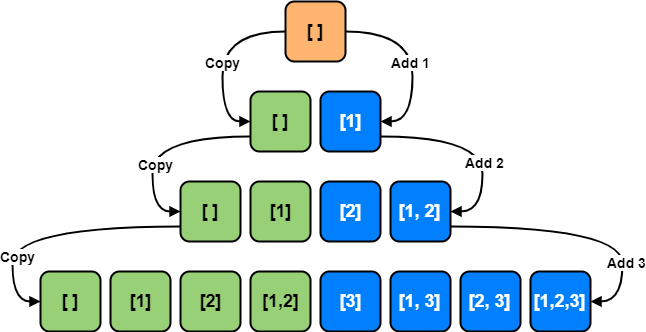

# :heavy_check_mark: Subsets
*Last Updated: 2/13/2023*

## :round_pushpin: Introduction
- A lot of problems deal with `Permutations` and `Combinations` of a given set of elements.
- A subset pattern is an `Breadth First Search (BFS)` approach to handle all these problems.

## :round_pushpin: Requirements
- Usually can tell if there's backtracking of some sort involved.

## :round_pushpin: Leetcode Problems 

- [ ] 17. [Letter Combinations of a Phone Number (Medium)](https://leetcode.com/problems/letter-combinations-of-a-phone-number/)
- [ ] 22. [Generate Parentheses (Medium)](https://leetcode.com/problems/generate-parentheses/)
- [x] 46. [Permutations (Medium)](https://leetcode.com/problems/permutations/)
- [x] 78. [Subsets (Medium)](https://leetcode.com/problems/subsets/)
- [x] 90. [Subsets II (Medium)](https://leetcode.com/problems/subsets-ii/)
- [ ] 95. [Unique Binary Search Trees II (Medium)](https://leetcode.com/problems/unique-binary-search-trees-ii/)
- [ ] 96. [Unique Binary Search Trees (Medium)](https://leetcode.com/problems/unique-binary-search-trees/)
- [ ] 241. [Different Ways to Add Parentheses (Medium)](https://leetcode.com/problems/different-ways-to-add-parentheses/)
- [ ] 320. [Generalized Abbreviations (Medium)](https://leetcode.com/problems/generalized-abbreviation/)
- [ ] 784. [Letter Case Permutation (Medium)](https://leetcode.com/problems/letter-case-permutation/)

## :round_pushpin: Sources
*List to be updated...*
