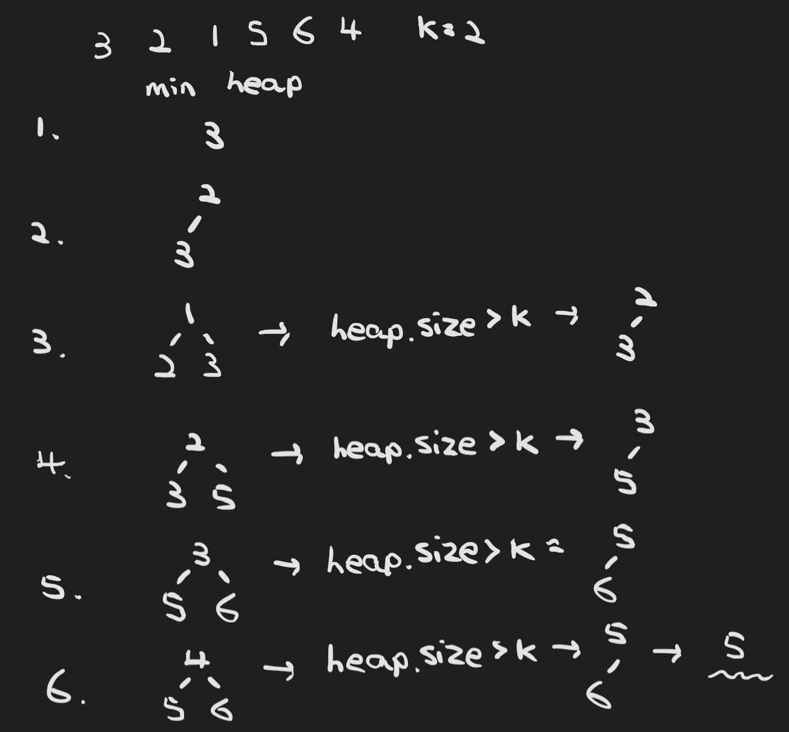

# :heavy_check_mark: Top K Elements
*Last Updated: 2/12/2023*

## :round_pushpin: Introduction
- Any problem that asks us to find the top/smallest/frequent `K` elements among a given set falls under this pattern.
- Best data structure is the `Heap`.

## :round_pushpin: Requirements
- Problem asks for top, smallest, or frequent elements.

## :round_pushpin: Leetcode Problems 
- [x] 215. [Kth Largest Element in an Array (Medium)](https://leetcode.com/problems/kth-largest-element-in-an-array/)
  - We can utilize a `Min Heap` or a `Max Heap`.
- [ ] 230. [Kth Smallest Element in a BST (Medium)](https://leetcode.com/problems/kth-smallest-element-in-a-bst/)
  - I included this here because it can be a heap problem and can be other tree related traversal algorithm problem.
- [ ] 347. [Top K Frequent Elements (Medium)](https://leetcode.com/problems/top-k-frequent-elements/description/)
- [ ] 358. [Rearrange String k Distance Apart (Hard)](https://leetcode.com/problems/rearrange-string-k-distance-apart/)
- [ ] 451. [Sort Characters By Frequency (Medium)](https://leetcode.com/problems/sort-characters-by-frequency/)
- [ ] 621. [Task Scheduler (Medium)](https://leetcode.com/problems/task-scheduler/)
- [ ] 658. [Find K Closest Elements (Medium)](https://leetcode.com/problems/find-k-closest-elements/)
- [ ] 703. [Kth Largest Element in a Stream (Easy)](https://leetcode.com/problems/kth-largest-element-in-a-stream/)
- [ ] 767. [Reorganize String (Medium)](https://leetcode.com/problems/reorganize-string/)
- [ ] 895. [Frequency Stack (Hard)](https://leetcode.com/problems/maximum-frequency-stack/)
- [ ] 973. [K Closest Points to Origin (Medium)](https://leetcode.com/problems/k-closest-points-to-origin/)
- [ ] 1000. [Minimum Cost to Merge Stones (Hard)](https://leetcode.com/problems/minimum-cost-to-merge-stones/)
- [ ] 1636. [Sort Array by Increasing Frequency (Easy)](https://leetcode.com/problems/sort-array-by-increasing-frequency/)
- [ ] 2461. [Maximum Sum of Distinct Subarrays With Length K (Medium)](https://leetcode.com/problems/maximum-sum-of-distinct-subarrays-with-length-k/)

## :round_pushpin: Sources
*List to be updated...*
