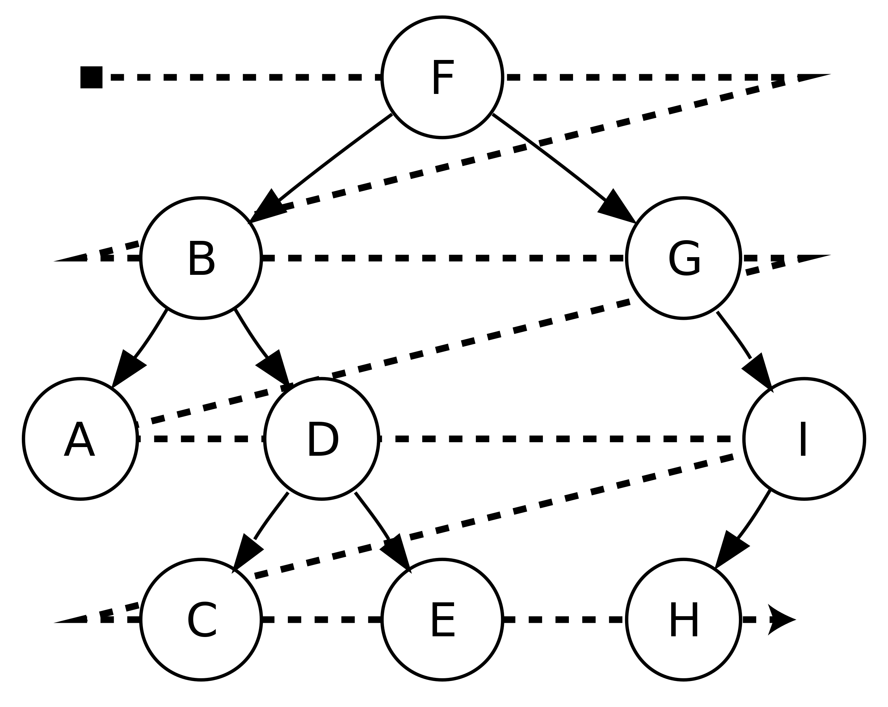

# :heavy_check_mark: Tree Breadth First Search
*Last Updated: 2/14/2023*



## :round_pushpin: Introduction
- This pattern is based on the `Breadth First Search (BFS)` technique to traverse a tree.
- Use a `Queue` data structure to keep track of all nodes of a level before we jump to the next level.
- Space complexity will be `O(W)` where `W` is the max number of nodes on any level.

## :round_pushpin: Requirements
- Problems that involve traversing a tree level by level can solved efficiently using this approach.

## :round_pushpin: Examples
Imagine a class `TreeNode` that represents the nodes of a binary tree. This class has properties `val`, `left` and `right`.

Below is an example of using a `Queue` data structure to traverse a `Binary Tree` in level-order. It is a generic template:

```java
public class TreeNode {
  int val;
  TreeNode left;
  TreeNode right;
  TreeNode() {}
  TreeNode(int val) { this.val = val; }
  TreeNode(int val, TreeNode left, TreeNode right) {
    this.val = val;
    this.left = left;
    this.right = right;
  }
}

public List<List<Integer>> levelOrderTraversal(TreeNode root) {
  List<List<Integer>> result = new ArrayList<>();
  Queue<TreeNode> bfsQueue = new LinkedList<>();
  bfsQueue.offer(root);

  while (!bfsQueue.isEmpty()) {
    int levelSize = bfsQueue.size();

    List<Integer> currentLevel = new ArrayList<>();
    for (int i = 0; i < levelSize; i++) {
      TreeNode currentNode = bfsQueue.poll();
      currentLevel.add(currentNode.val);
      if (currentNode.left != null) {
        bfsQueue.offer(currentNode.left);
      }

      if (currentNode.right != null) {
        bfsQueue.offer(currentNode.right);
      }
    }
    result.add(currentLevel);
  }

  return result;
}
```

## :round_pushpin: Leetcode Problems 

- [x] 102. [Binary Tree Level Order Traversal (Medium)](https://leetcode.com/problems/binary-tree-level-order-traversal/)
- [x] 103. [Binary Tree Zigzag Level Order Traversal (Medium)](https://leetcode.com/problems/binary-tree-zigzag-level-order-traversal/)
- [x] 107. [Binary Tree Level Order Traversal II (Medium)](https://leetcode.com/problems/binary-tree-level-order-traversal-ii/)
- [x] 111. [Minimum Depth of Binary Tree (Easy)](https://leetcode.com/problems/minimum-depth-of-binary-tree/)
- [x] 116. [Populating Next Right Pointers in Each Node (Medium)](https://leetcode.com/problems/populating-next-right-pointers-in-each-node/)
- [x] 117. [Populating Next Right Pointers in Each Node II (Medium)](https://leetcode.com/problems/populating-next-right-pointers-in-each-node-ii/description/)
- [x] 199. [Binary Tree Right Side View (Medium)](https://leetcode.com/problems/binary-tree-right-side-view/)
- [ ] 637. [Average of Levels in Binary Tree (Easy)](https://leetcode.com/problems/average-of-levels-in-binary-tree/)
- [ ] 987. [Vertical Order Traversal of a Binary Tree (Hard)](https://leetcode.com/problems/vertical-order-traversal-of-a-binary-tree/)
- [ ] 993. [Cousins in Binary Tree (Easy)](https://leetcode.com/problems/cousins-in-binary-tree/)

## :round_pushpin: Sources
*List to be updated...*
